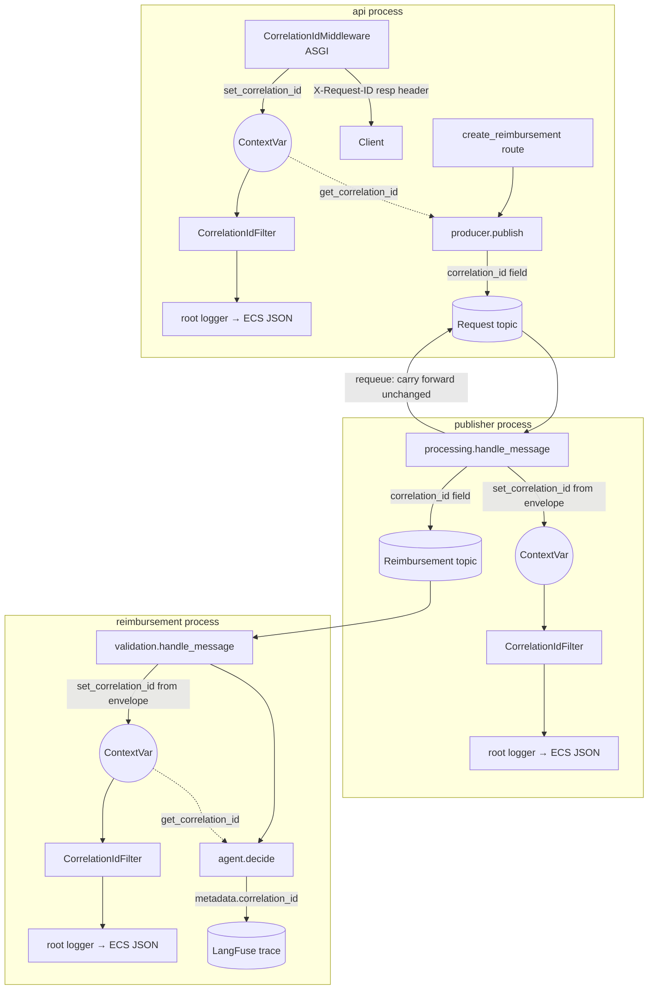

# JSON Structured Logging & Request Correlation — Design

**Spec**: `.specs/features/RA-1-json-structured-logging/spec.md`
**Status**: Draft

---

## Architecture Overview

One correlation primitive threads through every layer: a `contextvars.ContextVar[str | None]` owned by `shared.logging`, read by a `logging.Filter` (in-process log injection), by the API's ASGI middleware (HTTP boundary), by the two Kafka consumers (message boundary), and by `agent.decide()` (LangFuse boundary). Nothing downstream of the ContextVar needs to know *how* the id arrived — every reader just calls `get_correlation_id()`.



`configure_logging()` (new, `shared.logging`) is the single entrypoint every process calls once at startup, replacing that process's `logging.basicConfig(...)` call. It attaches one `ecs_logging.StdlibFormatter` handler (carrying the `CorrelationIdFilter`) to the root logger and resolves `LOG_LEVEL` with fallback.

---

## Code Reuse Analysis

### Existing Components to Leverage

| Component | Location | How to Use |
| --- | --- | --- |
| `shared.logging.log_event()` | `packages/shared/src/shared/logging.py` | Refactor internals only (message-string JSON → `extra={}`); signature and 6 call sites unchanged. |
| `shared.config.Config` / `load_config()` | `packages/shared/src/shared/config.py` | Add a `logging: LoggingConfig` field, following AD-023's "plain data holder, single cached loader does every `os.getenv`" pattern exactly. |
| `RequestEnvelope` / `ReimbursementEnvelope` | `packages/shared/src/shared/models.py` | Add one `Optional[str] = None` field each (mirrors AD-014's `errors` field: same envelopes, same "safe rolling-deploy" `Optional` reasoning). |
| `agent.decide()`'s `config["configurable"]["metadata"]` dict | `packages/reimbursement/src/reimbursement/agent/agent.py:150-154` | Already a plain dict with one key (`langfuse_session_id`); add a second key conditionally — no restructuring. |
| `api/errors.py`'s `register_handlers(app)` pattern | `packages/api/src/api/errors.py` | Precedent for a small, app-wide cross-cutting module registered from `main.py` — the new middleware follows the same shape (its own file, one registration call in `main.py`). |
| `shared/tests/conftest.py`'s `_clear_config_cache` autouse fixture | `packages/shared/tests/conftest.py`, `packages/api/tests/conftest.py` | Same `load_config.cache_clear()` need applies here since `LoggingConfig` is read through the same cached loader — no new fixture needed, existing one already covers it. |

### Integration Points

| System | Integration Method |
| --- | --- |
| `ecs-logging` (PyPI, new dependency) | Added to `packages/shared/pyproject.toml` only (AD-019/AD-025 precedent: shared-owned deps consumed transitively by api/publisher/reimbursement via the uv workspace). |
| `confluent-kafka` envelopes | No client-level change (no Kafka headers, per spec's Out-of-Scope) — `correlation_id` rides inside the existing pydantic-parsed JSON body on both topics. |
| LangFuse (`langfuse.langchain.CallbackHandler`) | No new wiring — reuses the callback handler and `metadata` dict `_langfuse_handlers()`/`decide()` already construct (`agent.py:107-156`). |
| FastAPI / Starlette | New ASGI middleware class (not `@app.middleware("http")` — see Tech Decisions) registered via `app.add_middleware(...)` in `api/main.py`. |

---

## Components

### `shared.logging` (extended)

- **Purpose**: Owns the correlation-id ContextVar, the log-injection Filter, the `configure_logging()` entrypoint, and the refactored `log_event()`.
- **Location**: `packages/shared/src/shared/logging.py`
- **Interfaces**:
  - `set_correlation_id(value: str | None) -> contextvars.Token` — sets the current context's correlation id (`None` is a valid, common value — e.g. a consumer processing a pre-feature message); returns a token for `reset_correlation_id`.
  - `reset_correlation_id(token: contextvars.Token) -> None` — restores the previous value; always called in a `finally` by every setter (middleware, both consumers).
  - `get_correlation_id() -> str | None` — read-only accessor used by `producer.publish()` and `agent.decide()`.
  - `class CorrelationIdFilter(logging.Filter)` — `filter(record)` sets `record.correlation_id` **only when** `get_correlation_id()` is not `None`, then always returns `True`. Omitting the attribute (not setting it to `None`) is what makes the field absent from the JSON line rather than present-as-`null` (Edge Case: "no `correlation_id` field present").
  - `configure_logging() -> None` — idempotent handler-attach (see Tech Decisions), level resolution + fallback warning, LOG-01..08 all funnel through this one function.
  - `log_event(logger: logging.Logger, level: int, event: str, **fields: Any) -> None` — same signature; internals now pass `extra={}` (see Tech Decisions for the UUID-serialization mitigation).
- **Dependencies**: `shared.config.load_config()` (for `LOG_LEVEL`), `ecs_logging` (new dependency).
- **Reuses**: Nothing new to reuse — this *is* the reused component for everything downstream.

### `shared.config` (extended)

- **Purpose**: Adds the one new configuration domain (`LOG_LEVEL`) this feature needs, via the existing cached-loader pattern.
- **Location**: `packages/shared/src/shared/config.py`
- **Interfaces**:
  - `@dataclass(frozen=True) class LoggingConfig: level: str` — the *raw* env value (e.g. `"info"`, `"bogus"`, or the `"debug"` default); no parsing/validation lives here, per AD-023's "plain data holder" rule. Parsing + fallback + the one warning line is `configure_logging()`'s job, not the config loader's — that logic needs a working logger to emit its warning, which only exists after the handler is attached.
  - `Config.logging: LoggingConfig` — new field on the root dataclass, alongside `kafka`/`database`/`failure_log`.
  - `load_config()` reads `os.getenv("LOG_LEVEL", "debug")` into it — one more line in the existing function body.
- **Dependencies**: none new.
- **Reuses**: the existing `@lru_cache(maxsize=1)` loader and its test-suite `cache_clear()` fixture.

### `shared.models` (extended)

- **Purpose**: Carries `correlation_id` across the Kafka hop.
- **Location**: `packages/shared/src/shared/models.py`
- **Interfaces**: `RequestEnvelope.correlation_id: str | None = None` and `ReimbursementEnvelope.correlation_id: str | None = None` — both added after `published_at`, before `errors`, matching where `AttemptError`'s docstring already narrates the fields.
- **Dependencies**: none new.
- **Reuses**: existing pydantic model validation/serialization — no custom `(de)serialization` code needed since it's a plain `Optional[str]`.

### `api.middleware` (new)

- **Purpose**: Establishes the request's `correlation_id` for the full span of the request — before the route handler runs, and before any error handler that might run instead of it.
- **Location**: `packages/api/src/api/middleware.py`
- **Interfaces**: `class CorrelationIdMiddleware` — a raw ASGI middleware (`__init__(self, app)`, `async __call__(self, scope, receive, send)`), not `BaseHTTPMiddleware`/`@app.middleware("http")` (see Tech Decisions for why). Reads `X-Request-ID` off `scope["headers"]`, calls `set_correlation_id`, wraps `send` to inject the `X-Request-ID` response header on `http.response.start`, and always `reset_correlation_id`s in a `finally`.
- **Dependencies**: `shared.logging.{set_correlation_id, reset_correlation_id}`, `uuid.uuid7`.
- **Reuses**: nothing pre-existing (grilling session confirmed no middleware exists in this repo today) — this is genuinely new API-layer infrastructure, kept as small and single-purpose as `api/errors.py`.

### `api.main` / `api.migrate` / `publisher.consumer` / `reimbursement.consumer` (modified, 4 call sites)

- **Purpose**: Replace each service's `logging.basicConfig(...)` with `configure_logging()`; `api/main.py` additionally registers `CorrelationIdMiddleware`.
- **Location**: `packages/api/src/api/main.py`, `packages/api/src/api/migrate.py`, `packages/publisher/src/publisher/consumer.py`, `packages/reimbursement/src/reimbursement/consumer.py`.
- **Interfaces**: no new interfaces — `configure_logging()` replaces one line each; `main.py` gains `app.add_middleware(CorrelationIdMiddleware)`.
- **Dependencies**: `shared.logging.configure_logging`.
- **Reuses**: the exact call-site shape and surrounding comments already there (`logging.basicConfig(level=logging.INFO)` → `configure_logging()`).

### `api.reimbursement.create.producer` (modified)

- **Purpose**: Carries the request's `correlation_id` into the byte-spliced `RequestEnvelope` prefix.
- **Location**: `packages/api/src/api/reimbursement/create/producer.py`
- **Interfaces**: `build_envelope(raw: bytes, published_at: datetime, correlation_id: str | None) -> bytes` (new third parameter, pure function — stays unit-testable with no contextvar involved); `publish(...)` (signature unchanged) internally calls `get_correlation_id()` and passes it to `build_envelope`.
- **Dependencies**: `shared.logging.get_correlation_id`.
- **Reuses**: the existing byte-splice technique (`json.dumps(correlation_id)` spliced in the same way `stamp` already is — `None` serializes as the bare JSON token `null`, which `RequestEnvelope`'s `Optional[str] = None` field parses back correctly).

### `publisher.processing` / `reimbursement.validation` (modified — both `handle_message()`s)

- **Purpose**: Set the process's `ContextVar` from the just-parsed envelope, for the duration of that one message's handling; carry the value forward unchanged on publisher's requeue path.
- **Location**: `packages/publisher/src/publisher/processing.py` (`handle_message`, `_requeue`), `packages/reimbursement/src/reimbursement/validation.py` (`handle_message`).
- **Interfaces**: no signature changes. Each `handle_message()` wraps its post-parse body in `token = set_correlation_id(envelope.correlation_id)` / `finally: reset_correlation_id(token)` — necessary because both consume loops process messages **sequentially in one coroutine**, so a stale value from message *N* would otherwise bleed into message *N+1*'s logs if not reset. `_requeue()`'s `RequestEnvelope(...)` reconstruction explicitly passes `correlation_id=envelope.correlation_id` (the model's own default of `None` would otherwise silently drop it on every requeue — see Risks & Concerns).
- **Dependencies**: `shared.logging.{set_correlation_id, reset_correlation_id}`.
- **Reuses**: the existing `handle_message()` control flow and the existing malformed-message error path (which still logs, just with no `correlation_id` set yet — nothing to set it from before the parse succeeds).

### `reimbursement.agent.agent` (modified)

- **Purpose**: Add `correlation_id` to the LangGraph invocation's LangFuse metadata.
- **Location**: `packages/reimbursement/src/reimbursement/agent/agent.py`, `decide()` (lines 140-156).
- **Interfaces**: `decide()`'s signature is unchanged (CORR-14). Internally: `metadata = {"langfuse_session_id": str(reimbursement.uuid)}`; `if (cid := get_correlation_id()) is not None: metadata["correlation_id"] = cid`.
- **Dependencies**: `shared.logging.get_correlation_id`.
- **Reuses**: the existing `metadata` dict construction and `_langfuse_handlers()` — no change to either.

### `CLAUDE.md` (root, modified)

- **Purpose**: DOC-01 — document the conventions for future contributors.
- **Location**: repo-root `CLAUDE.md`.
- **Interfaces**: n/a (documentation only). New "Logging" section covering: `configure_logging()` at every entrypoint, `LOG_LEVEL` default/fallback, and the full `correlation_id` chain (HTTP header → ContextVar → Kafka envelope field → LangFuse metadata).
- **Dependencies**: none.
- **Reuses**: n/a.

---

## Data Models

### `LoggingConfig` (new)

```python
@dataclass(frozen=True)
class LoggingConfig:
    level: str  # raw LOG_LEVEL value, unparsed — "debug" if unset
```

**Relationships**: nests onto `Config.logging`, alongside `Config.{kafka, database, failure_log}` — read once via the existing cached `load_config()`.

### `RequestEnvelope` / `ReimbursementEnvelope` (extended)

```python
class RequestEnvelope(BaseModel):
    retry: Annotated[int, Field(ge=0)]
    published_at: AwareDatetime
    correlation_id: str | None = None   # new
    errors: list[AttemptError] = []
    payload: Annotated[list[dict[str, Any]], Field(max_length=MAX_BATCH_ITEMS)]

class ReimbursementEnvelope(BaseModel):
    uuid: UUID
    retry: int
    published_at: AwareDatetime
    correlation_id: str | None = None   # new
    errors: list[AttemptError] = []
```

**Relationships**: `correlation_id` is independent of `AttemptError.stage`/`Stage` (no new `Stage` literal needed) and independent of `ReimbursementRequest.request_id` (pre-existing, unrelated business field — Out of Scope table already documents the naming distinction).

---

## Error Handling Strategy

| Error Scenario | Handling | User/Operator Impact |
| --- | --- | --- |
| `LOG_LEVEL` set to an unrecognized value | `configure_logging()` resolves to `DEBUG` and emits one `WARNING` naming the invalid value; never raises. | Service still starts; one clearly-flagged line tells the operator their env var was ignored. |
| Inbound `X-Request-ID` header empty or absent | Treated identically — a fresh `uuid.uuid7()` is minted. | Client always gets back *some* `X-Request-ID`, never an echoed empty string. |
| Consumed envelope's `correlation_id` is `None` | `set_correlation_id(None)` is a valid call; `CorrelationIdFilter` simply omits the field. | Logs for that message read normally, just without a `correlation_id` key — never a crash, never a literal `"correlation_id": null`. |
| `log_event()` field collides with a reserved `LogRecord` attribute | Unchanged pre-existing contract: `logger.log(...)` raises `KeyError` internally, caught by `log_event()`'s existing broad `except Exception`, falls back to the fallback logger. No new detection added (spec's Edge Cases, deliberately). | A single malformed call site logs one fallback line instead of its intended structured line — never breaks the caller's business flow. |
| A `log_event()` field is a `UUID` (explicitly allowed by its existing docstring) | `log_event()` explicitly `str()`-coerces `UUID` values before building `extra={}` (see Tech Decisions — `ecs-logging`'s own fallback would otherwise use `repr()`, producing `"UUID('...')"` instead of the bare string). | Kibana/log-consumer sees the same clean string value this field always had — no regression from the refactor. |
| `configure_logging()` called more than once in a process | Handler is attached at most once (module-level guard on the handler instance, not a "first call wins" full-function early-return); the log **level** is still re-resolved and re-applied on every call. | No duplicated JSON lines in production; tests can still call it repeatedly under different `LOG_LEVEL` values and observe the level (and fallback warning) change each time. |

---

## Risks & Concerns

| Concern | Location | Impact | Mitigation |
| --- | --- | --- | --- |
| `ecs-logging`'s JSON fallback serializer uses `repr()`, not `str()`, for non-JSON-native types (confirmed via Context7 docs for `ecs_logging`'s internal `_json_dumps_fallback`) | `shared/logging.py` — `log_event()` refactor | A `UUID` field passed through `extra={}` unmodified would render as `"UUID('550e8400-...')"` instead of the clean string `log_event()`'s docstring currently promises (mirroring `failure_log.write`'s `default=str`) — a real regression for every existing call site that logs a `uuid` field (`publisher/processing.py:208`, several `api/reimbursement/*/route.py` sites). | `log_event()` explicitly coerces `UUID`-typed field values with `str()` before handing them to `extra={}` — restores the pre-existing string-shaped output exactly. Documented as a Tech Decision below so Tasks doesn't drop it as "just pass fields straight through." |
| Starlette's `BaseHTTPMiddleware` (what `@app.middleware("http")` sugar constructs) has a documented history of subtle `ContextVar` propagation edge cases around its internal task-group/streaming-response handling | Would-be location: `api/middleware.py` if built as a decorator instead | CORR-06 (never leak one request's `correlation_id` onto another's logs) is a hard financial-domain traceability requirement — a propagation edge case here is exactly the failure this feature exists to prevent. | Design specifies a raw ASGI middleware class (`CorrelationIdMiddleware`) instead, which sets the ContextVar directly in the same coroutine that awaits the downstream app with no intermediate task-group hop — the standard, more robust pattern in the FastAPI/Starlette ecosystem for exactly this class of requirement. |
| Publisher's requeue path constructs a **new** `RequestEnvelope(...)` via the model (not a byte-splice) | `packages/publisher/src/publisher/processing.py:322-328` (`_requeue`) | The new field defaults to `None` — if the requeue construction is edited without explicitly passing `correlation_id=envelope.correlation_id`, every requeued item silently loses its correlation id from that retry onward, with no error or warning to surface the gap (CORR-09 violated silently). | Called out explicitly in this design's Component section for `publisher.processing` and should become its own verifiable line in `tasks.md`/the test-coverage matrix — a dedicated assertion that a requeued envelope's `correlation_id` matches the original, not just "requeue still works." |
| Existing test `packages/api/tests/test_main.py` (TRC-11, added by the prior `traceability-correlation-ids` feature) asserts `logging.basicConfig` is called with `{"level": logging.INFO}` on `api/main.py` import | `packages/api/tests/test_main.py:74-85` | This test breaks the moment `api/main.py` switches to `configure_logging()` — a guaranteed, expected failure, not a regression to chase. | Flagged here so Tasks plans its update (patch `shared.logging.configure_logging` instead of `logging.basicConfig`, or assert on the resulting handler/formatter) rather than treating it as a mystery failure during Execute. |
| None of the 3 consumer/producer call sites currently import `shared.logging` | n/a — net-new imports | None — flagged only because `packages/shared/pyproject.toml` gaining a new runtime dependency (`ecs-logging`) is easy to forget in a workspace-mode repo where `api`/`publisher`/`reimbursement` don't have their own `pyproject.toml` dependency lists for shared-owned libraries (AD-019/AD-025 precedent). | Explicitly named in this design's Integration Points table; a Tasks-phase item should be "add `ecs-logging` to `packages/shared/pyproject.toml`, run `uv sync`" as its own atomic, verifiable step before any code imports it. |

---

## Tech Decisions (only non-obvious ones)

| Decision | Choice | Rationale |
| --- | --- | --- |
| `configure_logging()` signature | Zero-argument (`() -> None`); reads `load_config()` internally rather than taking a `LoggingConfig` parameter. | Every one of the 4 call sites is a 1:1 replacement of a zero-argument `logging.basicConfig(level=logging.INFO)` call — matching that shape keeps the migration a pure substitution, and `load_config()`'s own cache means "call it again inside `configure_logging()`" costs nothing extra. |
| `LOG_LEVEL` parsing lives in `configure_logging()`, not `shared.config` | `LoggingConfig.level` stays a raw, unvalidated string (AD-023's "plain data holder" rule for `shared.config`); level-name validation, `DEBUG` fallback, and the one warning log line all happen inside `configure_logging()`. | The fallback path's own requirement (LOG-08: "emit exactly one warning log line") needs a *working logger* to emit into — that only exists once `configure_logging()` has attached its handler. Putting the validation in `load_config()` would need to either duplicate that logging setup or log before any formatter exists (defeating the point). Uses `logging.getLevelNamesMapping()` (stdlib, added Python 3.11 — stable, no recent-version risk) for case-insensitive level-name validation rather than hand-rolling a `getattr(logging, name.upper())` lookup. |
| `configure_logging()` idempotency: guard the **handler**, not the whole function | A module-level `_handler: logging.Handler \| None` sentinel — the handler is attached once ever; `root.setLevel(...)` (and the fallback warning) run on *every* call. | A naive "first call wins" full early-return would satisfy the Edge Case (no duplicate handlers) but would also make `LOG_LEVEL` unchangeable after the first call within a process — breaking LOG-04/LOG-07/LOG-08's own tests, which need to start a service (or invoke `configure_logging()` directly) under multiple different `LOG_LEVEL` values and observe the level actually change each time. |
| `log_event()`'s `extra={}` shape | `logger.log(level, event, extra={"event": event, **coerced_fields})` — `event` is both the human-readable `message` and a duplicate top-level field. | The spec's Independent Test explicitly checks `event` appears as its own top-level JSON key (not just embedded in `message`) — keeping it in both places costs nothing and gives a human a readable one-line message *and* a queryable field, matching what every other ECS-shaped log line already provides via `log.level`/`message`. |
| `log_event()` UUID handling | Explicit `str(v) if isinstance(v, UUID) else v` coercion per field, inside `log_event()` itself — not left to `ecs-logging`. | See Risks & Concerns — `ecs-logging`'s own fallback serializer uses `repr()`, which would silently regress every existing call site's `uuid`-typed fields (`publisher/processing.py:208` et al.) versus today's `json.dumps(default=str)` behavior. `log_event()`'s own docstring already documents UUID as an explicitly-supported field type — the contract is unchanged, just its enforcement point moves from `json.dumps` to `log_event()` itself. |
| `CorrelationIdMiddleware` is a raw ASGI class, not `@app.middleware("http")` | Implements `__init__(self, app)` / `async __call__(self, scope, receive, send)` directly, registered via `app.add_middleware(...)`. | See Risks & Concerns — avoids `BaseHTTPMiddleware`'s task-group indirection entirely for a hard traceability requirement (CORR-06) rather than relying on a behavior this design can't fully verify against the installed Starlette version. |
| Kafka `correlation_id` wire representation | Plain JSON `string \| null` field, spliced the same way `api/producer.py` already splices `published_at` — via `json.dumps(correlation_id)`, not a hand-written `"null"`/`f'"{value}"'` conditional. | Consistent with the file's existing byte-splice technique; `json.dumps(None)` → `null` and `json.dumps("abc")` → `"abc"` both round-trip correctly through `RequestEnvelope`'s pydantic parsing without any special-casing. |
| Filter omits the attribute entirely when unset, rather than setting `record.correlation_id = None` | `CorrelationIdFilter.filter()` only does `record.correlation_id = value` inside an `if value is not None:` guard. | Matches the Edge Case wording precisely ("no `correlation_id` field present", not "`correlation_id`: `null`") — `ecs_logging.StdlibFormatter` only emits attributes actually present on the record, so omitting the attribute is what makes the JSON key itself absent. |

> **Project-level convention flagged, not recorded:** this design establishes `configure_logging()` + the `shared.logging` ContextVar/Filter pair as the project's structured-logging and correlation-id pattern — any future service added to this repo should call `configure_logging()` at its entrypoint and reuse this same mechanism rather than inventing a parallel one. Per this task's scope (design.md only), that convention is **not** being appended to `.specs/STATE.md` `## Decisions` here — flagged in the handback to the orchestrator as a recommended follow-up (`AD-040`-equivalent) once this feature is approved/executed.
