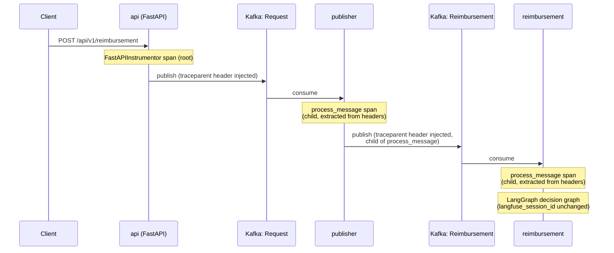

# Adding Tracing Support Design

**Spec**: `.specs/features/RA-2-adding-tracing-support/spec.md`
**Status**: Draft

---

## Architecture Overview

One new `shared.tracing` module owns everything OTel-specific — `TracerProvider`
init/shutdown, the Kafka header inject/extract helpers, and a consumer-side
span helper that both Kafka services reuse identically. `api`, `publisher`,
and `reimbursement` each call into it from their existing composition
roots (`api/main.py`'s module scope + `lifespan`, `publisher`/`reimbursement`'s
`_serve()`) — no new entrypoints, no restructured control flow.



All four spans — api's request span, publisher's `process_message`,
reimbursement's `process_message`, plus whatever internal spans
`FastAPIInstrumentor`/future auto-instrumentation add — share one trace ID
because each hop propagates context through the mechanism OTel calls
"inject/extract": `api` and `publisher` inject the *current* span's context
into outbound Kafka headers at publish time; `publisher` and `reimbursement`
extract that context from inbound headers and start their span as its child.

---

## Approach Exploration — Kafka Header Injection

This is the one genuine fork-in-the-road in this feature. Everything else
(where `TracerProvider` init/shutdown hooks go, where `FastAPIInstrumentor`
is called) is fully determined by the spec and the existing code shape.

**The problem, discovered by reading the pinned library (not assumed):**
`shared.producer.publish` calls `AIOProducer.produce(topic, value, ...)` —
`confluent-kafka` `2.15.0` (this repo's exact locked version, `uv.lock`),
`confluent_kafka/aio/producer/_AIOProducer.py:205-211`:

```python
if 'headers' in kwargs:
    raise NotImplementedError(
        "Headers are not supported in AIOProducer batch mode. "
        "Use the synchronous Producer.produce() method if headers are required."
    )
```

This is unconditional — it fires regardless of `batch_size`, including this
project's `batch_size=1` (`shared.producer.managed_producer`'s own default,
per AD-010). Confirmed current as of `confluent-kafka-python`'s latest
release via its own docs/CHANGELOG: "Per-message headers are not supported
in the current batched async produce path... use the synchronous
`Producer.produce(...)`, or offload a sync produce call to a thread executor."
Every current call site of `shared.producer.publish` (`api`'s create route,
`publisher.processing._insert_and_publish`, `reimbursement.validation._requeue`)
goes through this one function, so this blocks OTEL-04 outright as currently
implemented — not a hypothetical, a hard blocker for the feature's entire
point (P1's linked trace depends on headers actually carrying context).

**Option A — Bypass `AIOProducer.produce()`, drive the same underlying sync
`Producer` via its own executor (recommended).** `AIOProducer.__init__` already
constructs `self._producer = confluent_kafka.Producer(producer_conf)` and
`self.executor` (`ThreadPoolExecutor`), and every other blocking method on
`AIOProducer` (`poll`, `flush`, `purge`, `list_topics`, the transaction methods)
already delegates to `self._producer` via `self._call(...)` — reaching into
`producer._producer`/`producer.executor` from `shared.producer.publish` is a
direct extension of the pattern the library itself uses internally for
every one of its own blocking calls, not a novel hack. `publish()` calls
`loop.run_in_executor(producer.executor, produce_and_flush)`, where
`produce_and_flush` runs synchronously in that thread: `producer._producer.produce(topic=topic, value=payload, headers=headers, on_delivery=...)` then `producer._producer.flush(timeout_seconds)` —
`flush()` blocks (in that worker thread only) until the delivery callback
fires or the timeout elapses, then `publish()` raises `PublishFailed` if the
callback captured an error or `flush()` reports messages still queued.
Because `batch_size` is hard-set to `1` everywhere in this codebase already,
today's async batched path already flushes on every single message — this
change alters no observable latency/throughput behavior, only how the
flush is triggered.

**Option B — A second, dedicated synchronous `Producer` per service, used
only for header-carrying publishes, alongside the existing `AIOProducer`.**
Rejected: doubles Kafka client connections and idempotent-producer state per
process, splits `publish()`'s single code path across two producer objects
that `managed_producer`'s lifecycle (`close()`) would then need to cover
separately, and contradicts the "one producer per app" shape AD-010
established for exactly this kind of reason.

**Option C — Vendor/monkeypatch `AIOProducer.produce()` to remove the
`NotImplementedError` guard.** Rejected: patches over a deliberate upstream
safety check with local knowledge of that check's exact internal shape
(`_AIOProducer.py:205-211`) — precisely the kind of coupling a future
`confluent-kafka` upgrade (this project's `>=2.15.0` range allows any newer
one silently) could invalidate in the opposite direction, and with no
upstream signal that it changed. Higher maintenance burden than Option A for
no benefit — Option A already accepts the same private-attribute coupling in
a narrower, single-purpose way.

**Recommendation: Option A.**

---

## Code Reuse Analysis

### Existing Components to Leverage

| Component | Location | How to Use |
| --- | --- | --- |
| `shared.config.Config` / `load_config()` | `packages/shared/src/shared/config.py` | Extend with a `TracingConfig` field (`otlp_endpoint`), following the existing `KafkaConfig`/`DatabaseConfig`/`FailureLogConfig` pattern — one more `@dataclass(frozen=True)` block read via `os.getenv` inside the same cached loader. |
| `shared.signals.install_shutdown_handlers` | `packages/shared/src/shared/signals.py` | Unchanged — `reimbursement` keeps using it; `publisher` keeps its own separate handler (both out-of-scope-to-unify per spec). `shutdown_tracer(...)` is called from `_serve()`'s existing `async with` body, independent of which signal-install mechanism a service uses. |
| `shared.producer.managed_producer` / `publish` | `packages/shared/src/shared/producer.py` | `managed_producer` (the `AIOProducer` construction/lifecycle) is untouched. `publish`'s body changes per the Approach above; its public signature gains one new parameter (`headers`). |
| `shared.errors.PublishFailed` | `packages/shared/src/shared/errors.py` | Reused as-is — the new `publish()` implementation still raises exactly this exception on any delivery failure or timeout, preserving every current caller's error handling. |
| `AIOConsumer` message objects (`cimpl.Message`) | `publisher`/`reimbursement`'s `consumer.py` | `message.headers()`, `.topic()`, `.partition()`, `.offset()` are all already-stable, long-standing methods on the consumed message — no new consumer configuration needed to receive headers. |

### Integration Points

| System | Integration Method |
| --- | --- |
| Elastic APM Server (OTLP/HTTP ingest) | `shared.tracing.init_tracer` builds an `OTLPSpanExporter` pointed at `{otlp_endpoint}/v1/traces` (see Risks — the `/v1/traces` suffix must be added explicitly), wrapped in a `BatchSpanProcessor`, registered as the process's global `TracerProvider`. |
| LangFuse (`reimbursement`'s LangGraph decision graph) | No integration change — `agent.py:152-153`'s `langfuse_session_id` metadata keeps working unmodified; it simply now executes inside an already-current OTel span (`process_message`), per P2 AC3. |
| FastAPI (`api`) | `FastAPIInstrumentor.instrument_app(app)` called once at module scope, right after `app = FastAPI(lifespan=lifespan)`. |

---

## Components

### `shared.tracing` (new module)

- **Purpose**: Owns `TracerProvider` init/shutdown and the Kafka trace-context inject/extract helpers — the one place every service's OTel wiring comes from.
- **Location**: `packages/shared/src/shared/tracing.py`
- **Interfaces**:
  - `init_tracer(service_name: str, otlp_endpoint: str) -> TracerProvider` — builds `Resource.create({"service.name": service_name})`, an `OTLPSpanExporter(endpoint=f"{otlp_endpoint.rstrip('/')}/v1/traces")`, a `BatchSpanProcessor` wrapping it, registers the resulting `TracerProvider` via `trace.set_tracer_provider(...)`, and returns it so the caller can shut it down later. Sampling: no argument — `TracerProvider`'s own default (`ParentBased(AlwaysOn)`) is left untouched, per the seed decision.
  - `shutdown_tracer(provider: TracerProvider) -> None` — `provider.shutdown()` (flushes the `BatchSpanProcessor` and stops it in one call; no separate flush step needed).
  - `inject_headers() -> list[tuple[str, bytes]]` — builds a `dict[str, str]` carrier, `propagate.inject(carrier)` against the current context, returns `[(k, v.encode()) for k, v in carrier.items()]` (the wire shape `confluent_kafka.Producer.produce(headers=...)` expects).
  - `extract_context(headers: list[tuple[str, bytes]] | None) -> Context` — builds `{k: v.decode() for k, v in (headers or [])}`, returns `propagate.extract(carrier)`. Absent/empty headers naturally propagate() to an empty carrier, which OTel's own extract() turns into a context with no parent span — the consumer's subsequent `start_as_current_span` then starts a new root trace, satisfying P1 AC8 with no branching logic of our own.
  - `traced_message_span(tracer: Tracer, message: Message, span_name: str = "process_message") -> AbstractContextManager[Span]` — a small `@contextmanager` that extracts context from `message.headers()`, then `tracer.start_as_current_span(span_name, context=ctx, attributes={"messaging.kafka.topic": message.topic(), "messaging.kafka.partition": message.partition(), "messaging.kafka.offset": message.offset()})`. Used identically by `publisher/consumer.py` and `reimbursement/consumer.py`'s `run()` loops, wrapping the existing `handle_message(...)`/`commit(...)` lines with no change to their order or the loop's `while not stopping.is_set()` shape — satisfies OTEL-05 and OTEL-09 in one reused helper.
- **Dependencies**: `opentelemetry-sdk`, `opentelemetry-exporter-otlp-proto-http` (both new `shared` dependencies, per the seed request and grilling decision #4).
- **Reuses**: nothing pre-existing (this is genuinely new surface); its own four functions are then reused by every service.

### `shared.producer.publish` (modified)

- **Purpose**: Unchanged purpose (produce one message, await its delivery verdict, raise `PublishFailed` uniformly) — now always attaches trace-context headers, since header injection must apply uniformly to every call site (spec's Edge Cases: "there is exactly one `publish` function; this feature does not special-case some callers over others").
- **Location**: `packages/shared/src/shared/producer.py`
- **Interfaces**:
  - `publish(producer: AIOProducer, topic: str, payload: bytes, timeout_seconds: float) -> None` — signature unchanged at call sites (no caller passes headers explicitly); internally calls `shared.tracing.inject_headers()` itself and always produces with those headers via the Option-A sync path.
- **Dependencies**: `shared.tracing.inject_headers`.
- **Reuses**: `AIOProducer.executor` and `AIOProducer._producer` (see Risks — this is the one place the private-attribute coupling lives; kept to a single function so an upgrade break surfaces in one place).

**Why inject here, not at each of the three call sites:** resolves an
apparent gap between P1 AC4's literal wording ("api or publisher publishes
... through `shared.producer.publish`") and the Edge Cases' broader "publisher
or reimbursement" retry-republish language — `reimbursement.validation._requeue`
also calls `shared.producer.publish` (confirmed by reading the code), so AC4's
enumeration is incomplete relative to the codebase. Injecting inside
`publish()` itself covers all three services' call sites — including any
future one — without needing AC4 amended, and is what the Edge Cases bullet
already asks for.

### `api/main.py` (modified)

- **Purpose**: Add `TracerProvider` init/shutdown and `FastAPIInstrumentor` wiring around the existing lifespan, with no route-level changes to *how spans get created*.
- **Location**: `packages/api/src/api/main.py`
- **Changes**:
  - Module scope, after `load_dotenv()`/`logging.basicConfig(...)` and before `app = FastAPI(...)`: `_tracer_provider = init_tracer("reimbursement-analyzer-api", load_config().tracing.otlp_endpoint)`.
  - Immediately after `app = FastAPI(lifespan=lifespan)`: `FastAPIInstrumentor.instrument_app(app)` — exactly once, no per-route code (AC3).
  - Inside `lifespan`, after the `yield` and still inside the innermost `async with managed_pool(...)` block (i.e. the same statement position the spec's AC2 describes: "after `yield`, before the resource-managing `async with` block exits"): `shutdown_tracer(_tracer_provider)`.
- **Dependencies**: `opentelemetry-instrumentation-fastapi` (new `api`-only dependency).

### `api`'s GET/PUT routes (modified, one line each)

- **Purpose**: Stamp `reimbursement.uuid` on the auto-instrumented request span for the two routes where the uuid is already a resolved path parameter (P2 AC2).
- **Location**: `packages/api/src/api/reimbursement/get/route.py` (`get_reimbursement_by_uuid`), `packages/api/src/api/reimbursement/update/route.py` (the PUT handler) — both already receive `uuid: UUID` as a function parameter.
- **Change**: one line at the top of each handler body: `trace.get_current_span().set_attribute("reimbursement.uuid", str(uuid))`.
- **Reconciling this with the Out-of-Scope row** ("Per-route manual span instrumentation in api... no per-route changes"): that row scopes out per-route *span creation* — `FastAPIInstrumentor` remains the only thing that creates a span per route. A one-line attribute stamp on the span that instrumentation already created is enrichment, not a new instrumentation code path, and is the smallest change able to satisfy P2 AC2 at all. Flagged here as a spec-precision note, not a silent scope decision.

### `publisher/consumer.py`, `reimbursement/consumer.py` (modified)

- **Purpose**: Wrap each consumed message's existing handling in `shared.tracing.traced_message_span`, and stamp `reimbursement.uuid` once it's known.
- **Location**: both services' `run()` functions and `_serve()`.
- **Changes**:
  - `_serve()`: `provider = init_tracer("reimbursement-analyzer-publisher" | "reimbursement-analyzer-reimbursement", config.tracing.otlp_endpoint)` near the top (alongside the existing `config = load_config()`); `shutdown_tracer(provider)` right after `await run(deps, consumer, stopping)` returns, still inside the `async with (managed_pool(...), managed_producer(...), managed_consumer(...))` block (matches AC2's wording exactly).
  - `run()`: the body between `error = message.error()` and `await consumer.commit(...)` moves inside `with traced_message_span(tracer, message):`, unchanged in every other respect — same `handle_message`/`_LazyJSON` logging, same commit call, same `while not stopping.is_set()` loop shape.
  - `reimbursement.uuid` stamping: `publisher.processing.handle_message` and `reimbursement.validation.handle_message` each call `trace.get_current_span().set_attribute("reimbursement.uuid", str(uuid))` once the envelope is parsed and the uuid is known — reading the *current* span (already the `process_message` span opened in `consumer.py`'s `run()`) rather than threading a new `span` parameter down through `handle_message`'s existing signature, so nothing about that function's call shape changes.
- **Dependencies**: none new (both already depend on `shared` transitively for the tracing pieces).

---

## Data Models

No persisted data model changes. Two wire-shape conventions this feature introduces:

```python
KafkaHeaders = list[tuple[str, bytes]]   # confluent_kafka's producer/consumer header wire shape
TraceCarrier = dict[str, str]            # what opentelemetry.propagate.inject/extract operate on
```

`shared.tracing.inject_headers`/`extract_context` are the only two places that
convert between them.

### `shared.config.TracingConfig` (new)

```python
@dataclass(frozen=True)
class TracingConfig:
    otlp_endpoint: str
```

Added as a `tracing: TracingConfig` field on the existing `Config` dataclass,
populated in `load_config()` via
`os.getenv("OTEL_EXPORTER_OTLP_ENDPOINT", "http://apm-server.shared-services.svc.cluster.local:8200")` —
same pattern as every other env-var-backed field already there.

---

## Error Handling Strategy

| Error Scenario | Handling | User/Operator Impact |
| --- | --- | --- |
| `OTEL_EXPORTER_OTLP_ENDPOINT` unset | `load_config()` defaults it to the in-cluster APM Server address (AC1/edge case) | None — service starts normally. |
| Elastic APM Server unreachable at startup or export time | No custom fallback (per spec's Assumptions table). `BatchSpanProcessor`/`OTLPSpanExporter`'s own best-effort export swallows the failure internally and never raises into the caller. | Spans for that window are lost; HTTP requests and Kafka messages keep being served/processed unaffected. |
| Kafka message with no trace-context headers | `extract_context([])` → `propagate.extract({})` → a context with no parent span; the consumer's `start_as_current_span` then starts a fresh root trace | Trace still exists, just not linked to an upstream one — matches P1 AC8 exactly, no special-case code. |
| `producer._producer.produce(...)`/`.flush(...)` raises or times out (broker error, buffer full, delivery timeout) | Caught by `publish()`'s existing `except Exception as exc: raise PublishFailed(...)` wrapper — unchanged from today | Same as today: caller (api route / publisher / reimbursement's requeue path) handles `PublishFailed` exactly as it already does. |

---

## Risks & Concerns

| Concern | Location | Impact | Mitigation |
| --- | --- | --- | --- |
| `AIOProducer.produce()` unconditionally raises `NotImplementedError` when `headers` is passed, at every batch size, on the exact locked version (`confluent-kafka` `2.15.0`) | `confluent_kafka/aio/producer/_AIOProducer.py:205-211` (third-party); `shared/producer.py`'s `publish()` | Without a fix, P1 AC4 (the feature's entire linking mechanism) cannot be implemented via the current `publish()` at all | Approach A above: bypass `AIOProducer.produce()`, drive `producer._producer`/`producer.executor` directly (see Approach Exploration). |
| That fix reaches into `AIOProducer._producer`/`.executor` — private (underscore-prefixed), undocumented-as-public attributes of a still-`beta` async wrapper | `shared/producer.py`'s new `publish()` body | A future `confluent-kafka` upgrade (this project's `>=2.15.0` range permits any newer version silently) could rename or restructure these without any deprecation signal, silently breaking trace propagation (not the business path — `publish()` would presumably raise, which is at least loud) | Add one guard/smoke test asserting `isinstance(producer._producer, confluent_kafka.Producer)` and `hasattr(producer, "executor")` against the real `managed_producer(...)`, so an incompatible upgrade fails the suite instead of failing silently in production; comment the exact version this was verified against. |
| `OTLPSpanExporter(endpoint=...)` does **not** auto-append `/v1/traces` when `endpoint` is passed explicitly (confirmed by reading `opentelemetry-exporter-otlp-proto-http`'s source — that auto-append only happens when the exporter falls back to resolving `OTEL_EXPORTER_OTLP_ENDPOINT` itself, not when a caller passes `endpoint=` directly) | `shared.tracing.init_tracer` | Passing the bare `http://apm-server...:8200` value straight through would silently export to the wrong path — every span POST fails, with no error visible to the business path (per the "no silent fallback" decision), defeating the feature's own success criteria (a real trace landing in APM Server) with nothing to flag it | `init_tracer` builds the exporter with `endpoint=f"{otlp_endpoint.rstrip('/')}/v1/traces"` explicitly, never passing the bare host through unmodified. |
| `shared/tests/test_producer.py`'s existing fakes (`_ImmediateFakeProducer`, `_NeverResolvesFakeProducer`, `_OutOfOrderFakeProducer`) model `producer.produce()` as an awaitable — the exact method the new `publish()` no longer calls in production | `packages/shared/tests/test_producer.py` | All four existing `DescribePublish` tests test a code path that no longer reflects production behavior once this ships; they need rewriting, not extending, against fakes shaped like the new `._producer`/`.executor` contract | Flagged for Tasks: rewrite the fakes to a `_producer`/`executor`-shaped double (a fake sync `Producer` plus a real or fake executor), preserving the same four behavioral guarantees (resolves-on-ack, raises-on-broker-error, raises-on-timeout, per-call isolation under concurrent out-of-order resolution) against the new implementation. |
| `docker-compose.yml`'s removal (P3 AC3) conflicts with active decision AD-038, which assumes the file's continued existence | `.specs/STATE.md` `AD-038` | Leaving AD-038 marked `Active` after the file it governs is deleted would be a stale, misleading project-level decision | AD-038 superseded by a new `AD-040` appended to `.specs/STATE.md` as part of this Design pass (see below). |
| No OTel span-assertion test infrastructure exists in the repo yet | n/a (new ground) | Tests for `traced_message_span`, `init_tracer`, and header inject/extract need a way to assert span names/attributes without a live APM Server | `opentelemetry-sdk` ships `opentelemetry.sdk.trace.export.in_memory_span_exporter.InMemorySpanExporter` for exactly this — a `TracerProvider` wired to it in test setup, read back via `get_finished_spans()`. Standard library-provided test utility, no new dependency. |

---

## Tech Decisions

| Decision | Choice | Rationale |
| --- | --- | --- |
| Kafka header injection mechanism | Bypass `AIOProducer.produce()`; drive `producer._producer`/`.executor` synchronously (Approach A) | See Approach Exploration — the only option that keeps one producer per app and doesn't fork upstream internals. |
| Where header injection happens | Inside `shared.producer.publish` itself, unconditionally | Applies uniformly to all three services' call sites (including `reimbursement`'s own requeue-republish, which AC4's wording under-states but the Edge Cases require) with one change instead of three. |
| `OTEL_EXPORTER_OTLP_ENDPOINT` config placement | New `TracingConfig` field on `shared.config.Config`, read via `load_config()` | Matches this repo's existing "single source of truth for every env-var read" convention (`config.py`'s own docstring) rather than a second, independent env-read inside `shared.tracing`. |
| OTLP exporter path suffix | `init_tracer` appends `/v1/traces` to the configured endpoint explicitly | `OTLPSpanExporter` only auto-appends when it resolves the env var itself, not when `endpoint=` is passed in — verified by reading the exporter's source (see Risks). |
| Dependency versions | `opentelemetry-sdk>=1.44.0`, `opentelemetry-exporter-otlp-proto-http>=1.44.0`, `opentelemetry-instrumentation-fastapi>=0.65b0` | Current stable releases as of this Design pass (verified via PyPI JSON metadata), each declaring `requires_python >= 3.10` — no upper bound, no known incompatibility with this project's Python 3.14.7. Ranges via `>=`, matching this repo's existing dependency-declaration convention (never `==`). |
| `reimbursement.uuid` stamping on api's GET/PUT spans vs. the "no per-route changes" scope-out | A one-line `set_attribute` call in each handler, not a new span | See the GET/PUT Components entry above — reconciles an apparent tension between the Out-of-Scope table and P2 AC2. |

**Project-level decision recorded:** `AD-040` appended to `.specs/STATE.md` `## Decisions`, superseding `AD-038` (docker-compose.yml removal, per P3 AC3, retires the convention AD-038 established for a file that no longer exists).

---

## Tips applied

- Confirmed with the pinned dependency's own source and current upstream docs before designing around it (the `AIOProducer` headers gap) — not assumed.
- Reused `shared.config`/`shared.signals`/`shared.producer`'s existing shapes rather than inventing new ones.
- The one real fork (Kafka header injection) got a full approach comparison; everything else the spec/codebase already fully determines.
