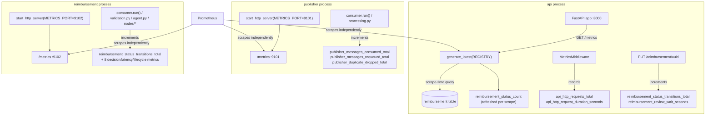

# Prometheus Metrics MVP Design

**Spec**: `.specs/features/RA-3-prometheus-metrics-mvp/spec.md`
**Grilling session**: `.specs/features/RA-3-prometheus-metrics-mvp/grilling-session.md`
**Status**: Draft

---

## Sizing

Large/multi-component, per Specify's own classification: 3 services touched, 1 new
workspace dependency, 16 new metric objects, 1 new domain enum, a middleware
addition, a SQL change, and 2 documentation deliverables. Design runs in full.

## Decisions Read (`.specs/STATE.md` `## Decisions`)

Read in full before drafting. The ones this design actually conforms to or
extends:

- **AD-025** (`shared` owns cross-service persistence/infra, sliced by
  domain) — governs where the one truly cross-service metric
  (`reimbursement_status_transitions_total`, owned by both `api` and
  `reimbursement`) and the `start_metrics_server()` helper live.
- **AD-019/AD-023** (`shared.config`, single cached `load_config()`;
  single-service tuning stays in that service's own `config.py`) — governs
  where `METRICS_PORT` is declared (`publisher.config.PublisherConfig` /
  `reimbursement.config.AgentConfig`, not `shared.config.Config`).
- **AD-032** (per-node `ModelConfig` nesting) — the model names fed into
  `reimbursement_agent_node_duration_seconds`'s `model` label come from
  `AgentModelsConfig`, already available at `build_graph()` time.
- **AD-039** (decision-stage failure escalates immediately, no
  retry-then-escalate) — is exactly what makes
  `reimbursement_decision_failure_escalations_total`'s single increment site
  (`_escalate_decision_failure`) unambiguous: there is no separate retry loop
  to double-count.
- **AD-036/AD-037** (accepting a real-but-currently-unreachable invariant,
  documented rather than defended by an extra DB round trip, matching
  `escalate_existing`'s own precedent) — the direct precedent this design
  leans on for hardcoding the reimbursement-side transition's `from` label
  (see Tech Decisions).

No conflicting active decision found; nothing here needs a new AD to
supersede anything. No confirmed lesson in `python3 scripts/lessons.py list
--status confirmed` applies to implementation (L-003 is about spec-writing,
already reflected in spec.md's own Independent Test sections).

---

## Architecture Overview

Three independent, unauthenticated `/metrics` scrape targets — one per
service — each backed by that process's own default `prometheus_client`
registry. No shared registry, no aggregation, no multiprocess mode (single
uvicorn worker in `api`, single asyncio process in `publisher`/
`reimbursement`). `api` exposes `/metrics` as one more FastAPI route on its
existing HTTP port; `publisher` and `reimbursement` — neither of which has
an HTTP server today — each start a second, tiny HTTP server via
`prometheus_client.start_http_server()` on a dedicated port.



`reimbursement_status_transitions_total` is the one metric two processes
each construct and increment independently — same name/labels, defined once
in `shared.metrics` so the two definitions cannot drift, but each process's
Counter object is its own in-memory instance with no shared state.

---

## Approach Exploration

The macro architecture (3 endpoints, `prometheus_client`, no auth) is
already locked by the grilling session and spec.md's Out of Scope table —
not re-opened here. Three narrower implementation choices remained open and
are resolved below (spec.md Assumption 3 explicitly delegates the bucket
question to Design; the other two are pure implementation-approach calls
with no spec text either way). `grilling-session.md`'s own decision 12 note
("no further pauses expected") plus this session having no interactive user
available means each is resolved with a recommendation rather than left as
an open question — reversible in review if wrong.

### 1. How `api`'s HTTP RED metrics get wired

| Approach | Trade-off |
| --- | --- |
| **A. Raw ASGI middleware class (recommended)** | Matches `CorrelationIdMiddleware`'s existing, already-justified pattern (`middleware.py`'s own docstring: avoids `BaseHTTPMiddleware`'s `ContextVar`/streaming edge cases). Zero new dependencies. Reads `scope["route"]` directly — the same mechanism `starlette-exporter`/`prometheus-fastapi-instrumentator` rely on. |
| B. `BaseHTTPMiddleware` / `@app.middleware("http")` | Simpler to write, but reintroduces exactly the wrapper class `middleware.py` already rejected for a different metric (correlation id) — inconsistent with the one middleware this codebase already has an opinion about. |
| C. Add `prometheus-fastapi-instrumentator` as a dependency | Batteries-included, but spec Assumption 4 / grilling decision 13 scope this feature to exactly one new dependency (`prometheus_client`); pulling in a second library for ~30 lines of logic this codebase can own directly is not justified. |

**Chosen: A.** New `MetricsMiddleware` class in `api/middleware.py`, sibling
to `CorrelationIdMiddleware`, added via `app.add_middleware(MetricsMiddleware)`.

### 2. How per-node graph timing gets wired

| Approach | Trade-off |
| --- | --- |
| **A. Wrap each node callable once, at graph-build time (recommended)** | One function (`_timed_node`) in `agent.py`, applied inside `_wire()` — a single choke point, zero duplication, and the exact `Node` Protocol shape (`agent/types.py`) means a plain wrapping closure satisfies it structurally with no node file touched for timing. |
| B. Add timing inside each of the 5 node classes' own `__call__` | 5x the surface area for the same measurement, and mixes cross-cutting instrumentation into files whose docstrings already state a narrow purpose ("decides, doesn't persist", etc.) — the kind of scope creep `apply_agent_decision.py`'s own docstring explicitly guards against ("Never authors its own status/decision_reason"). |
| C. A LangGraph/LangChain `CallbackHandler`, mirroring the LangFuse handler already wired in `agent.py` | Real prior art in this exact file, but requires mapping callback events (`on_chain_start`/`on_chain_end`) back onto node names and re-deriving per-node model attribution the callback API doesn't hand you directly — more moving parts for an identical outcome to Approach A. |

**Chosen: A.**

### 3. Sourcing the `from` label on `reimbursement_status_transitions_total`

| Approach | Trade-off |
| --- | --- |
| **A. Hardcode `from="pending"` on the `reimbursement`-side increment; read the true prior status via a `WITH old AS (...)` CTE on the `api`-side `approve()`/`reject()` statements (recommended, asymmetric by design)** | `reimbursement` provably only ever writes a status-changing decision onto a row that started at `pending` (publisher's `insert_pending` is the only entry point into the pipeline `reimbursement` consumes; the staleness guard in `validation.py`'s `_resolve` — `envelope.published_at < row["updated_at"]` — means a row that already left `pending` is never written to again by this service). `api`'s `PUT` route has no equivalent invariant: `ELIGIBLE_STATUSES = ["human-review", "auto-rejected", "human-rejected"]` genuinely has three possible priors, so a single hardcoded value would be wrong up to two-thirds of the time. |
| B. CTE-based true prior status on both sides, uniformly | More "correct-looking" but adds a second SQL round-trip shape and a `repository.update_decision()` signature change (`bool` → a record/tuple) that ripples into `apply_policies.py`, `apply_agent_decision.py`, and `send_human_review.py`'s `escalate_existing()` — three call sites changed for a label value that is provably constant today. Rejected as unjustified complexity per the same reasoning AD-036/AD-037 already applied to `delete_pending`'s savepoint question in this exact module. |
| C. Skip the `from` label's accuracy, always pass the caller's own `eligible_statuses`/assumed value | Silently wrong whenever more than one status is eligible (api's own case) — rejected outright, not a real option. |

**Chosen: A.** Flagged in Risks & Concerns with its exact mitigation (an
inline comment on the invariant, not a test — the invariant is architectural,
not a code path this feature can unit-test without faking a redelivery race).

---

## Code Reuse Analysis

### Existing Components to Leverage

| Component | Location | How to Use |
| --- | --- | --- |
| `CorrelationIdMiddleware` (raw ASGI middleware pattern) | `packages/api/src/api/middleware.py` | Copy its shape (constructor + `send_wrapper` intercepting `http.response.start`) for the new `MetricsMiddleware` — same file. |
| `configure_logging()` single-entrypoint-per-process convention | `packages/shared/src/shared/logging.py`; called from `api/main.py`, `publisher/consumer.py`, `reimbursement/consumer.py` | `start_metrics_server()` follows the identical shape: one `shared`-owned function, called once per process at startup, right after `configure_logging()`. |
| `shared.reimbursement.repository` (all SQL lives here) | `packages/shared/src/shared/reimbursement/repository.py` | Add one new read statement (`count_by_status`) here rather than inlining SQL in `api/metrics.py` — matches the file's own stated scope ("Every SQL statement against the `reimbursement` table"). |
| `Node` Protocol | `packages/reimbursement/src/reimbursement/agent/types.py` | `_timed_node()`'s wrapper closure satisfies this structurally — no protocol change needed. |
| `AgentModelsConfig`/`ModelConfig` (AD-032) | `packages/reimbursement/src/reimbursement/config.py` | Source of the `model` label fed into `reimbursement_agent_node_duration_seconds` for `extract_fields`/`analysis`. |
| `PublisherConfig`/`AgentConfig` single-service-config pattern | `packages/publisher/src/publisher/config.py`, `packages/reimbursement/src/reimbursement/config.py` | `metrics_port` is a single-service tuning value (only that service's `start_http_server()` reads it) — added here, not to `shared.config.Config`, mirroring the file's own documented reasoning for `item_concurrency`/`ai`/`models`. |
| `sanitize()`, `log_event()`, `failure_log.write()` | `shared/errors.py`, `shared/logging.py`, `shared/failure_log.py` | Unused by this feature directly — metrics failures (the one DB-query failure mode) use a plain `logger.warning(...)`, per spec Assumption 6's own framing ("a metrics scrape is not a reimbursement decision"), not the traceability-grade failure_log sink. |

### Integration Points

| System | Integration Method |
| --- | --- |
| `prometheus_client`'s default `CollectorRegistry` | Every metric object below is a module-level constant, constructed once at import time (the Edge Cases table's "construct once, import the module-level instance" rule) — never per-request/per-message construction. |
| FastAPI `app.state.pool` | `api/metrics.py`'s `refresh_status_gauge()` takes the same `asyncpg.Pool` the `/metrics` route resolves via the existing `Depends(get_pool)` dependency — no new DI wiring. |
| `docker-compose.yml` / k3s manifests | Out of scope for this feature's own deployment config (spec's Out of Scope table) — `METRICS_PORT` env vars and the 3 scrape targets are a tracked `docs/codebase/CONCERNS.md` follow-up, not built here. |

---

## Dependency Placement

`prometheus-client` is added to **`packages/shared/pyproject.toml`
`dependencies`** only (spec Assumption 4) — identical precedent to
`ecs-logging` (RA-1): declared once where the cross-service code that
imports it lives, reaching `api`/`publisher`/`reimbursement` transitively
through their existing `shared = { workspace = true }` dependency. None of
the three service `pyproject.toml` files gain a direct entry — `shared`'s
own `logging.py`/`producer.py` already establish this exact pattern (their
direct dependencies — `ecs-logging`, `confluent-kafka` — aren't re-declared
in `api`/`publisher`/`reimbursement` either).

```toml
# packages/shared/pyproject.toml
dependencies = [
    "asyncpg>=0.31.0",
    "confluent-kafka>=2.15.0",
    "ecs-logging>=2.3.0",
    "prometheus-client>=0.24.1",   # verify latest 0.24.x via Context7/PyPI at Execute time
    "pydantic[email]>=2.13.4",
]
```

---

## Components

### `shared.metrics` (new file)

- **Purpose**: The one metric genuinely owned by two services
  (`reimbursement_status_transitions_total`), plus the `start_http_server()`
  wrapper both `publisher` and `reimbursement` call at startup.
- **Location**: `packages/shared/src/shared/metrics.py`
- **Interfaces**:
  - `reimbursement_status_transitions_total: Counter` — constructed as
    `Counter("reimbursement_status_transitions", "...", labelnames=["from", "to"])`.
    **`from` is a Python reserved word** — every call site MUST use
    positional `.labels(from_value, to_value)`, matching the declared
    `labelnames` order exactly; `.labels(from=..., to=...)` is a
    `SyntaxError` and must never be attempted.
  - `start_metrics_server(port: int) -> None` — calls
    `prometheus_client.start_http_server(port)`, then logs one `info` line
    (`"metrics server listening on port %s"`). Raises on bind failure
    (e.g. port already in use) rather than swallowing it — consistent with
    `consumer.check_startup_config()`'s existing fail-fast-at-boot
    convention in both `publisher` and `reimbursement`.
- **Dependencies**: `prometheus_client`.
- **Reuses**: nothing new; this is the module AD-025's "cross-domain
  infrastructure stays at shared root" clause describes.

### `api.metrics` (new file)

- **Purpose**: Every `api`-only metric object, plus the scrape-time DB
  refresh function for the one Gauge.
- **Location**: `packages/api/src/api/metrics.py`
- **Interfaces**:
  - `api_http_requests_total: Counter` — `Counter("api_http_requests", "...", labelnames=["method", "path", "status_code"])`.
  - `api_http_request_duration_seconds: Histogram` — `Histogram("api_http_request_duration_seconds", "...", labelnames=["method", "path"], buckets=(0.005, 0.01, 0.025, 0.05, 0.1, 0.25, 0.5, 1, 2.5, 5, 10))` (`prometheus_client`'s own default HTTP-latency-shaped buckets — appropriate for an API layer with no LLM calls in its own request path).
  - `reimbursement_status_count: Gauge` — `Gauge("reimbursement_status_count", "...", labelnames=["status"])`.
  - `reimbursement_review_wait_seconds: Histogram` — `Histogram("reimbursement_review_wait_seconds", "...", buckets=(60, 300, 900, 3600, 14400, 43200, 86400, 259200, 604800))` (1 minute to 1 week — the "minutes-to-days" scale spec Assumption 3 mandates, deliberately sharing no bucket list with any `reimbursement`-side histogram).
  - `UNMATCHED_PATH_LABEL = "unmatched"` — the fixed literal for a 404's `path` label (Assumption 7).
  - `ALL_STATUSES: tuple[str, ...]` — the 6 values from `0001.create-reimbursement.sql`'s `CHECK` constraint (AD-003), used to zero-fill the Gauge so a status with 0 current rows still reports `0`, not an absent series.
  - `async def refresh_status_gauge(pool: asyncpg.Pool) -> None` — queries `repository.count_by_status`, zero-fills `ALL_STATUSES`, sets the Gauge; on any exception, logs one `warning` and returns without raising (Assumption 6/Edge Cases: the scrape still returns the other 15 metrics).
- **Dependencies**: `prometheus_client`, `asyncpg`, `shared.reimbursement.repository`, `shared.config.load_config` (for `acquire_timeout_seconds`).
- **Reuses**: `shared.reimbursement.repository`'s existing pool/connection pattern.

### `api.middleware.MetricsMiddleware` (new class, existing file)

- **Purpose**: Records `api_http_requests_total`/`api_http_request_duration_seconds` for every HTTP request, success or error, with a route-template `path` label.
- **Location**: `packages/api/src/api/middleware.py` (alongside `CorrelationIdMiddleware`)
- **Interfaces**: `__call__(self, scope, receive, send) -> None` — raw ASGI middleware, registered via `app.add_middleware(MetricsMiddleware)` in `main.py`.
- **Behavior**:
  ```python
  class MetricsMiddleware:
      def __init__(self, app): self.app = app

      async def __call__(self, scope, receive, send):
          if scope["type"] != "http":
              await self.app(scope, receive, send)
              return
          method = scope["method"]
          status_holder = {"status_code": 500}   # default if no response.start is ever sent

          async def send_wrapper(message):
              if message["type"] == "http.response.start":
                  status_holder["status_code"] = message["status"]
              await send(message)

          start = time.monotonic()
          try:
              await self.app(scope, receive, send_wrapper)
          finally:
              duration = time.monotonic() - start
              route = scope.get("route")
              path = route.path if route is not None else UNMATCHED_PATH_LABEL
              status_code = str(status_holder["status_code"])
              api_http_requests_total.labels(method, path, status_code).inc()
              api_http_request_duration_seconds.labels(method, path).observe(duration)
  ```
  `scope.get("route")` is populated by Starlette's router *inside* the
  `await self.app(...)` call, on the same mutable `scope` dict this
  middleware holds — the standard mechanism `starlette-exporter`/
  `prometheus-fastapi-instrumentator` both rely on for path-template
  extraction. `errors.py`'s `add_exception_handler(Exception, ...)`
  catch-all means the `try/finally`'s `status_code=500` default is a
  defensive fallback, not the expected path — nearly every response,
  including unhandled exceptions, already produces a clean
  `http.response.start` before reaching this middleware.
- **Dependencies**: `api.metrics`.
- **Reuses**: `CorrelationIdMiddleware`'s exact raw-ASGI-class shape and
  `send_wrapper` interception technique.

### `api.main` (existing file, additive changes)

- Add `/metrics` route:
  ```python
  from prometheus_client import CONTENT_TYPE_LATEST, generate_latest, REGISTRY
  from starlette.responses import Response
  from api.metrics import refresh_status_gauge

  @app.get("/metrics")
  async def metrics(pool: asyncpg.Pool = Depends(get_pool)) -> Response:
      await refresh_status_gauge(pool)
      return Response(generate_latest(REGISTRY), media_type=CONTENT_TYPE_LATEST)
  ```
  Registered alongside the existing `/health` route (AC1), no auth
  dependency added.
- Add `app.add_middleware(MetricsMiddleware)` next to the existing
  `app.add_middleware(CorrelationIdMiddleware)` line.

### `shared.reimbursement.repository` (existing file, additive changes)

- New statement + function, following the file's existing naming
  convention (`_UPPER_SNAKE` SQL constant, lowercase async function):
  ```python
  _COUNT_BY_STATUS = "SELECT status, count(*) AS count FROM reimbursement GROUP BY status"

  async def count_by_status(conn: asyncpg.Connection) -> list[asyncpg.Record]:
      """One row per status currently present; a status with zero rows is
      simply absent — the caller (api.metrics.refresh_status_gauge)
      zero-fills against the full CHECK-constraint status list."""
      return await conn.fetch(_COUNT_BY_STATUS)
  ```
- `_APPROVE`/`_REJECT` gain a `WITH old AS (...)` CTE capturing the row's
  pre-write `status`/`updated_at`, exposed as extra `RETURNING` columns —
  both statements' `WHERE` clause, `SET` clause, and existing return shape
  (`asyncpg.Record | None`) are otherwise unchanged:
  ```sql
  _APPROVE = """
      WITH old AS (
          SELECT status, updated_at FROM reimbursement WHERE uuid = $1
      )
      UPDATE reimbursement
      SET status = 'human-approved',
          receipts_value = $3,
          receipts_date = $4,
          currency = $5,
          decision_reason = $6,
          updated_at = now()
      WHERE uuid = $1 AND status = ANY($2::text[])
      RETURNING *, (SELECT status FROM old) AS from_status, (SELECT updated_at FROM old) AS from_updated_at
  """
  ```
  Same shape for `_REJECT` (its own `SET` clause unchanged). The `old` CTE
  and the main `UPDATE` share one statement-level snapshot, so `old`
  reliably reads the pre-update row even though both run in the same
  round trip — no separate `SELECT ... FOR UPDATE` needed (matching this
  file's own documented reasoning for why `approve()`/`reject()` never take
  an explicit row lock).

### `shared.reimbursement.use_cases.apply_decision` (existing file, modified)

- **Purpose (unchanged)**: write a decision onto an existing row. **New**:
  the single choke point for `reimbursement_status_transitions_total` on
  the `reimbursement` side — every reimbursement-side status write funnels
  through this one function (`apply_policies.py`, `apply_agent_decision.py`,
  and `send_human_review.py`'s `escalate_existing()` all call it), so
  instrumenting here covers all of them with one change.
  ```python
  from shared.metrics import reimbursement_status_transitions_total

  async def apply_decision(conn, uuid, status, decision_reason, *, receipts_value=None, receipts_date=None, currency=None) -> UUID | None:
      updated = await repository.update_decision(conn, uuid, status, decision_reason,
                                                   receipts_value=receipts_value,
                                                   receipts_date=receipts_date, currency=currency)
      if updated:
          # "pending" is hardcoded, not queried — see design.md's Approach
          # Exploration #3 and Risks & Concerns for the invariant this relies on.
          reimbursement_status_transitions_total.labels("pending", status).inc()
          return uuid
      return None
  ```

### `api.reimbursement.update.route` (existing file, modified)

- After a successful `approve_reimbursement`/`reject_reimbursement` call
  (the `else` branch of the existing `try/except`, before the connection is
  released), capture the CTE's extra columns off the *decision* row — not
  the later re-fetched `row` used for the response, which doesn't carry
  them:
  ```python
  decision_row = await approve_reimbursement(...)  # or reject_reimbursement(...)
  # existing get_reimbursement(conn, uuid) call is unchanged, still named `row`
  ```
  Then, only once `decision_write_error is None` (i.e. after the existing
  failure_log/raise branch), before building the response:
  ```python
  from shared.metrics import reimbursement_status_transitions_total
  from api.metrics import reimbursement_review_wait_seconds

  from_status = decision_row["from_status"]
  to_status = row["status"]
  reimbursement_status_transitions_total.labels(from_status, to_status).inc()
  if from_status == "human-review":
      wait_seconds = (datetime.now(UTC) - decision_row["from_updated_at"]).total_seconds()
      reimbursement_review_wait_seconds.observe(wait_seconds)
  ```
  The `if from_status == "human-review"` gate is load-bearing: AD-027
  confirms `auto-rejected`/`human-rejected` are also `PUT`-eligible sources,
  but a row that never passed through `human-review` has no "entered
  human-review" instant to measure — `reimbursement_review_wait_seconds`
  observes only the genuine human-review-queue-wait case (AC2's literal
  scope).

### `reimbursement.agent.agent` (existing file, modified)

- `_timed_node(name: str, node: Node, model_name: str = "") -> Node` — new
  private helper:
  ```python
  def _timed_node(name: str, node: Node, model_name: str = "") -> Node:
      async def wrapper(state: State, config: RunnableConfig) -> dict[str, Any]:
          start = time.monotonic()
          try:
              return await node(state, config)
          finally:
              reimbursement_agent_node_duration_seconds.labels(name, model_name).observe(
                  time.monotonic() - start
              )
      return wrapper
  ```
  `model_name` defaults to `""` — the concrete, always-supplied value
  standing in for AC3's "omitted for the other three [nodes]" (Prometheus
  label sets are fixed-arity; there is no way to truly omit a declared
  label per observation, so `""` is the omission encoding, documented here
  and in `docs/METRICS.md`).
- `_wire(nodes: dict[str, Node], node_models: dict[str, str] | None = None) -> CompiledStateGraph` — gains the optional `node_models` param (default `{}`, so every existing routing-test call site keeps working unchanged); wraps each node via `_timed_node` before `graph.add_node(...)`.
- `build_graph()` passes `{"extract_fields": config.models.extract_fields.model_name, "analysis": config.models.analysis.model_name}` as `node_models`.
- `decide()` wraps its own `await graph.ainvoke(...)` call in `time.monotonic()`/`try`/`finally`, observing `reimbursement_agent_decision_duration_seconds` unconditionally (success or failure — AC1's literal requirement; a raised exception still hits the `finally`, then re-propagates to `validation.py`'s `_decide()` unchanged).

### `reimbursement.agent.nodes.extract_fields` / `.analysis` (existing files, modified)

- Both wrap their own `await self._model.ainvoke(messages)` call:
  ```python
  try:
      result = await self._model.ainvoke(messages)
  except Exception:
      reimbursement_agent_llm_calls_total.labels(self._model_name, "failure").inc()
      raise
  reimbursement_agent_llm_calls_total.labels(self._model_name, "success").inc()
  ```
  The `raise` is unchanged control flow — `extract_fields.py`/`analysis.py`
  today let an `ainvoke` exception propagate uncaught up to
  `validation.py`'s `_decide()`, which is exactly what feeds
  `reimbursement_decision_failure_escalations_total` below; this metric
  adds an observation, not a new catch.

### `reimbursement.agent.nodes.apply_policies` (existing file, modified)

- New `PolicyRule` enum, module-local (single consumer — this file and its
  own tests):
  ```python
  class PolicyRule(str, Enum):
      STALE_RECEIPT_REJECT = "stale-receipt-reject"
      LOW_VALUE_AUTO_APPROVE = "low-value-auto-approve"
      HIGH_VALUE_HUMAN_REVIEW = "high-value-human-review"
  ```
  Each of the three `if`/`elif` branches (currently unlabeled) sets a
  `rule: PolicyRule` value in addition to today's `status`/`decision_reason`,
  and increments `reimbursement_policy_rule_triggered_total.labels(rule.value).inc()`
  immediately once the rule is determined to have fired — independent of
  whether the subsequent DB write (`persisted`) succeeds, matching AC2's
  literal wording ("WHEN a deterministic rule fires... THEN system SHALL
  increment"). The ambiguous-zone `else` branch (today's
  `requires_llm_judgment=True` return) is unchanged — no rule fires there
  by definition.

### `reimbursement.validation` (existing file, modified)

- `_decide()`: on the success branch, before `return MessageOutcome.RESOLVED`, and only when `final_state.get("persisted")` is true:
  ```python
  if final_state.get("persisted"):
      reimbursement_time_to_decision_seconds.observe(
          (datetime.now(UTC) - row["created_at"]).total_seconds()
      )
  ```
  `row` is already a parameter of `_decide()` (the full `asyncpg.Record`
  fetched by `_resolve()`'s `repository.get_by_uuid`), so `row["created_at"]`
  needs no new query. The `persisted` gate excludes the rare ghost-during-
  write case (R-001-adjacent) from an otherwise-misleading latency
  observation for a decision that was never actually durably recorded.
  **Scope note (Tech Decision, see below)**: this observes on *every*
  successful `agent.decide()` completion that persisted — i.e. all of
  `apply_policies`'s three rule outcomes, `analysis`'s ambiguous-zone
  verdict, and `validate`'s missing-fields-to-human-review branch — not
  only the three statuses spec.md's AC2 names as examples.
- `_escalate_decision_failure()`: increments
  `reimbursement_decision_failure_escalations_total.inc()` unconditionally,
  before calling `_escalate_row(...)` — this is the one and only increment
  site for this metric. The sibling retry-ceiling path (`_escalate()`,
  triggered by `envelope.retry > MAX_RETRY`) shares `_escalate_row()`'s
  plumbing but must **not** increment this counter — a resolve-stage retry
  exhaustion (e.g. a flaky DB read) is not "the LLM/agent pipeline failed"
  (AD-039's own precedent: only `agent.decide()` raising counts as a
  decision-stage failure).
- `_requeue()`: increments `reimbursement_messages_requeued_total.labels(REIMBURSEMENT_TOPIC).inc()` immediately before `return MessageOutcome.REQUEUED` (the publish-succeeded branch only — a requeue whose own re-publish fails falls through to `MessageOutcome.LOGGED` and is not counted as a requeue).

### `reimbursement.consumer` (existing file, modified)

- `run()`: after the `error is not None: continue` guard (i.e. only for a
  genuinely delivered message, not a Kafka-protocol-level error record),
  before `await handle_message(...)`:
  ```python
  reimbursement_messages_consumed_total.labels(REIMBURSEMENT_TOPIC).inc()
  ```
- `main()`: after `configure_logging()`, before `asyncio.run(_serve())`:
  ```python
  start_metrics_server(load_agent_config().metrics_port)
  ```

### `reimbursement.config.AgentConfig` (existing file, modified)

- New field `metrics_port: int = 9102`; `load_agent_config()` reads
  `int(os.getenv("METRICS_PORT", "9102"))`.

### `publisher.processing` (existing file, modified)

- `_requeue()`: same shape as `reimbursement.validation._requeue()` —
  increments `publisher_messages_requeued_total.labels(REQUEST_TOPIC).inc()`
  immediately before `return ItemOutcome.REQUEUED`.
- `_log_duplicate()`: single choke point for
  `publisher_duplicate_dropped_total.inc()` (no labels) — already called
  from both `process_item`'s and `escalate_item`'s duplicate-detection
  branches, so one change covers both.

### `publisher.consumer` (existing file, modified)

- `run()`: identical placement to `reimbursement.consumer.run()` — after
  the `error is not None` guard, before `handle_message(...)`:
  ```python
  publisher_messages_consumed_total.labels(REQUEST_TOPIC).inc()
  ```
- `main()`: `start_metrics_server(load_publisher_config().metrics_port)`
  after `configure_logging()`.

### `publisher.config.PublisherConfig` (existing file, modified)

- New field `metrics_port: int = 9101`; `load_publisher_config()` reads
  `int(os.getenv("METRICS_PORT", "9101"))`.

### `reimbursement.metrics` / `publisher.metrics` (new files)

- **Purpose**: every metric object owned exclusively by that one service.
- **Location**: `packages/reimbursement/src/reimbursement/metrics.py`,
  `packages/publisher/src/publisher/metrics.py`
- **`reimbursement.metrics` interfaces**:
  - `reimbursement_agent_decision_duration_seconds: Histogram` — no labels; buckets `(0.1, 0.5, 1, 2, 5, 10, 20, 30, 60, 120)` (sub-second to 2 minutes — bounded above by `AIConfig.timeout_seconds`'s 30s-per-call default times up to 2 sequential LLM calls).
  - `reimbursement_time_to_decision_seconds: Histogram` — no labels; buckets `(1, 5, 15, 30, 60, 300, 900, 1800, 3600, 21600)` (1 second to 6 hours — includes Kafka queue wait, deliberately not sharing AC1's bucket list per spec AC2's literal text).
  - `reimbursement_agent_node_duration_seconds: Histogram` — labels `["node", "model"]`; buckets `(0.05, 0.1, 0.25, 0.5, 1, 2.5, 5, 10, 30, 60)` (finer-grained than the whole-graph histogram — a single node is always faster than the full run).
  - `reimbursement_agent_llm_calls_total: Counter` — labels `["model", "outcome"]`.
  - `reimbursement_policy_rule_triggered_total: Counter` — labels `["rule"]`.
  - `reimbursement_decision_failure_escalations_total: Counter` — no labels.
  - `reimbursement_messages_consumed_total: Counter` — labels `["topic"]`.
  - `reimbursement_messages_requeued_total: Counter` — labels `["topic"]`.
- **`publisher.metrics` interfaces**:
  - `publisher_messages_consumed_total: Counter` — labels `["topic"]`.
  - `publisher_messages_requeued_total: Counter` — labels `["topic"]`.
  - `publisher_duplicate_dropped_total: Counter` — no labels.
- **Dependencies**: `prometheus_client` only.
- **Naming rule (hard constraint, spec.md + grilling decision 13)**: every
  `Counter(...)` call above uses the name **without** `_total` (e.g.
  `Counter("reimbursement_messages_consumed", ...)`) — `prometheus_client`
  appends `_total` at exposition time. Every name shown in this document's
  prose already reflects the correct exposed form; the literal `Counter(...)`
  constructor calls must not repeat the suffix.

---

## Data Models

No new persisted data model. Two SQL-shape additions, both already covered
under Components above:

- `count_by_status`'s result shape: `{status: str, count: int}` per row (a
  plain `GROUP BY`, not a new table).
- `_APPROVE`/`_REJECT`'s `RETURNING` clause gains two additional columns
  (`from_status: str`, `from_updated_at: datetime`) on the existing
  `asyncpg.Record` — no schema/migration change, since these are `SELECT`-
  only projections computed by the CTE, not new persisted columns.

---

## Error Handling Strategy

| Error Scenario | Handling | Operational Impact |
| --- | --- | --- |
| `reimbursement_status_count`'s scrape-time DB query fails | `api.metrics.refresh_status_gauge()` catches, logs one `warning`, returns without raising (Assumption 6) | `/metrics` still returns the other 15 metrics; the Gauge keeps its last-successfully-set values until the next successful scrape (not reset to 0/absent) — a real, accepted staleness window, not a crash. |
| `start_http_server()` fails at `publisher`/`reimbursement` startup (e.g. port already bound) | Not caught — propagates, crashing the process at boot | Matches `check_startup_config()`'s existing fail-fast convention in both services; a metrics port collision is a deployment misconfiguration that should surface immediately, not degrade silently. |
| A route genuinely raises past every registered exception handler (extremely unlikely given `add_exception_handler(Exception, ...)`) | `MetricsMiddleware`'s `try/finally` still records the request with `status_code="500"` | No request goes unrecorded; the default-500 fallback only ever fires on a path this feature did not introduce and did not change. |
| `reimbursement_agent_llm_calls_total`'s `outcome="failure"` path | The underlying exception still propagates (`raise` after `.inc()`) — no swallowing | Existing `_decide()`/`failure_log` handling for a decision-stage failure is entirely unchanged; this metric only observes, never intercepts. |

---

## Risks & Concerns

| Concern | Location | Impact | Mitigation |
| --- | --- | --- | --- |
| `from` is a Python reserved word but is also the spec-mandated label name on `reimbursement_status_transitions_total` | `shared/metrics.py`, `shared/reimbursement/use_cases/apply_decision.py`, `api/reimbursement/update/route.py` | `.labels(from=...)` is a `SyntaxError`, not a runtime bug — would be caught immediately at Execute, but worth flagging up front so it isn't rediscovered mid-task. | Every call site uses positional `.labels(value, value)` in declared `labelnames` order, documented inline at the `Counter(...)` construction site. |
| Reimbursement-side `from="pending"` is hardcoded on an unenforced (though architecturally sound) invariant | `shared/reimbursement/use_cases/apply_decision.py` | If a future feature ever lets `reimbursement` write a second decision onto a row that already left `pending` (e.g. a re-decision/appeal flow), this label silently becomes wrong without any error | Same class of accepted, documented risk as AD-036/AD-037's `delete_pending`/`insert_pending` savepoint reasoning in this same module family — an inline code comment cites this design doc; no test can meaningfully pin an invariant about code that doesn't exist yet. |
| `scope["route"]` path-template extraction is a well-established but not project-verified Starlette mechanism | `api/middleware.py` (`MetricsMiddleware`) | If a future Starlette/FastAPI upgrade changes when/whether `scope["route"]` is populated, `path` labels would silently degrade to always-`"unmatched"` | An Execute-phase test (parameterized route + a 404) must assert the exact `path` label values before this ships — this is exactly spec.md's own Independent Test for the "API HTTP RED Metrics" story, so it is already a planned gate, not new scope. |
| `_wire()`'s nodes are now wrapped closures, not the original node objects | `reimbursement/agent/agent.py` | Any existing test asserting node-callable *identity* (rather than behavior) against `_wire()`'s output would break | No such assertion found while reading `agent.py`/`types.py`; flagged here so Tasks/Execute checks `test_agent.py`/`test_validate.py` for this pattern before assuming it's silent. |
| `reimbursement_time_to_decision_seconds` observes on every persisted terminal outcome, not only the three statuses spec.md's AC2 names as examples (see Tech Decisions) | `reimbursement/validation.py::_decide` | If the spec's intent was narrower (only the deterministic-rule-driven three), this over-observes for `validate`'s missing-fields path and `analysis`'s ambiguous-zone path | Documented explicitly as a Tech Decision below with rationale; cheap to narrow later (one added `if final_state.get("status") in {...}` condition) if a reviewer disagrees — no data model or metric name changes needed either way. |

> No fragile code, tech debt, security risk, or performance bottleneck was
> found in the specific files this feature touches beyond what's already
> tracked in `docs/codebase/CONCERNS.md` (the unauthenticated-API entry this
> feature itself extends, per METRICS-26).

---

## Tech Decisions

| Decision | Choice | Rationale |
| --- | --- | --- |
| Metric object placement | `shared.metrics` for the one 2-service metric; `<service>.metrics` for everything else | Mirrors AD-025's "shared owns code with more than one real consumer" rule precisely — 15 of 16 metrics have exactly one consumer process. |
| `reimbursement_status_transitions_total`'s `from` label | Hardcoded `"pending"` on the `reimbursement` side; true prior status via a `WITH old AS (...)` CTE on the `api` side | See Approach Exploration #3 — asymmetric because the two services' invariants genuinely differ. |
| Histogram bucket boundaries (spec Assumption 3 explicitly delegates this) | 4 distinct bucket lists — `agent_decision_duration_seconds` (0.1s–2min), `time_to_decision_seconds` (1s–6h), `agent_node_duration_seconds` (0.05s–1min), `review_wait_seconds` (1min–1week) | Satisfies the one hard constraint (review-wait never shares a bucket set with the 3 automated-latency histograms) and additionally keeps `time_to_decision_seconds` distinct from `agent_decision_duration_seconds` per AC2's own literal text; values are `prometheus_client`-idiomatic round numbers, not derived from production data (none exists yet) — tunable later with zero metric-identity change. |
| `model` label on `reimbursement_agent_node_duration_seconds` for the 3 non-LLM nodes | Empty string `""`, not a truly absent label | Prometheus/`prometheus_client` label sets are fixed-arity per metric — a declared label must be supplied on every observation. `""` is the standard encoding for "not applicable" and is what AC3's "omitted" is implemented as. |
| `reimbursement_time_to_decision_seconds`'s observation scope | Every persisted `agent.decide()` completion (all reachable terminal statuses), not only the 3 statuses spec.md's AC2 lists by name | The AC2 examples read as illustrative of "a real terminal automated outcome happened," not as an exhaustive status allowlist — `validate`'s missing-fields path and `analysis`'s ambiguous-zone verdict are equally real, equally terminal, equally automated decisions from this pipeline's perspective. Flagged in Risks & Concerns as the one place this design's reading of spec.md is an interpretation, not a restatement. |
| `reimbursement_decision_failure_escalations_total`'s increment site | `_escalate_decision_failure()` only — never the retry-ceiling `_escalate()` | AD-039 precedent: only an `agent.decide()` exception is "the LLM/agent pipeline failed"; a resolve-stage retry-ceiling exhaustion is a different failure class entirely (pre-decision, not LLM/agent-caused). |
| `api`'s `/metrics` DB query failure handling | Plain `logger.warning(...)`, not `failure_log.write(...)` | Assumption 6's own framing: a metrics scrape is not a reimbursement decision, so it doesn't warrant the traceability-grade durable sink `CLAUDE.md`'s hard requirement reserves for decision-affecting paths. |
| `METRICS_PORT` config location | `PublisherConfig`/`AgentConfig` (service-local), not `shared.config.Config` | Matches `shared/config.py`'s own documented scoping rule verbatim — only claimed by a second consumer, ever, moves there; a metrics port is read by exactly one process each. |

> No project-level decision here rises to an `AD-NNN` in `.specs/STATE.md`
> — every choice above is feature-local (a metric's bucket list, a label's
> sourcing strategy) rather than a convention future unrelated features
> would need to conform to or supersede.

---

## Deliverables: `docs/METRICS.md` and `docs/codebase/CONCERNS.md`

Both are Execute-phase file writes; this section specifies their required
content precisely enough to write without further design work.

### `docs/METRICS.md` (new file)

Must contain, in order:

1. One table: all 16 metrics from spec.md's Metric Catalog — `#`, `Metric`,
   `Type`, `Service`, `Labels`, `Description` — copied verbatim (no
   renames), plus a **Port/Endpoint** column: `api` → `GET /metrics` on the
   main HTTP port; `publisher`/`reimbursement` → `GET /metrics` on
   `METRICS_PORT` (default `9101`/`9102` respectively).
2. The rule-ID enum's 3 exact values (`stale-receipt-reject`,
   `low-value-auto-approve`, `high-value-human-review`) and which threshold
   each corresponds to (90 days / ≤200 / >2000).
3. The decision-latency histogram split: why `agent_decision_duration_seconds`
   (in-process), `time_to_decision_seconds` (end-to-end, includes Kafka
   queue wait), and `agent_node_duration_seconds` (per-node) are three
   separate histograms rather than one, and their bucket ranges.
4. Why 3 independent scrape targets rather than one centralized/federated
   endpoint (grilling session decision 8 — in-process counters in one
   process are invisible to another's endpoint; no federation layer built).
5. The Counter naming rule: constructed without `_total` in code,
   `prometheus_client` appends it at exposition time.
6. A pointer to `docs/codebase/CONCERNS.md` for the two accepted MVP gaps
   (no auth, 3 new scrape targets), so a reader doesn't have to wonder
   whether those were overlooked.

### `docs/codebase/CONCERNS.md` (2 edits)

**(a) Extend, don't duplicate** — the existing "No authentication on the
public API" entry under `## Security Considerations` (currently lines
43–47):
- Its Risk sentence gains `/metrics` (all 3 services) to the list of
  unauthenticated surfaces it already names (`POST`, `/health`, `GET`,
  `PUT`).
- Its Files list gains `packages/publisher/src/publisher/consumer.py` and
  `packages/reimbursement/src/reimbursement/consumer.py` (the two new
  `start_http_server()` call sites) alongside the existing `api` files.
- Recommendations text gains one clause noting the two new unauthenticated
  ports (`publisher`'s 9101, `reimbursement`'s 9102) as additional surface,
  not just `api`'s existing HTTP port.

**(b) New entry** under `## Missing Critical Features`:
```
**3 new Prometheus scrape targets need k3s manifest updates:**
- Problem: `publisher` and `reimbursement` each now expose a `/metrics`
  HTTP port (`METRICS_PORT`, default 9101/9102) with no corresponding k3s
  Service/scrape-annotation/ServiceMonitor added by this feature — `api`'s
  `/metrics` rides its existing Service, but the other two are brand-new
  listening ports with no deployment-side discovery path yet.
- Files: k3s manifests / `docker-compose.yml` (whichever this repo's
  current deployment tooling actually is at Execute time — verify, don't
  assume).
- Current workaround: none; the endpoints work if scraped directly by IP:port,
  but nothing wires that up today.
- Blocks: Prometheus actually discovering and scraping any of the 3 new/
  changed endpoints in a real deployment.
- Rough effort: small — one Service + one scrape annotation (or
  ServiceMonitor, if a Prometheus Operator is in use) per service.
```

---

## Tips (from the template — applied)

- Every metric object above is declared at module scope, constructed once
  at import time — satisfies the Edge Cases table's "construct once,
  import the module-level instance" rule with no additional guard code.
- No component in this design does 3+ unrelated things — `metrics.py`
  files hold declarations only; behavior lives at each existing call site,
  touched minimally.
