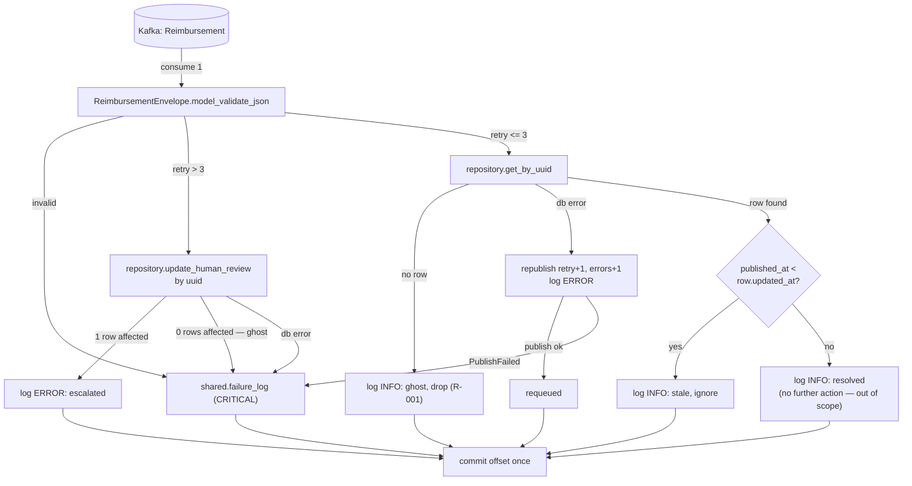

# Agent — Consume `Reimbursement`, Resolve by UUID Design

**Spec**: `.specs/features/agent-consume-reimbursement/spec.md`
**Context**: `.specs/features/agent-consume-reimbursement/context.md`
**Risks**: `.specs/RISKS.md` (R-001, R-005, R-007)
**Status**: Draft — reconciled against real, committed code (`1e3bd7e`,
verified via `architecture-evaluate` incremental sync). **The blocking
condition is resolved**: `publisher-consume-request` is fully implemented,
tested, and validated (PASS recorded in its own `validation.md`) — not a
plan anymore. **Execute is now unblocked.**

---

## Reconciliation note (superseded — kept for history)

This design was originally written against `publisher-consume-request`'s
Draft `design.md` (v3, unapproved) as a documented contract, with Execute
explicitly blocked pending that feature landing code — the same situation
its own v1→v3 rewrite had already gone through once against `shared/config.py`.

**That situation has now resolved.** `publisher-consume-request` shipped 21
commits (`b60ffeb`…`1e3bd7e`), including `shared/reimbursement/repository.py`,
`shared/failure_log.py`, `shared/reimbursement/use_cases/send_human_review.py`,
and the `AttemptError`/`ReimbursementEnvelope` additions to `shared/models.py`
— all committed, all tested. Every signature this design assumed was
verified directly against that real code (not the draft) during this
reconciliation pass — see the updated Code Reuse Analysis and Components
sections below, which now cite real file contents rather than a design doc.
**No signature mismatches were found** — the draft's contract held. Two
items still require action before this feature's own Tasks phase, both
flagged inline where they apply: the `Stage` Literal widening, and the new
`AgentConfig`/`Config.agent` field, neither of which exist yet because no
other feature has needed them.

---

## Architecture Overview

One consumer loop, one message at a time. No per-item fan-out — a
`Reimbursement` message already carries exactly one logical unit of work
(one `uuid`), unlike `Request`'s N-item batches, so there is no
concurrency dimension to bound here (see spec Assumptions).

Two structural properties, mirroring the publisher's own two:

**No DB-write is ever paired with a Kafka publish in this feature.**
Unlike the publisher (`INSERT` + publish, held atomic in one transaction),
this feature's only DB write (`UPDATE ... SET status = 'human-review'`)
has no downstream publish, and its only publish (the republish-on-failure)
happens because a *read* failed — there is nothing to roll back. AD-017's
`conn.transaction()` pattern is therefore not needed here; a plain
connection checkout suffices.

**No item task raises.** The decision tree returns a `MessageOutcome`, so
nothing propagates out of message handling uncaught — matching the
publisher's `ItemOutcome` precedent and giving **R-004**'s style of
countable-event observability for free.



---

## Code Reuse Analysis

### Existing Components to Leverage

| Component | Location | How to Use |
| --------- | -------- | ---------- |
| `shared.producer.publish` / `managed_producer` | `shared/producer.py` (landed) | Republish to `Reimbursement` on a resolve-stage failure — unchanged, already topic-agnostic |
| `shared.errors.sanitize` | `shared/errors.py` (landed, uncommitted) | Sanitize the `ERROR`-level stdout log line (AGT-12) — exact signature verified in source: `sanitize(exc: BaseException) -> str` |
| `shared.config.{KafkaConfig, DatabaseConfig, FailureLogConfig, REIMBURSEMENT_TOPIC, MAX_RETRY}` | `shared/config.py` (landed, uncommitted) | Reuse directly; **add** `AgentConfig` alongside the existing `PublisherConfig` and a 5th `Config.agent` field |
| `shared.reimbursement.repository` (pool lifecycle, statement-per-file pattern, `is_duplicate` shape) | `shared/reimbursement/repository.py` (per `publisher-consume-request/design.md` — not yet landed) | Reuse `managed_pool(config: DatabaseConfig)` as-is; **add** `get_by_uuid` and `update_human_review` statements to the same file |
| `shared.reimbursement.use_cases.send_human_review.render_history` | `shared/reimbursement/use_cases/send_human_review.py` (not yet landed) | Reuse the pure rendering function as-is; **add** a sibling `escalate_existing` function for the `UPDATE`-based path (this feature does not reuse `send_human_review()` itself — that function `INSERT`s a new row, which is the publisher's shape, not this feature's) |
| `shared.failure_log.write` | `shared/failure_log.py` (not yet landed) | Malformed input, republish failure, `retry > 3` fallback failures — unchanged |
| `shared.models.{AttemptError, ReimbursementEnvelope}` | `shared/models.py` (not yet landed) | Reuse the message contract as-is; **requires** `AttemptError.stage`'s `Literal` widened to include a new value this feature introduces (see Data Models) |

### Integration Points

| System | Integration Method |
| ------ | ------------------- |
| Kafka `Reimbursement` topic | Consumed via `confluent_kafka.aio.AIOConsumer`, same `consume(num_messages=1)` + `enable.auto.commit=False` shape as the publisher; republished to on resolve-stage failure |
| `reimbursement` table | Read via `get_by_uuid` (no write); written via `update_human_review` on `retry > 3` — no `INSERT`, the publisher already owns row creation |
| `shared.failure_log`'s dedicated logger | Same sink, same `CRITICAL` level, no new destination |

---

## Components

### `agent/src/agent/consumer.py` (package root — user's explicit instruction)

- **Purpose**: composition root and the loop — config, pool, producer,
  consumer; run; shut down; offset commit. Replaces the `SampleMessage` /
  `sample-topic` placeholder entirely.
- **Location**: `src/agent/src/agent/consumer.py`
- **Interfaces**: `async run(deps) -> None` (never returns except on
  shutdown signal); `check_startup_config(config) -> None` — refuse to
  boot if `DATABASE_URL` is unset, mirroring `publisher.consumer`'s own
  function (confirmed in source) **minus** its pool-vs-concurrency
  assertion, which doesn't apply here (no fan-out to size a pool against).
- **Dependencies**: `shared.config.load_config`, `shared.reimbursement.repository.managed_pool`,
  `shared.producer.managed_producer`, `agent.validation.handle_message`
- **Reuses**: the publisher's own `consumer.py` shape (`AIOConsumer`
  constructed inside the running loop, never at import — same
  `get_event_loop()` constraint applies here, confirmed in source) —
  **minus** the `asyncio.Semaphore` fan-out, which this feature has no use
  for.

### `agent/src/agent/validation.py`

- **Purpose**: the decision tree — `retry > 3` short-circuit, resolve by
  `uuid`, staleness compare, error branching. The only module with
  business branching, kept separate from `consumer.py` so it unit-tests
  with no real Kafka consumer, mirroring exactly why the publisher keeps
  `processing.py` apart from its own `consumer.py`.
- **Location**: `src/agent/src/agent/validation.py` — a flat module at the
  package root, not a nested slice. `agent`'s only domain object is
  `reimbursement`, so a resource-name directory (the way `api/reimbursement/create/`
  disambiguates *which* resource within a multi-resource service) adds a
  directory level with nothing to disambiguate — user decision, this
  session.
- **Interfaces**:
  - `async handle_message(deps, raw: bytes) -> MessageOutcome` — never raises
  - `MessageOutcome` — `RESOLVED | STALE | GHOST | REQUEUED | ESCALATED | LOGGED | INVALID`
- **Dependencies**: `shared.reimbursement.repository.{get_by_uuid, update_human_review}`,
  `shared.reimbursement.use_cases.send_human_review.{render_history, escalate_existing}`,
  `shared.producer.publish`, `shared.failure_log.write`, `shared.errors.sanitize`,
  `shared.models.{ReimbursementEnvelope, AttemptError}`
- **Reuses**: the publisher's `processing.py` shape (a pure decision-tree
  module returning an outcome enum, never raising) — narrowed, since there
  is no per-item fan-out to coordinate.

### `shared/reimbursement/repository.py` — extended (not owned by this feature)

- **Added interfaces** (this feature's contribution to a file
  `publisher-consume-request` already created and owns the pool lifecycle
  of — confirmed present: `managed_pool`, `insert_pending`,
  `insert_human_review`, `is_duplicate`; neither addition below exists yet):
  - `async get_by_uuid(conn, uuid: UUID) -> asyncpg.Record | None` —
    `SELECT * FROM reimbursement WHERE uuid = $1`; full row, not a column
    subset — the row's `updated_at` drives the staleness check and
    `original_payload` is what the (future) processing feature will need,
    so there's no narrower projection that serves this feature alone.
    `None` on no match, via `conn.fetchrow`. Maps directly onto the ghost
    case (R-001) with no exception handling needed to detect it.
  - `async update_human_review(conn, uuid: UUID, reason: str) -> bool` —
    `UPDATE reimbursement SET status = 'human-review', decision_reason =
    $2, updated_at = now() WHERE uuid = $1`; returns whether exactly one
    row was affected, parsed from asyncpg's `UPDATE n` status string
    (matches how `insert_pending`/`insert_human_review` already return
    values derived from the statement's own result, not a second query).
    The `False` branch is what AGT-18 (ghost + `retry > 3`) needs.

### `shared/reimbursement/use_cases/send_human_review.py` — extended (not owned by this feature)

- **Added interface**: `async escalate_existing(conn, uuid: UUID, errors:
  list[AttemptError]) -> UUID | None` — calls `render_history(errors)`
  (reused as-is) then `repository.update_human_review`; returns the `uuid`
  on success, `None` when the row doesn't exist (the ghost branch).
  Deliberately a sibling function to `send_human_review()`, not a
  parameterized merge of the two — `send_human_review` `INSERT`s, this
  `UPDATE`s, and collapsing them into one polymorphic function would
  obscure which SQL statement a caller is actually invoking.

---

## Data Models

No new models. Reuses `ReimbursementEnvelope`/`AttemptError` exactly as
committed in `shared/models.py`, **with one widening**, verified against
the real file (not a draft):

```python
# shared/models.py — current:
Stage = Literal["db-insert", "publish"]

# needs, for this feature:
Stage = Literal["db-insert", "publish", "resolve"]  # "resolve" is new
```

`Stage` is a **module-level type alias** (not inlined in `AttemptError`),
used both by `AttemptError.stage` and by `publisher.processing._requeue`'s
own `stage: Stage` parameter — confirmed in source. `"resolve"` is this
feature's own failure stage — a `get_by_uuid` query failure. `"publish"` is
reused unchanged for a republish-itself failure. `"db-insert"` never occurs
here (this feature never inserts). This is a **committed shared-type
change**, not a draft-vs-reality gap: `publisher-consume-request` already
shipped `Stage` with two values, so widening it to three is this feature's
own first task, touching one line in `shared/models.py` plus its own
`AttemptError.next(errors, "resolve", exc)` call site — `AttemptError.next`
itself (the `.next()` classmethod constructor, confirmed in source) is
reused as-is, no wrapper needed.

`Config` gains a 5th field, alongside the existing `PublisherConfig`
pattern:

```python
@dataclass(frozen=True)
class AgentConfig:
    consumer_group_id: str
    consume_timeout_seconds: float = 1.0

    def to_consumer_config(self, kafka: KafkaConfig) -> dict[str, Any]:
        return {
            "bootstrap.servers": kafka.bootstrap_servers,
            "group.id": self.consumer_group_id,
            "auto.offset.reset": "earliest",
            "enable.auto.commit": False,
            **kafka.security_config(),
        }
```

Deliberately **no** `fetch.max.bytes` / `max.partition.fetch.bytes`
override, unlike `PublisherConfig.to_consumer_config` — `Reimbursement`
messages are small, fixed-shape envelopes, so librdkafka's default fetch
sizing is sufficient (spec Assumptions).

---

## Error Handling Strategy

| Scenario | Handling | Outcome |
| -------- | -------- | ------- |
| Message not valid JSON / not `ReimbursementEnvelope` | `shared.failure_log` (`CRITICAL`), commit offset | `INVALID` (AGT-20) |
| `retry > 3` | `escalate_existing` — attempt `UPDATE` by `uuid` | — |
| … `UPDATE` affects 1 row | Log `ERROR` (escalation), take no further action | `ESCALATED` (AGT-14…17) |
| … `UPDATE` affects 0 rows (ghost) | `shared.failure_log` (`CRITICAL`) | `LOGGED` (AGT-18) |
| … `UPDATE` raises a genuine DB error | `shared.failure_log` (`CRITICAL`) | `LOGGED` (AGT-19) |
| `retry <= 3`, `get_by_uuid` returns no row | Log informational (R-001), drop | `GHOST` (AGT-03) |
| `retry <= 3`, `get_by_uuid` raises | Log `ERROR`, republish `retry+1` + `AttemptError(stage="resolve")` | `REQUEUED` (AGT-08…11) |
| `retry <= 3`, row found, `published_at < updated_at` | Log informational, ignore | `STALE` (AGT-05…07) |
| `retry <= 3`, row found, `published_at >= updated_at` | Log informational — resolved; no further action (out of this feature's scope) | `RESOLVED` (AGT-02) |
| Republish (`publish` to `Reimbursement`) itself raises `PublishFailed` | `shared.failure_log` (`CRITICAL`) | `LOGGED` (AGT-13) |
| `shared.failure_log` itself fails | Swallowed — nowhere left to report to; never propagates | — |
| Signal mid-processing | Current message finishes; uncommitted offset redelivers | — (AGT-22) |

---

## Risks & Concerns

| Concern | Location | Impact | Mitigation |
| ------- | -------- | ------ | ---------- |
| `Stage`'s `Literal` (`shared/models.py`) is committed with only `["db-insert", "publish"]` — this feature's first `REQUEUED` outcome needs a third value | `shared/models.py:14` (confirmed in source) | Constructing `AttemptError(stage="resolve", ...)` fails Pydantic validation until the `Literal` is widened | This feature's own first task: widen `Stage` to `["db-insert", "publish", "resolve"]`. One-line change, additive, cannot break `publisher`'s existing two values |
| `Config.agent` field and `AgentConfig` dataclass don't exist yet | `shared/config.py` (confirmed in source — only `kafka`/`database`/`failure_log`/`publisher` fields exist) | `load_config().agent` isn't reachable until added | This feature's own first task, alongside the `Stage` widening — additive, same pattern as `PublisherConfig`'s addition |
| `agent` staying an installable package (not flattened) is a deliberate choice, not a default | `src/agent/pyproject.toml` (`[build-system]` present) | Closes a risk `publisher-consume-request/design.md` explicitly flagged and deferred here: a flattened `agent.consumer` would collide with `publisher/src/consumer.py` on the shared pytest `sys.path` | Resolved by *not* flattening — `agent.consumer` stays namespaced. No action needed unless a future feature has an independent reason to flatten `agent` |
| `send_human_review.py` gains a second, structurally different consumer (`UPDATE` vs. `INSERT`) | `shared/reimbursement/use_cases/send_human_review.py` | Mild tension with that module's original framing as "the one action" | Two clearly-named sibling functions (`send_human_review`, `escalate_existing`) sharing only `render_history` — not merged into one polymorphic function, so each caller's SQL intent stays obvious from the call site |
| `Config.agent` is a 5th top-level field read by every service via one `load_config()` | `shared/config.py` | `api` never touches `AgentConfig`, but constructs it anyway via the shared cached loader | Matches the existing, already-accepted pattern (`api` already unconditionally constructs `PublisherConfig` too) — zero-cost, no service-specific branching needed |
| Multiple agent replicas consuming different partitions concurrently | — | Cross-instance correctness | Relies on Kafka consumer-group partition assignment plus `get_by_uuid`/`update_human_review`'s natural idempotency — same mitigation the publisher already uses, no new coordination needed (spec Edge Cases) |

---

## Tech Decisions

| Decision | Choice | Rationale |
| -------- | ------ | --------- |
| Decision-tree logic lives in `agent`, not `shared.reimbursement` | `agent/src/agent/validation.py` | User decision, this session. Mirrors `publisher/processing.py` staying publisher-local despite calling `shared.reimbursement.repository` — only primitives genuinely identical across both services belong in `shared`; retry/staleness/branching logic is Agent-specific |
| `agent` stays an installable package (no flattening, unlike `api`/`publisher`) | Keep `[build-system]` / `agent.consumer` namespaced import | Avoids the `consumer.py` name collision `publisher-consume-request/design.md` explicitly flagged as a decision "belonging to the agent feature" |
| No `asyncio.Semaphore` / bounded concurrency | Sequential, one message at a time | A `Reimbursement` message already carries exactly one logical unit of work — no per-message fan-out exists to bound (spec Assumptions) |
| No `conn.transaction()` wrapping a publish | Plain connection checkout for `get_by_uuid`; `update_human_review` has no paired publish | Unlike the publisher, this feature never pairs a DB write with a Kafka publish — the republish only happens on a *read* failure, and the human-review `UPDATE` has no downstream publish in this feature's scope |
| Flat two-file layout: `consumer.py` (loop) + `validation.py` (decision tree) — no resource-name nesting | Both at `agent` package root | User decision, this session, superseding this design's earlier `reimbursement/resolve/` slice: `agent`'s domain is *exclusively* reimbursement, so a resource-name directory (which disambiguates *which* resource in a multi-resource service like `api`) adds a level with nothing to disambiguate here. The testability split (loop vs. decision tree) is preserved — only the nesting is dropped |
| `escalate_existing` added beside `send_human_review`, sharing `render_history` | One file, two entry functions | Same domain, same rendering logic; `publisher-consume-request/design.md` already anticipated the Agent as `use_cases/`'s justifying second caller — this is that caller landing |
| `get_by_uuid` returns `None` on no match | `conn.fetchrow(...)`, no exception path | Matches asyncpg's natural return shape and maps directly onto the ghost case — no exception handling needed to detect it |
| `update_human_review` returns a bool (rows-affected) | Parse asyncpg's `UPDATE n` status string | The only way to distinguish "escalated successfully" from "zero rows — ghost", the exact branch AGT-18 requires |

No new project-level `AD-NNN` proposed here — every decision above is
either feature-local (the slice layout, the semaphore-free loop) or an
instance of a convention `publisher-consume-request`'s design already
proposes claiming (AD-017's implicit-transaction pattern is explicitly
*not* invoked here, by choice, not by conflict).

---

## Tips carried from Context

- **Log severity** ("HIGH" = `logging.ERROR`) applies to exactly two
  stdout log lines this design owns: the `REQUEUED` branch's failure log,
  and the `ESCALATED` branch's success log. Every `shared.failure_log`
  write already exceeds the bar at `CRITICAL` — no separate handling
  needed there.
- Ghost (`GHOST` outcome) and stale (`STALE` outcome) stay informational —
  explicitly not `ERROR` — per this session's earlier clarification.

## Event naming (confirmed against `publisher.processing`'s real constants)

`publisher.processing` defines module-level `..._EVENT` string constants
(`DUPLICATE_DROPPED_EVENT = "reimbursement.duplicate_dropped"`, etc.) used
two ways: standalone in a `logger.info(json.dumps({"event": ..., ...}))`
call for informational outcomes, or embedded as the `"event"` field inside
a `failure_record(...)`-shaped dict passed to `shared.failure_log.write()`
for failures. `failure_record` itself is **publisher-local** (a plain
function in `publisher/processing.py`, not exported from `shared`), so this
feature defines its own equivalent in `agent/validation.py` rather than
importing it — same shape (`event`, `request`-identifying field, `errors`
rendered via `model_dump(mode="json")`, `**extra`), not the same function.

`agent/validation.py`'s own constants, following the identical naming
convention (`"reimbursement.<event_name>"`):

| Constant | Value | Used for |
| -------- | ----- | -------- |
| `GHOST_DROPPED_EVENT` | `reimbursement.ghost_dropped` | `GHOST` outcome (informational) |
| `STALE_IGNORED_EVENT` | `reimbursement.stale_ignored` | `STALE` outcome (informational) |
| `RESOLVED_EVENT` | `reimbursement.resolved` | `RESOLVED` outcome (informational) |
| `RESOLVE_FAILED_EVENT` | `reimbursement.resolve_failed` | `REQUEUED` outcome's stdout log (`ERROR`) and, if the requeue itself fails, the `failure_log` record |
| `ESCALATED_EVENT` | `reimbursement.escalated` | `ESCALATED` outcome's stdout log (`ERROR`) — publisher's own `escalate_item` has no equivalent success log, so this is a new event name, not a reused one |
| `MALFORMED_MESSAGE_EVENT` | `reimbursement.malformed_message` | `INVALID` outcome's `failure_log` record |
