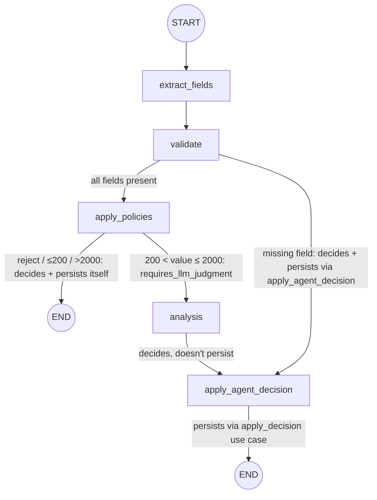

# Agent — Decide `Reimbursement` Design

**Spec**: `.specs/features/agent-decide-reimbursement/spec.md`
**Context**: `.specs/features/agent-decide-reimbursement/context.md`
**Status**: Ready for Tasks

---

## 1. Context Loaded

- `spec.md` (26 requirements, AGD-01..26) and `context.md` — both loaded, no conflicts found between them and the scaffold described below.
- `.specs/STATE.md` `## Decisions` — active constraints this design conforms to: AD-017 (`asyncpg` pool + implicit transaction), AD-023 (`load_config()` single cached loader, no per-class `from_env()`), AD-025 (`shared` owns cross-service persistence, sliced by domain), AD-029 (`shared.db.managed_pool` is the generic pool lifecycle), AD-030 (this feature's own four business-rule decisions: unconditional single-call extraction, reject-always-wins, BRL-only, decision-stage error handling deferred to R-011). `reimbursement` is, as of this branch, a real installed, namespaced package (`reimbursement.consumer`, `reimbursement.agent.nodes.*`, via `uv_build` with a nested `packages/reimbursement/src/reimbursement/` src-layout — AD-031, amended on this branch after the `setuptools`/`package-dir` mechanism broke Pyright resolution) — every import path below reflects that, not the earlier flat/bare-module layout.
- Confirmed lessons (`scripts/lessons.py list --status confirmed`): **L-003** — a spec AC claiming a memory/performance property needs a stated observable proxy. Applied below: the "compiled once" requirement is designed with an explicit, testable proxy — see Component 1.
- No conflicts requiring supersession — this design conforms to every active AD.

---

## 2. Architecture Overview

The decision logic is a 5-node LangGraph `StateGraph`, compiled once at process startup and invoked once per resolved `Reimbursement`. Two nodes — `apply_policies` and `apply_agent_decision` — call the shared `apply_decision` use case directly, exactly at the two persistence points the original scope diagram draws (the deterministic layer's own outcomes, and the LLM-assisted outcomes converging through one shared finalizer). This is a deliberate correction from an earlier draft that kept every node DB-free and centralized the write in `validation.py` after the graph returned — per your review, the graph itself owns applying the decision it reaches, not just deciding it.



### `conn` reaches nodes via `RunnableConfig`, not a closure

The graph is compiled once and reused across every message (Component 2), but each decision needs its own `asyncpg.Connection` for that one message's write. Baking a connection into the graph at build time would leak it across every future invocation, so `conn` is passed per-call through LangGraph's standard `configurable` mechanism instead: `graph.ainvoke(initial_state, config={"configurable": {"conn": conn}, "callbacks": [...]})`, and every node declares `async def run(state: State, config: RunnableConfig) -> dict[str, Any]` — only `apply_policies` and `apply_agent_decision` actually read `config["configurable"]["conn"]`, but all five keep the same signature for consistency.

### Two separate, non-overlapping traceability mechanisms — a third was a mistake

Caught in review, worth recording so it isn't reintroduced: an earlier draft of this design added a `State["trace"]` list, appended to by every node and rendered into `decision_reason` at the end. That was redundant and wrong for two reasons:

1. **LangFuse's `CallbackHandler` already captures this.** Attaching it to `graph.ainvoke(...)` auto-records every node's input/output/timing as a span under one trace, with zero code in any node — a hand-rolled `state["trace"]` duplicates exactly what the callback already gets for free.
2. **`decision_reason` is a decision, not a step log.** It's authored directly, in plain language, by whichever single node actually decides (`validate`, `apply_policies`, or `analysis`) — "receipt is 98 days old, older than the 90-day limit" — not a generic multi-node trace concatenated after the fact. An auditor reading the DB row wants *why*, not *which nodes ran* — that second thing is what logs and LangFuse are for.

What actually gives this feature LangFuse-independent traceability is simpler: every node opens with `logger.info("FLOW: Executing '<node>' node")`, so the graph's path is reconstructable by grepping stdout for one `uuid` — no state plumbing required, because logs are already sequential. `decision_reason` remains the separate, DB-persisted audit-of-record, authored once, by the node that decided.

Errors are logged with full context at the point they're caught (`logger.exception(...)`) — orthogonal to R-011's still-open retry/escalate mechanism question, but worth adopting regardless of how R-011 resolves.

---

## 3. Approach Exploration

**Superseded by direct feedback**, recorded rather than deleted so the reasoning isn't lost: this design originally compared "pure nodes, persistence in `validation.py`" (Approach A) against "fewer, fatter nodes" (B) and "nodes own their DB writes" (C), and recommended A specifically to avoid DB access inside LangGraph nodes.

That recommendation is now overridden: `apply_policies` and `apply_agent_decision` call the `apply_decision` use case directly (a version of what was called Approach C), because it matches the scope diagram's own two persistence points exactly, and because centralizing the write in `validation.py` (Approach A) would have needed the graph's THREE possible decision sources (`validate`, `apply_policies`, `analysis`) to all funnel into one shared `status`/`decision_reason` output regardless — which is extra indirection once two of those three are willing to persist their own outcome directly. The tradeoff A was protecting — node-level unit tests not needing a DB — is accepted as a real, known cost for exactly the two nodes that call the use case; the other three (`extract_fields`, `validate`, `analysis`) remain DB-free and test the same way as before.

---

## 4. Code Reuse Analysis

### Existing Components to Leverage

| Component | Location | How to Use |
| --- | --- | --- |
| `handle_message` / `MessageOutcome.RESOLVED` branch | `packages/reimbursement/src/reimbursement/validation.py` | Currently logs and stops. Extended to acquire a connection and invoke the compiled graph — the exact seam `agent-consume-reimbursement`'s spec left open ("no stub hook or call point into the not-yet-built processing stage"). The graph itself now applies its own decision (see Architecture Overview); `validation.py` no longer performs a separate persistence call. |
| `AttemptError` / `Stage` (`Literal["db-insert", "publish", "resolve"]`) | `packages/shared/src/shared/models.py` | Widen `Stage` to add `"decide"` for this feature's own failure attribution — same mechanism the resolve stage already uses, no new pattern. |
| `escalate_existing` / `shared.failure_log` | `shared/reimbursement/use_cases/send_human_review.py`, `shared/failure_log.py` | Candidate reuse for the no-loss invariant — **not committed to** until R-011 resolves (see Risks & Concerns). |
| `load_config()` single cached loader pattern (AD-023) | `packages/shared/src/shared/config.py` | New `OllamaConfig`/`AgentDecisionConfig` nests onto the same `Config` root, read once via `load_config().<domain>` — no new `from_env()` convention invented. |
| `shared.reimbursement.repository.update_human_review` | `packages/shared/src/shared/reimbursement/repository.py` | **Consolidated, not just reused** — `update_human_review` (hardcoded `status = 'human-review'`) is a special case of the same UPDATE shape this feature needs generically. Replaced by one `update_decision(conn, uuid, status, decision_reason) -> bool`; `update_human_review` is removed, not kept alongside it. |
| `shared.reimbursement.use_cases.send_human_review.escalate_existing` | `packages/shared/src/shared/reimbursement/use_cases/send_human_review.py` | **Refactored to delegate** — keeps its own signature (still owns rendering `AttemptError` history into text) but its body now calls the new `apply_decision(conn, uuid, "human-review", rendered_reason)` instead of `update_human_review` directly. |
| `AttemptError.from_exception` classmethod-constructor shape | `packages/shared/src/shared/models.py` | Precedent for `Reimbursement.from_record` (new, below) — this file already builds a model from a non-dict source via a named classmethod, so `from_record` isn't a new convention. |

### Integration Points

| System | Integration Method |
| --- | --- |
| Ollama | `langchain-ollama` integration package (new dependency — not yet in `packages/reimbursement/pyproject.toml`), addressed via LangChain's `"ollama:<model>"` model string, per current LangChain docs (verified via Context7) |
| Langfuse | `langfuse.langchain.CallbackHandler`, passed as `config={"callbacks": [handler]}` to `graph.ainvoke(...)` — traces every node automatically as one trace per reimbursement (verified current API via Context7) |
| Database | `shared.db.managed_pool` (AD-029) — `validation.py` acquires a `conn` from the existing pool and passes it into the graph via `config={"configurable": {"conn": conn}}`; `apply_policies`/`apply_agent_decision` read it from there to call `apply_decision` |

---

## 5. Components

### Nodes are callable classes, dependency-injected once at graph-build time

Per your review: instead of bare `run(state, config)` functions, every node is a small class — `__init__` takes its dependencies (an LLM model instance, a prompt template, the `apply_decision` use case), `__call__` implements the node itself. `build_graph()` constructs each node's dependencies and instantiates the class exactly once; since `get_graph()` is already the `@lru_cache(maxsize=1)` singleton from Component 2, those objects — most importantly the Ollama client(s) — are built once per process, not once per message. Applied uniformly to all 5 nodes, including the two (`validate`) with no real external dependency, so every node has the same shape rather than some being classes and some being bare functions.

```python
class Node(Protocol):
    async def __call__(self, state: State, config: RunnableConfig) -> dict[str, Any]: ...
```

A `Protocol`, not an `ABC` — documents the shared shape for type-checking without forcing an inheritance hierarchy the rest of this codebase doesn't otherwise use (`Dependencies`, `AgentConfig`, `KafkaConfig` are all plain dataclasses, not class hierarchies — this stays consistent with that). LangGraph itself doesn't need the Protocol at all: `add_node` accepts any callable (verified via Context7 — it wraps whatever's given in an internal `RunnableCallable` and invokes it identically whether that's a bare function or a class instance's `__call__`); a node instance just needs an **explicit string name** passed to `add_node("extract_fields", extract_fields_node)`, since instances don't have `__name__` the way functions do.

`apply_policies` and `apply_agent_decision` still receive their per-message `conn` through `RunnableConfig` (Architecture Overview), never through the constructor — a connection can't be a singleton-constructed dependency the way a model client can.

### `shared.models.Reimbursement` (new file addition — does not exist yet)

- **Purpose**: The graph's own minimal view of a resolved row — just `uuid` and `original_payload`, not the full table. `schema.py`'s `State["reimbursement"]: Reimbursement` already imports this name; today that import fails, since no such class exists in `shared.models` yet.
- **Location**: `packages/shared/src/shared/models.py`
- **Interfaces**:
  ```python
  class Reimbursement(BaseModel):
      uuid: UUID
      original_payload: dict[str, Any]

      @classmethod
      def from_record(cls, record: asyncpg.Record) -> Self:
          return cls(
              uuid=record["uuid"],
              original_payload=json.loads(record["original_payload"]),
          )
  ```
  `original_payload` decodes via `json.loads` because no asyncpg JSON codec is configured anywhere in this codebase — every existing reader of that JSONB column does the same manual decode at the point of use.
- **Dependencies**: `asyncpg.Record` as `from_record`'s input shape only — no import-time coupling to any other package.
- **Reuses**: The `from_exception`-style classmethod-constructor shape `AttemptError` already establishes in this same file (see Code Reuse Analysis) — no new pattern introduced.
- **Consumer, single call site**: `validation.py`'s `_resolve` (extended below) already fetches the full row via `repository.get_by_uuid` for its own ghost/staleness checks — it builds `Reimbursement.from_record(row)` from that same `row` and passes it into `agent.decide`. No second query.

### `schema.py` — graph state

- **Purpose**: The single `TypedDict` every node reads and writes.
- **Location**: `packages/reimbursement/src/reimbursement/schema.py`
- **Interfaces**:
  ```python
  class ExtractedFields(TypedDict, total=False):
      value: float | None
      currency: str | None
      receipts_date: date | None

  class State(TypedDict):
      reimbursement: Reimbursement          # input: uuid + original_payload
      extracted: ExtractedFields             # written by extract_fields

      # Routing-only signals — read by conditional-edge functions,
      # never by another node's decision logic.
      missing_fields: list[str]              # written by validate, e.g. ["value"]
      requires_llm_judgment: bool            # written by apply_policies

      # The decision — written ONCE, by exactly one of the three deciding
      # nodes per run (validate | apply_policies | analysis).
      status: str | None
      decision_reason: str | None

      # Set by whichever node actually calls apply_decision
      # (apply_policies or apply_agent_decision) — False on the 0-rows-
      # affected ghost case, so validation.py can log it without a second
      # DB round-trip to find out.
      persisted: bool | None

      guardrail_verdict: bool | None         # written by analysis; None until it runs
  ```
  **Why `status`/`decision_reason` aren't used for routing:** routing goes through purpose-built signals instead — `missing_fields` for the `validate` branch, `requires_llm_judgment` for the `apply_policies` branch — so `status`/`decision_reason` stay pure decision output, never inspected by a conditional edge. No reducer/accumulation is needed anywhere in this state: every field is written by exactly one node on any given run.
- **Dependencies**: `shared.models.Reimbursement`.
- **Reuses**: Already scaffolded; extends it with the fields the other nodes need.

### `agent.py` — graph construction and the singleton entry point

- **Purpose**: Build every node's dependencies and the graph exactly once; expose one call for `validation.py` to invoke per message.
- **Location**: `packages/reimbursement/src/reimbursement/agent/agent.py`
- **Interfaces**:
  - `build_graph() -> CompiledStateGraph` — constructs the Ollama model client(s) (one bound with `.with_structured_output(ExtractedFieldsSchema)` for extraction, one with the guardrail's own schema for `analysis`), instantiates all 5 node classes with their dependencies, wires them plus both conditional edges, calls `.compile()`. The only place any node's dependencies get constructed.
  - `get_graph() -> CompiledStateGraph` — `@lru_cache(maxsize=1)` wrapper around `build_graph()`, same singleton shape as `shared.config.load_config` (AD-023) — **this is the testable proxy for "compiled once"** (L-003): a task asserts `get_graph() is get_graph()` and that `build_graph()` (and therefore every node's `__init__`, and every Ollama client constructor) runs only once across repeated `get_graph()` calls.
  - `async def decide(reimbursement: Reimbursement, conn: asyncpg.Connection) -> State` — `get_graph().ainvoke({"reimbursement": reimbursement}, config={"configurable": {"conn": conn}, "callbacks": [langfuse_handler()]})`, returns the final `State`.
- **Dependencies**: `reimbursement.schema.State`, `reimbursement.agent.nodes.*`, Langfuse handler factory.
- **Reuses**: `@lru_cache` singleton pattern (AD-023).

### `agent/nodes/extract_fields.py`

- **Purpose**: Resolve `value`, `currency`, `receipts_date` from the full payload — one unconditional LLM call (AGD-01..04), optionally pre-seeded by a deterministic read of `claimed_amount_brl` when present (internal composition, not a new business rule).
- **Location**: `packages/reimbursement/src/reimbursement/agent/nodes/extract_fields.py`
- **Interfaces**:
  ```python
  class ExtractFields:
      def __init__(self, model: Runnable, prompt: ChatPromptTemplate): ...
      async def __call__(self, state: State, config: RunnableConfig) -> dict[str, Any]: ...
  ```
  Returns `{"extracted": ExtractedFields}`. No DB access, never touches `status`.
- **Dependencies (constructor-injected)**: the Ollama model bound via `.with_structured_output(ExtractedFieldsSchema)`, `reimbursement.agent.prompts.extract_fields` (placeholder).
- **Logging**: `logger.info("FLOW: Executing 'extract_fields' node")` on entry, then one line naming which fields resolved (and from where) and which didn't.

### `agent/nodes/validate.py`

- **Purpose**: Gate on completeness (AGD-09..11) — routes the graph, **and** is one of the three nodes that decides (the missing-field → `human-review` case is its own decision).
- **Location**: `packages/reimbursement/src/reimbursement/agent/nodes/validate.py`
- **Interfaces**:
  ```python
  class Validate:
      async def __call__(self, state: State, config: RunnableConfig) -> dict[str, Any]: ...
  ```
  No constructor dependencies — kept as a class anyway, for the uniform shape, per your review ("make it standard for all of them"). Always returns `{"missing_fields": [...]}`; when non-empty, also returns `{"status": "human-review", "decision_reason": "..."}` (naming the missing field(s) — AGD-09/10). No DB access — it decides, but hands the write to `apply_agent_decision`.
- **Routing**: `route_after_validate(state) -> Literal["apply_policies", "apply_agent_decision"]` reads `missing_fields` only.
- **Logging**: `"FLOW: Executing 'validate' node"`, then which fields were found present/missing.

### `agent/nodes/apply_policies.py`

- **Purpose**: The three purely-deterministic outcomes (AGD-05..08 reject, AGD-12..16 ≤200/>2000), reject checked first — decides **and persists**.
- **Location**: `packages/reimbursement/src/reimbursement/agent/nodes/apply_policies.py`
- **Interfaces**:
  ```python
  class ApplyPolicies:
      def __init__(self, apply_decision: Callable[..., Awaitable[UUID | None]]): ...
      async def __call__(self, state: State, config: RunnableConfig) -> dict[str, Any]: ...
  ```
  When a rule fires: authors `status`/`decision_reason` directly, calls `self._apply_decision(config["configurable"]["conn"], uuid, status, decision_reason)`, and returns `{"status": ..., "decision_reason": ..., "persisted": ..., "requires_llm_judgment": False}`. When the value falls in `200 < value ≤ 2000` and reject didn't fire, returns `{"requires_llm_judgment": True}` only — no use-case call, `status` stays `None`.
- **Dependencies (constructor-injected)**: `shared.reimbursement.use_cases.apply_decision.apply_decision` — injected, not imported inside the method, so a test can substitute a fake without patching a module-level name.
- **Routing**: `route_after_apply_policies(state) -> Literal["analysis", "__end__"]` reads `requires_llm_judgment` only.
- **Logging**: `"FLOW: Executing 'apply_policies' node"`, then which rule fired (or that none did), then the `apply_decision` outcome when it calls it.

### `agent/nodes/analysis.py`

- **Purpose**: The LLM-as-judge guardrail for the ambiguous zone only (AGD-17..20) — never runs for the other three outcomes. Decides, doesn't persist.
- **Location**: `packages/reimbursement/src/reimbursement/agent/nodes/analysis.py`
- **Interfaces**:
  ```python
  class Analysis:
      def __init__(self, model: Runnable, prompt: ChatPromptTemplate): ...
      async def __call__(self, state: State, config: RunnableConfig) -> dict[str, Any]: ...
  ```
  Computes `guardrail_verdict` and, from it, authors `status`/`decision_reason` directly (`"auto-approved"` when consistent, `"human-review"` with the guardrail's own stated reasoning otherwise — this doubles as the human-review side-note SCOPE.md asks for, once R-011 decides whether that note is universal or `>2000`-only). No DB access — always routes onward to `apply_agent_decision`.
- **Dependencies (constructor-injected)**: the Ollama model bound with the guardrail's own structured-output schema, `reimbursement.agent.prompts.analysis` (placeholder).
- **Logging**: `"FLOW: Executing 'analysis' node"`, plus the verdict and authored reason.

### `agent/nodes/apply_agent_decision.py`

- **Purpose**: The single, decision-agnostic finalizer — persists whatever `status`/`decision_reason` is already in state, regardless of whether `validate` or `analysis` put it there. Not "apply what the LLM decided" specifically (that framing from the scaffold undersold it) — it's the generic second persistence point the scope diagram's other convergence node represents.
- **Location**: `packages/reimbursement/src/reimbursement/agent/nodes/apply_agent_decision.py`
- **Interfaces**:
  ```python
  class ApplyAgentDecision:
      def __init__(self, apply_decision: Callable[..., Awaitable[UUID | None]]): ...
      async def __call__(self, state: State, config: RunnableConfig) -> dict[str, Any]: ...
  ```
  Calls `self._apply_decision(config["configurable"]["conn"], uuid, state["status"], state["decision_reason"])`, returns `{"persisted": ...}`. Never invents a `status`/`decision_reason` of its own.
- **Dependencies (constructor-injected)**: same `apply_decision` reference as `ApplyPolicies` — the same object, injected twice, not two separate imports.
- **Logging**: `"FLOW: Executing 'apply_agent_decision' node"`, then the `apply_decision` outcome.

### `agent/prompts/extract_fields.py`, `agent/prompts/analysis.py`

- **Purpose**: Placeholder prompt templates only — no real prompt engineering this session, per your instruction.
- **Location**: `packages/reimbursement/src/reimbursement/agent/prompts/`
- **Interfaces**: `PLACEHOLDER_PROMPT: str = "TODO: ..."` or an empty `ChatPromptTemplate` — deferred to a follow-up.

### `shared/reimbursement/use_cases/apply_decision.py` (new file)

- **Purpose**: The single use case for "write a decision onto an existing `reimbursement` row" — called from inside two graph nodes (`apply_policies`, `apply_agent_decision`) plus the already-shipped retry-ceiling escalation.
- **Location**: `packages/shared/src/shared/reimbursement/use_cases/apply_decision.py`
- **Interfaces**: `async def apply_decision(conn: asyncpg.Connection, uuid: UUID, status: str, decision_reason: str) -> UUID | None` — calls `repository.update_decision`, returns `None` on 0-rows-affected.
- **Dependencies**: `shared.reimbursement.repository.update_decision`.
- **Consumers, all real**: `apply_policies` node, `apply_agent_decision` node (both this feature), and `send_human_review.escalate_existing` (refactored below — an *existing*, shipped consumer).
- **Note on R-010**: `.specs/RISKS.md`'s R-010 ("`shared.reimbursement.use_cases` is filling with single-consumer code") is directly answered — `apply_decision` launches with three real call sites, not a speculative one.

### `send_human_review.py` — `escalate_existing` refactor (existing, shipped file)

- **Purpose**: Stop duplicating the UPDATE path `apply_decision` now owns generically.
- **Location**: `packages/shared/src/shared/reimbursement/use_cases/send_human_review.py`
- **Change**: `escalate_existing(conn, uuid, errors, max_message_chars) -> UUID | None` keeps its exact existing signature — but its body becomes `return await apply_decision(conn, uuid, "human-review", render_history(errors, max_message_chars))`, replacing its direct call to `repository.update_human_review`.
- **Blast radius, called out explicitly**: this modifies code from `agent-consume-reimbursement`, already merged and independently verified PASS (`feature/6_reimbursement_consumer`) — see Risks & Concerns. Its existing tests assert behavior (ghost → `None`, success → the uuid, `decision_reason` content), not internal call graph, so they should keep passing unchanged if the refactor preserves that contract — but must be run, not assumed.

### `validation.py` extension (existing file)

- **Purpose**: Where the graph actually gets invoked — the seam `agent-consume-reimbursement` deliberately left open.
- **Location**: `packages/reimbursement/src/reimbursement/validation.py`
- **Change**: `_resolve` (not `handle_message` directly — `handle_message` never has `conn`/`row` in scope, only `_resolve` does), right where it currently returns `MessageOutcome.RESOLVED`, instead builds `reimbursement = Reimbursement.from_record(row)` and calls `final_state = await agent.decide(reimbursement, conn)` — still inside the same `async with deps.pool.acquire(...) as conn:` block the row fetch already opened, so this is the same connection, not a second acquire. Logs the outcome (`final_state["status"]`, and `final_state["persisted"]` to distinguish a genuine write from the 0-rows-affected ghost case — AGD-21..23), then returns `MessageOutcome.RESOLVED`. It does **not** call `apply_decision` itself — the graph already did, inside `apply_policies` or `apply_agent_decision`.
- **Error handling — corrected claim, no guard actually exists today**: an earlier draft of this design said an `agent.decide()` failure would propagate to "the same top-level guard `handle_message` already has" — checked against the real code, no such guard exists. `handle_message`'s only `try`/`except` wraps envelope parsing; `_resolve`'s only wraps the `get_by_uuid` call. Nothing catches an exception raised after that point, and `consumer.py`'s `run()` loop calls `await handle_message(...)` with no `try`/`except` of its own either — so today, an uncaught `agent.decide()` exception would propagate all the way out of the consume loop, breaking `handle_message`'s own documented "never raises" invariant (AGT-20) and very likely killing the whole consumer process on the first LLM hiccup. This is exactly the gap R-011 exists to close — see Open Item Before Tasks.

---

## 6. Data Models

### `ExtractedFields` / `State`

See Component 1 above — process-local (`TypedDict`, no persistence of their own beyond the final `status`/`decision_reason` write, which reuses existing `reimbursement` table columns).

**Relationships**: `State["reimbursement"]` is the new `shared.models.Reimbursement` (Component 2 above — does not exist yet, added by this feature); nothing here introduces a new DB table or column.

---

## 7. Error Handling Strategy

| Error Scenario | Handling | User Impact |
| --- | --- | --- |
| Ollama unreachable / times out during `extract_fields` or `analysis` | `_resolve` wraps its `agent.decide(reimbursement, conn)` call in its own `try`/`except`, writes a durable `failure_log` record (`reimbursement.decision_failed`, uuid + exception detail — same shape `_failure_record` already produces), returns `MessageOutcome.LOGGED`. No retry, no auto-escalation. | The row stays exactly as it was (`pending`) — visibly stuck, not silently lost; the durable log is the audit trail an operator uses to notice and manually reprocess. Never bills a second LLM call automatically. |
| LLM returns malformed structured output | Same `try`/`except`/`failure_log`/`LOGGED` path as above — `with_structured_output`'s own validation raising is just one more exception `agent.decide()` can raise | Same as above |
| `apply_decision`'s `update_decision` write fails inside `apply_policies` or `apply_agent_decision` (genuine DB error, not the 0-rows-affected ghost case) | Same exception bubbles up through `agent.decide()` to the same `_resolve`-level `try`/`except` — one net, not one per failure mode | Same as above |

**R-011 interim resolution — my call, flagged for your override, not silently decided:** no retry, no automatic human-review escalation, durable log only, row stays `pending`. Reasoning: this is the one interim option that adds zero new mechanism (reuses `_failure_record`/`failure_log`/`MessageOutcome.LOGGED`, all already shipped), never re-bills a failed LLM call automatically (your own stated cost concern in AD-030), and never auto-writes a `human-review` status on a mechanism failure that has nothing to do with the reimbursement's own merits — the alternative (auto-escalate) quietly conflates "the row needs a human's judgment" with "our infrastructure hiccuped," which felt like the wrong default to pick for you. Trade-off, stated plainly: a failed row does not self-heal — it requires an operator to notice the log and manually republish or intervene. If you want auto-retry-with-ceiling (mirroring the resolve stage) or auto-escalate-to-human-review instead, say so and this section changes before Tasks starts — R-011 itself (the full retry/circuit-breaker policy question) stays open as a real follow-up either way; this is only the interim floor.

---

## 8. Risks & Concerns

| Concern | Location | Impact | Mitigation |
| --- | --- | --- | --- |
| R-011 (decision-stage retry/escalate policy) still open long-term; interim floor picked for Tasks — see Error Handling Strategy | `_resolve`, `agent.decide()` | Interim behavior (log + `MessageOutcome.LOGGED`, no retry, no auto-escalation) unblocks Tasks now, but a failed row needs manual operator intervention until a real policy replaces it | Interim behavior specified above, built from already-shipped primitives only; R-011 itself stays a tracked follow-up in `.specs/RISKS.md` for the real retry/circuit-breaker policy |
| No `langchain-ollama` dependency yet | `packages/reimbursement/pyproject.toml` | `ollama:` model strings won't resolve without it | Add as a Tasks-phase dependency change; `uv lock` regenerated |
| `Stage` Literal needs a `"decide"` value | `packages/shared/src/shared/models.py:17` | `AttemptError` can't attribute a decision-stage failure to its own stage yet | One-line Tasks item, same mechanism as `"resolve"`'s widening |
| Model choice (which Ollama model) left unpicked | `agent/agent.py` / config | Decision correctness at the 200–2000 boundary depends entirely on this and is unverified | Explicitly out of scope this round — a config-driven placeholder (env var, no hardcoded model name) |
| `apply_policies` and `apply_agent_decision` now need a real/fake `asyncpg.Connection` (via `config`) and a fake `apply_decision` (via the constructor) in their unit tests | `packages/reimbursement/tests/` | A real architectural tradeoff, not an oversight — accepted per your review (see Approach Exploration) | The class-based, constructor-injected shape actually helps here: tests instantiate `ApplyPolicies(apply_decision=fake_apply_decision)` directly, no monkeypatching a module-level import; a `FakePool`/`FakeConnection` (mirroring the one already in `test_validation.py`) still goes in via `config["configurable"]["conn"]`. The other three nodes stay DB-free in their tests |
| `status`/`decision_reason` discipline ("write-once, decided-node-only") is a convention, not enforced by the type system | `schema.py`, all 5 nodes | A future node change could accidentally read or overwrite `status` | A Tasks-phase unit test asserts `extract_fields`'s return dict never contains a `status` key |
| `escalate_existing`/`update_human_review` refactor touches already-shipped, independently-verified code | `send_human_review.py`, `repository.py` — both from `agent-consume-reimbursement` (PASS, `feature/6_reimbursement_consumer`) | A behavior-preserving refactor can still regress silently if run without its own gate | Its own ordered Tasks-phase task: refactor, then run `agent-consume-reimbursement`'s existing test suite unchanged and confirm it still passes |

> No other fragile-code/tech-debt findings beyond the above.

---

## 9. Tech Decisions

| Decision | Choice | Rationale |
| --- | --- | --- |
| LLM provider | Ollama, via `langchain-ollama` + `"ollama:<model>"` model string | Your explicit instruction this session; verified current integration shape via Context7 |
| Structured output mechanism | `.with_structured_output(PydanticModel)` on the chat model | Matches `SCOPE.md:272`'s "returning as json via structured output" requirement literally; current LangChain API, verified via Context7 |
| Graph singleton | `@lru_cache(maxsize=1)` around `build_graph()` | Matches AD-023's already-established loader pattern exactly |
| Tracing | `langfuse.langchain.CallbackHandler` passed via `config={"callbacks": [...]}` on `ainvoke` | Verified current API via Context7; auto-traces every node with zero per-node tracing code |
| Node I/O boundary | `apply_policies` and `apply_agent_decision` call `apply_decision` directly, via a `conn` injected through `RunnableConfig`; the other three nodes stay DB-free | Corrected per direct feedback — matches the scope diagram's two persistence points exactly; supersedes an earlier "all nodes pure" recommendation |
| Async nodes | All 5 nodes implement `async def __call__(state, config) -> dict[str, Any]` | The whole consumer stack is async (`asyncpg`, `AIOConsumer`) and Ollama calls are I/O-bound |
| Nodes as callable classes, dependency-injected once | Every node is a small class (`__init__` takes its deps, `__call__` runs it); `build_graph()` constructs the Ollama client(s) and node instances exactly once, reused for every message via `get_graph()`'s existing singleton | Per your review — avoids rebuilding an LLM client per message, and makes `apply_decision` swappable-by-construction in node tests instead of monkeypatched. A `Protocol`, not an `ABC`, documents the shared `__call__` shape — no inheritance hierarchy, consistent with the rest of the codebase's dataclass-first style |
| Log-based traceability, independent of LangFuse | `"FLOW: Executing '<node>'"` log line per node only — no state-carried trace | LangFuse's callback already captures per-node detail, so a parallel state field would only duplicate it |
| Routing vs. decision separation | `missing_fields`/`requires_llm_judgment` drive conditional edges; `status`/`decision_reason` are never inspected by a routing function | Conflating graph control-flow with the business decision was the wrong shape — corrected per direct feedback |

**Project-level decision candidate:** the routing-signal/decision-output separation, and the "exactly two nodes own persistence, matching the diagram's own convergence points" shape, are both arguably project-level (any future LangGraph feature would want the same discipline) — recommend appending to `.specs/STATE.md` once you've validated this design.

---

## Status

Ready for Tasks. Both items that were blocking this design are closed:

1. **`Reimbursement` model** — corrected from a false "already exists" claim to a real new-component spec (Component 2, `shared.models.Reimbursement`), built from the row `validation.py`'s `_resolve` already fetches — no second query, no dependency on any other package's code.
2. **R-011** — given an interim floor (Error Handling Strategy above) so Tasks can specify every node's failure path precisely now. The full retry/circuit-breaker policy question stays open in `.specs/RISKS.md` as a real follow-up, unaffected by this interim floor.
