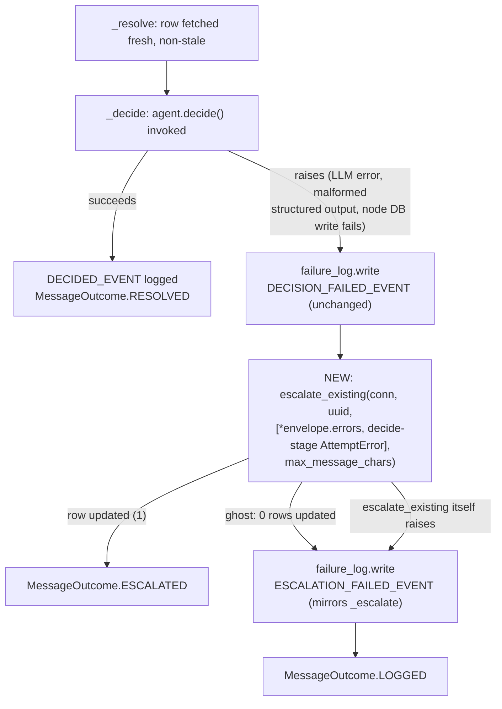

# Agent Decision Error Escalation Design

**Spec**: `.specs/features/agent-decision-error-escalation/spec.md`
**Status**: Draft

---

## Architecture Overview

One function changes shape: `reimbursement/validation.py`'s `_decide`'s
`except Exception` branch. Today it only calls `failure_log.write` and
returns `MessageOutcome.LOGGED`. It gains a second step — escalate the row
to `human-review` via the exact same primitive `_escalate` (the `retry > 3`
path, a few lines above it in the same file) already uses:
`escalate_existing`. No new subsystem, no new external dependency, no new
DB table or column.



The only new data-shape change is additive: `shared/models.py`'s `Stage`
literal gains a `"decide"` value, so a decision-stage failure can be
expressed as an `AttemptError` and folded into the same `render_history`
rendering `_escalate` already uses for the retry-ceiling path.

---

## Code Reuse Analysis

### Existing Components to Leverage

| Component | Location | How to Use |
| --------- | -------- | ---------- |
| `escalate_existing` | `packages/shared/src/shared/reimbursement/use_cases/send_human_review.py:54` | Called directly from `_decide`'s except branch — identical signature and ghost-handling contract `_escalate` already relies on, no wrapper needed |
| `render_history` / `AttemptError.from_exception` | same file:26 / `packages/shared/src/shared/models.py:76` | Builds `decision_reason` from `[*envelope.errors, AttemptError.from_exception(len(envelope.errors) + 1, "decide", exc)]` — zero new formatting/truncation/newline-collapsing code |
| `failure_log.write` | `packages/shared/src/shared/failure_log.py:41` | Unchanged, called exactly as today for `DECISION_FAILED_EVENT`; reused a second time (mirroring `_escalate`'s own shape) for the new `ESCALATION_FAILED_EVENT` fallback if the escalation write itself fails |
| `sanitize` | `packages/shared/src/shared/errors.py:42` | Unchanged — `_decide`'s `logger.error(...)` keeps calling it; no new stdout-sanitization logic |
| `MessageOutcome.ESCALATED` / `.LOGGED` | `packages/reimbursement/src/reimbursement/validation.py:44` | Reused as-is, no new enum member |
| `_failure_record` | same file:225 | Reused unchanged for both `failure_log.write` calls in the new branch |
| `deps.pool.acquire(...)` pattern | `_escalate`, same file:98 | Same acquire-timeout shape reused for the new connection the escalation needs (the graph's own connection, if any, is already closed/rolled back by the time `_decide`'s except runs) |

### Integration Points

| System | Integration Method |
| ------ | ------------------- |
| PostgreSQL (`reimbursement`, `human_review` tables) | `escalate_existing` → `apply_decision` → `repository.update_decision`, already the exact write path the retry-ceiling escalation uses today — no new SQL |
| `failure_log` (CRITICAL structured log) | Unchanged sink, one additional call site on the new fallback branch (escalation-write failure) |

No new integration — this feature is entirely internal to `reimbursement`'s
consume loop plus one additive field on a `shared` enum-like literal.

---

## Components

### `_decide` (modified)

- **Purpose**: On `agent.decide()` failure, escalate the row to
  `human-review` (new) in addition to the existing `failure_log` write,
  instead of leaving the row untouched.
- **Location**: `packages/reimbursement/src/reimbursement/validation.py`
- **Interface**: unchanged — `async def _decide(deps: Dependencies, envelope: ReimbursementEnvelope, row: asyncpg.Record) -> MessageOutcome`
- **Dependencies**: `deps.pool` (new `acquire()` inside the except branch), `escalate_existing`, `failure_log.write`, `AttemptError.from_exception`
- **Reuses**: `_escalate`'s exact try/except/ghost-check shape (same file, ~30 lines above) — the new except branch is structurally a copy of `_escalate`'s body, not a new pattern

### `Stage` literal (extended)

- **Purpose**: Let a decision-stage failure be expressed as an
  `AttemptError`, so it renders through the existing `render_history`.
- **Location**: `packages/shared/src/shared/models.py:17`
- **Interface**: `Stage = Literal["db-insert", "publish", "resolve", "decide"]`
- **Dependencies**: none — a type-only change
- **Reuses**: nothing new; every consumer of `Stage` (`AttemptError`, `render_history`) already handles an arbitrary literal value generically

---

## Data Models

No new models. `shared.models.AttemptError` is unchanged in shape — only
`Stage`'s allowed value set grows by one:

```python
Stage = Literal["db-insert", "publish", "resolve", "decide"]
```

`decision_reason` (already an existing `TEXT` column on both `reimbursement`
and `human_review`) receives `render_history`'s output — no schema change.

---

## Error Handling Strategy

| Error Scenario | Handling | Reviewer/Ops Impact |
| --------------- | -------- | -------------------- |
| `agent.decide()` raises (LLM error, malformed structured output, node-level DB write failure) | `failure_log.write(DECISION_FAILED_EVENT, ...)` (unchanged) **then** `escalate_existing(conn, uuid, [*envelope.errors, AttemptError(stage="decide", ...)], max_message_chars)` | Row appears in `human-review` with a `decision_reason` naming the failure — reviewer can act without reading logs |
| Escalation targets a ghost row (deleted between resolve and decide) | `escalate_existing` returns `None` (0 rows affected) → `failure_log.write(ESCALATION_FAILED_EVENT, ...)`, no retry of the escalation itself | Same as today's ghost handling elsewhere — a durable log record, no row to review (there is no row) |
| `escalate_existing` itself raises (e.g. DB unreachable) | Caught, `failure_log.write(ESCALATION_FAILED_EVENT, error=str(exc))`, outcome `LOGGED` | Same terminal behavior as today — at least one durable record, no crash of the consume loop |
| A decision was computed in-memory but its own persist call (inside `apply_policies`/`apply_agent_decision`) threw | Exception propagates to `_decide`'s except exactly like any other decision-stage failure — same escalation path, overwriting the never-durably-written decision | Row lands in `human-review` with the write error as the reason, not the decision that was never confirmed durable |
| stdout logging of any of the above | `logger.error("uuid=%s decision failed: %s", envelope.uuid, sanitize(exc))` — unchanged | Ops sees type + safe diagnostic only, never raw error text, on stdout |

---

## Risks & Concerns

| Concern | Location (file:line) | Impact | Mitigation |
| ------- | -------------------- | ------ | ---------- |
| `_decide`'s except is a broad `except Exception`, same shape AD-021 already accepted for `PublishFailed` — a genuine code bug (e.g. an `AttributeError` from a future node change) would also be escalated to human-review, not surfaced as a crash | `reimbursement/validation.py:172` (existing, unchanged by this feature) | A programming bug masquerades as a business escalation; debugging relies on grepping `decision_reason`/`failure_log` for the type name, same tradeoff AD-021 already made project-wide | No new mitigation needed — this feature doesn't change the exception surface, only what happens after catching it; `AttemptError.error_type` (`type(exc).__name__`) still distinguishes a code bug from a genuine LLM/DB failure in the rendered reason |
| The new escalation branch needs its own `pool.acquire()`, separate from whatever connection (if any) the graph's own failed node used | `reimbursement/validation.py` (new code) | If written incorrectly (e.g. reusing a connection object from a different acquire scope), could raise an unrelated asyncpg error | Mirror `_escalate`'s existing `async with deps.pool.acquire(timeout=...) as conn:` block exactly — verified pattern already in the same file |
| No existing test exercises `_decide`'s except branch turning into an escalation (current tests only cover the `LOGGED`-only path) | `packages/reimbursement/tests/test_validation.py` | Untested code path until this feature adds coverage | ADE-01..08 each map to a task with its own test; the Verifier's discrimination sensor checks these specifically |

---

## Tech Decisions (only non-obvious ones)

| Decision | Choice | Rationale |
| -------- | ------ | --------- |
| Reuse `escalate_existing`/`render_history`/`AttemptError` rather than a new one-off reason-string builder | Reuse | DRY with the only other human-review escalation path in the codebase; identical reviewer-facing format for both escalation reasons, no new redaction/truncation/newline logic to write or test |
| New `Stage = "decide"` literal value | Additive | Required so a decision-stage failure can be expressed as an `AttemptError`; naming matches the existing `resolve`/`publish`/`db-insert` convention |
| `MessageOutcome.ESCALATED` reused, no new enum member | Reuse | Semantically identical to the retry-ceiling escalation outcome — "row moved to human-review via escalation, not the normal decision path" |
| Escalation-failure fallback mirrors `_escalate`'s exact try/except/ghost-check shape | Copy existing pattern | Avoids inventing a second fallback pattern for the same failure class (ghost row, write failure) the codebase already has one answer for |
| **R-011 resolved: immediate escalation, not retry-then-escalate or a cause-differentiated policy** | Immediate escalation | Project-level — resolves the mechanism `agent-decide-reimbursement`'s AGD-25 explicitly deferred; recorded as `AD-039` in `.specs/STATE.md` |

> **Project-level decision recorded:** the R-011 resolution above is
> appended to `.specs/STATE.md` `## Decisions` as `AD-039` once this design
> is approved; every other row in this table is feature-local.
