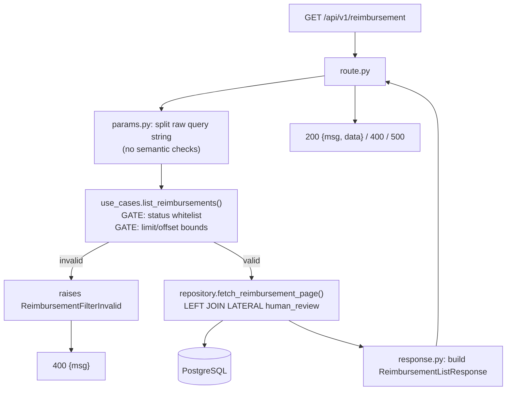

# GET /api/v1/reimbursement — Listing & Filtering Design

**Spec**: `.specs/features/api-get-reimbursement/spec.md`
**Status**: Draft

---

## Architecture Overview

A new `reimbursement/list/` vertical slice (matching `reimbursement/create/`'s
shape) sits behind a new `get_pool` dependency, itself backed by a DB
connection pool opened once in `api`'s lifespan — the same construct/yield/
close shape the Kafka producer already uses. All SQL stays in
`shared.reimbursement.repository`, which owns every statement against the
`reimbursement`/`human_review` tables (AD-025); this feature adds the one
read function it's missing.

**Single point of entry for filters (confirmed with user, 2026-08-08):** a
new `shared.reimbursement.use_cases.list_reimbursements` sits between
`route.py` and the repository. It owns both gates — the status whitelist
and the pagination bounds — so `params.py` stays purely syntactic (extract
raw values from the query string) and the actual filter *semantics* live in
one place any future non-HTTP consumer could call too, not duplicated
between an HTTP layer and elsewhere. This mirrors `review_reimbursement`'s
role in the PUT design, though the driver is different — there it was
transactional orchestration; here it's not duplicating domain validation
knowledge (which statuses exist, what the list-size ceiling is).

**Prerequisite refactor (AD-029):** `managed_pool` currently lives in
`shared.reimbursement.repository`, but it's generic pool-lifecycle code
with no reimbursement-specific logic — exactly parallel to
`shared.producer.managed_producer`, which correctly lives at the `shared`
root. It relocates to a new `shared/db.py` before this feature's `main.py`
wiring imports it, taking its three existing usage sites with it. See
Components below.



---

## Code Reuse Analysis

### Existing Components to Leverage

| Component | Location | How to Use |
| --------- | -------- | ---------- |
| `managed_pool` (relocating to `shared.db`, AD-029) | `src/shared/src/shared/reimbursement/repository.py` → `src/shared/src/shared/db.py` | Already built for the publisher — `api`'s lifespan opens the same pool type, doesn't reinvent it. Relocated first (see Components), then imported from its new home. |
| `shared.config.DatabaseConfig`/`load_config().database` | `src/shared/src/shared/config.py` | Already has `dsn`/`pool_min_size`/`pool_max_size` — no new config needed. |
| `dependencies.get_producer` pattern | `src/api/src/dependencies.py` | Mirrored exactly by a new `get_pool(request) -> asyncpg.Pool`. |
| `main.lifespan` | `src/api/src/main.py` | Extended with a second `async with managed_pool(...) as pool:`, `app.state.pool = pool`. |
| `errors.py`'s `{"msg"}` contract, `_msg_response`, `_unhandled_exception_handler` | `src/api/src/errors.py` | `500` and raw-type-coercion `400`s (e.g. `limit=abc`) are already covered; one new handler added for the filter/pagination gate (see below). |
| `reimbursement_status_created_idx (status, created_at DESC)` | `src/api/src/migrations/0001.create-reimbursement.sql` | Built specifically to serve this endpoint's filter+sort — confirmed still unused until now (`ARCHITECTURE.md`). |
| `human_review_reimbursement_created_idx (reimbursement_uuid, created_at DESC)` | `src/api/src/migrations/0002.create-human-review.sql` | Built specifically to serve "return the last Human Review" — the LATERAL join below uses it directly. |
| `shared.reimbursement.use_cases.send_human_review` — the use-case shape itself | `src/shared/src/shared/reimbursement/use_cases/send_human_review.py` | Same `conn`-taking, framework-agnostic, single-entry-point shape reused for `list_reimbursements`; also the direct precedent `api-put-reimbursement/design.md`'s `review_reimbursement` follows. |
| `shared.config.MAX_BATCH_ITEMS` — the "wire ceiling lives in shared.config" pattern | `src/shared/src/shared/config.py` | Mirrored by a new `MAX_LIST_LIMIT`, so the pagination ceiling is a named, centralized constant rather than a magic number inside the use case. |

### Integration Points

| System | Integration Method |
| ------ | ------------------- |
| PostgreSQL | New read-only query via `shared.reimbursement.repository.fetch_reimbursement_page()`, called by the `list_reimbursements` use case, run over the shared pool. |
| `api-put-reimbursement` (sibling feature) | Shares the DB-pool-wiring component (`main.py`/`dependencies.py`) and the `AD-029` relocation — whichever feature's Tasks land first adds them; the other reuses them unmodified (see Risks & Concerns). |

---

## Components

### `shared.db` — new module (AD-029 refactor)

- **Purpose**: house the generic, domain-agnostic pool-lifecycle helper — relocated out of a domain package it never belonged in.
- **Location**: `src/shared/src/shared/db.py` (new file)
- **Interfaces**: `managed_pool(config: DatabaseConfig) -> AsyncIterator[asyncpg.Pool]` — identical signature and behavior to today's, only the module changes.
- **Change scope**:
  - Move the function out of `src/shared/src/shared/reimbursement/repository.py`; update that module's docstring (drop "Pool lifecycle", keep "every SQL statement against the reimbursement table").
  - Update the three existing import sites: `src/publisher/src/consumer.py:17`, `src/publisher/tests/test_integration.py:23`, `src/shared/tests/reimbursement/test_repository.py` (its `DescribeManagedPool` class moves to a new `src/shared/tests/test_db.py`, matching the 1:1 test-mirrors-source convention).
  - No behavior change — pure relocation. The publisher's existing, already-verified test suite (`publisher-consume-request/validation.md`: 274 passed) must stay green after the move.
- **Reuses**: nothing new — this *is* the reuse target for everything else in this feature.

### `main.lifespan` — modified, not new

- **Purpose**: also own the DB pool's lifetime, alongside the existing Kafka producer.
- **Location**: `src/api/src/main.py`
- **Change**: nest `async with managed_pool(load_config().database) as pool:` inside the existing `async with managed_producer(...) as producer:` block; `app.state.pool = pool`.
- **Dependencies**: `shared.db.managed_pool`, `shared.config.load_config`.
- **Reuses**: the exact construct/yield/close shape `managed_producer` already establishes.

### `dependencies.get_pool` — new function, existing file

- **Purpose**: FastAPI `Depends()` accessor for the live pool.
- **Location**: `src/api/src/dependencies.py`
- **Interfaces**: `get_pool(request: Request) -> asyncpg.Pool`
- **Reuses**: identical shape to `get_producer`.

### `shared.config.MAX_LIST_LIMIT` — new constant, existing file

- **Purpose**: name the pagination ceiling as a shared wire constant, matching `MAX_BATCH_ITEMS`'s existing precedent, instead of a magic number in the use case.
- **Location**: `src/shared/src/shared/config.py`
- **Interfaces**: `MAX_LIST_LIMIT = 500` — module-level constant alongside `MAX_BATCH_ITEMS`.

### `shared.errors.ReimbursementFilterInvalid` — new exception, existing file

- **Purpose**: signal that the requested `status`/`limit`/`offset` combination failed the use case's own gate (bad status value, or a bound violation).
- **Location**: `src/shared/src/shared/errors.py`
- **Interfaces**: `class ReimbursementFilterInvalid(Exception): ...` — same shape as `BatchInvalid`/`ReviewInvalid` (PUT's design).

### `api.errors._reimbursement_filter_invalid_handler` — new handler, existing file

- **Purpose**: translate `ReimbursementFilterInvalid` to the app-wide `{"msg"}` contract.
- **Location**: `src/api/src/errors.py`
- **Interfaces**: registered in `register_handlers()` → `400`.
- **Reuses**: `_msg_response`, same as every other handler.

### `shared.reimbursement.repository.fetch_reimbursement_page` — new function, existing file

- **Purpose**: the one SQL statement this feature needs — paginated, optionally status-filtered, each row paired with its most recent `human_review`. Pure SQL, no validation — trusts its caller (the use case) to have already gated the inputs.
- **Location**: `src/shared/src/shared/reimbursement/repository.py`
- **Interfaces**: `fetch_reimbursement_page(conn: asyncpg.Connection, *, statuses: list[str] | None, limit: int, offset: int) -> list[asyncpg.Record]`
- **Implementation**: `LEFT JOIN LATERAL (SELECT status, reviewed_by, reason, created_at FROM human_review WHERE reimbursement_uuid = r.uuid ORDER BY created_at DESC LIMIT 1) hr ON true`; `WHERE ($1::text[] IS NULL OR r.status = ANY($1))`; `ORDER BY r.created_at DESC LIMIT $2 OFFSET $3`. Confirmed approach (LATERAL, single round trip) over a two-query merge — it's the standard Postgres idiom for "top-1 per group" and the existing index serves it directly.
- **Naming note**: not `list_reimbursements` — that name belongs to the use case below (the one `route.py` actually calls), mirroring the `repository.approve`/`reject` vs. `use_cases.approve_reimbursement`/`reject_reimbursement` split in the PUT design, so the two layers never share an identical name.
- **Dependencies**: none beyond `asyncpg`.
- **Reuses**: `shared.db.managed_pool` (post-relocation), same file's docstring-enforced invariant.

### `shared.reimbursement.use_cases.list_reimbursements` — new module

- **Purpose**: the single point of entry for listing reimbursements — owns both gates (status whitelist, pagination bounds) before delegating to the repository, so any future non-HTTP consumer gets the identical guarantees the API does.
- **Location**: `src/shared/src/shared/reimbursement/use_cases/list_reimbursements.py` (new file, second sibling to `send_human_review.py`)
- **Interfaces**:
  ```python
  VALID_STATUSES = {
      "auto-approved", "human-approved", "human-review",
      "auto-rejected", "human-rejected",
  }  # deliberately excludes "pending" — internal-only, AD-003

  async def list_reimbursements(
      conn: asyncpg.Connection, *, statuses: list[str] | None, limit: int, offset: int,
  ) -> list[asyncpg.Record]:
      """GATE 1: every entry in `statuses`, if given, must be client-facing.
      GATE 2: 0 <= limit <= MAX_LIST_LIMIT and offset >= 0.
      Raises ReimbursementFilterInvalid on either violation; never touches
      the DB before both gates pass."""
  ```
- **Dependencies**: `shared.reimbursement.repository.fetch_reimbursement_page`, `shared.errors.ReimbursementFilterInvalid`, `shared.config.MAX_LIST_LIMIT`.
- **Reuses**: the exact shape `send_human_review` already established.

### `reimbursement/list/route.py` — new slice

- **Purpose**: orchestrate parse → query → shape → respond, same shape as `create/route.py`.
- **Location**: `src/api/src/reimbursement/list/route.py`
- **Interfaces**: `GET /api/v1/reimbursement` handler, `Depends(get_pool)`.
- **Dependencies**: `params.py`, `response.py`, `shared.reimbursement.use_cases.list_reimbursements`.

### `reimbursement/list/params.py` — new slice file, narrowed scope

- **Purpose**: pure syntactic extraction only — no semantic validation, that's the use case's job now.
- **Location**: `src/api/src/reimbursement/list/params.py`
- **Interfaces**: `limit: int = 100`, `offset: int = 0` as plain FastAPI `Query()` params (type coercion only — no `ge`/`le`, those bounds moved to the gate); `parse_status_filter(raw: str | None) -> list[str] | None` — splits on `,`, returns the raw segments unchecked (no whitelist check here anymore).
- **Reuses**: FastAPI's native `int` coercion still gives `400` for free on a genuinely malformed type (e.g. `limit=abc`) via the existing `RequestValidationError` path — that narrow case is the one place native validation still applies; everything about *values being in range* moved to the use case.

### `reimbursement/list/response.py` — new slice file

- **Purpose**: shape the DB row (with its `hr_*`-prefixed LATERAL columns) into the documented response body.
- **Location**: `src/api/src/reimbursement/list/response.py`
- **Interfaces**: `HumanReviewSummary` (`status`, `reviewed_by`, `reason`, `created_at`), `ReimbursementListItem` (every `reimbursement` column + `last_human_review: HumanReviewSummary | None`), `ReimbursementListResponse` (`msg: str`, `data: list[ReimbursementListItem]`), `ReimbursementListItem.from_record(record: asyncpg.Record) -> Self`.
- **Reuses**: none directly — this is API-local response shaping, which stays out of `shared` per `CONVENTIONS.md`'s shared-kernel discipline (only `api` serves HTTP).

---

## Data Models

### `ReimbursementListItem` (api-local response model)

```python
class HumanReviewSummary(BaseModel):
    status: Literal["approved", "rejected"]
    reviewed_by: str
    reason: str
    created_at: AwareDatetime

class ReimbursementListItem(BaseModel):
    uuid: UUID
    request_id: str
    submitted_by: str | None
    submitted_at: AwareDatetime | None
    status: str
    receipts_value: Decimal | None
    receipts_date: date | None
    currency: str | None
    decision_reason: str | None
    human_review_notes: str | None
    created_at: AwareDatetime
    updated_at: AwareDatetime
    last_human_review: HumanReviewSummary | None

class ReimbursementListResponse(BaseModel):
    msg: str
    data: list[ReimbursementListItem]
```

**Relationships**: `last_human_review` is a 1:0..1 projection of the most
recent `human_review` row for that `reimbursement.uuid` — never the full
history, matching `SCOPE.md:162`'s "last Human Review if any."

---

## Error Handling Strategy

| Error Scenario | Handling | User Impact |
| --------------- | -------- | ------------ |
| `limit`/`offset` not even a valid integer (e.g. `limit=abc`) | FastAPI's native type coercion fails → `RequestValidationError` → existing `_validation_handler` (AD-011) | `400 {"msg": "..."}` — zero new code |
| `status` outside the five client-facing values, `limit` out of `[0, MAX_LIST_LIMIT]`, or `offset < 0` | `list_reimbursements()` use case raises `ReimbursementFilterInvalid` | `400 {"msg": "..."}` — one new exception + handler |
| Zero rows match | Normal query result, empty list | `200 {"msg": "...", "data": []}` |
| DB pool/connection failure | Falls through to the existing `_unhandled_exception_handler` | `500 {"msg": "internal error"}` — zero new code |

---

## Risks & Concerns

| Concern | Location (file:line) | Impact | Mitigation |
| ------- | --------------------- | ------ | ---------- |
| `shared.reimbursement.repository`'s own docstring states "nothing else in the workspace touches asyncpg" | `src/shared/src/shared/reimbursement/repository.py:1-3` | A future author could be tempted to query directly from `route.py` for a one-off need, breaking the single-owner invariant | Keep all SQL in `repository.py`; `route.py` only calls the use case, never `fetch_reimbursement_page()` directly |
| Two names for "list reimbursements" one layer apart (`repository.fetch_reimbursement_page` vs. `use_cases.list_reimbursements`) | `src/shared/src/shared/reimbursement/{repository,use_cases/list_reimbursements}.py` | A reader jumping to the wrong one could think the repository function already gates its inputs | Deliberately distinct verbs (`fetch_*` vs. `list_*`), matching the `approve`/`reject` vs. `approve_reimbursement`/`reject_reimbursement` split already established for PUT; repository docstring states plainly it performs no validation |
| Response body has no `total`/`count` field | `SCOPE.md:170-176` (documented shape) | A client can't render "page N of M" without a second `COUNT(*)` query this feature doesn't add | Out of scope per the documented response shape — flagged so it isn't mistaken for an oversight later |
| Two features (`api-get-reimbursement`/`api-put-reimbursement`) both need to edit `main.py`/`dependencies.py` for the same pool | `src/api/src/{main,dependencies}.py` | Implementing both features' task lists independently risks two conflicting edits | Tasks phase: whichever feature is executed first owns this edit; the other's tasks reference it as already-done |
| `managed_pool`'s relocation (AD-029) touches already-shipped, already-tested code (`publisher-consume-request`) | `src/publisher/src/consumer.py`, `src/publisher/tests/test_integration.py`, `src/shared/tests/reimbursement/test_repository.py` | A careless move breaks a currently-green, independently-verified suite (274 passed) | Pure rename/relocate, no logic change; run the full publisher + shared suites after the move, not just this feature's new tests |

---

## Tech Decisions

| Decision | Choice | Rationale |
| -------- | ------ | --------- |
| Last-human-review fetch | Single query, `LEFT JOIN LATERAL ... LIMIT 1` | Confirmed with user (2026-08-08) — the standard Postgres idiom for "top-1 per group," uses the existing index, one round trip, composes with the outer `LIMIT`/`OFFSET`. |
| **Filter/pagination validation → a use case, not `params.py`** | `shared.reimbursement.use_cases.list_reimbursements` owns the status whitelist + bounds gates; `params.py` only extracts raw values | Confirmed with user (2026-08-08). Revises the earlier "native FastAPI validation, zero new exception type" plan — that was leaner, but this centralizes filter *semantics* (which statuses exist, the list-size ceiling) as domain knowledge any future non-HTTP consumer can reuse, rather than only enforcing it at the HTTP edge. Mirrors `review_reimbursement`'s single-point-of-entry role in the PUT design, for a different reason (no transactional orchestration here — just not duplicating validation knowledge). |
| Pagination ceiling as a named constant | `shared.config.MAX_LIST_LIMIT = 500` | Matches `MAX_BATCH_ITEMS`'s existing precedent for a wire-contract ceiling living in `shared.config`, not hardcoded in the use case. |
| Response models | API-local (`reimbursement/list/response.py`), not `shared` | Only `api` serves HTTP (`CONVENTIONS.md` shared-kernel discipline). |
| DB pool wiring | Extend `main.py` lifespan + `dependencies.py`, mirroring the Kafka producer pattern exactly | Established precedent (AD-010/AD-024); one-time addition shared with `api-put-reimbursement`. |
| `managed_pool` location | Relocate to `shared/db.py`, out of `shared.reimbursement.repository` | Confirmed with user (2026-08-08) — recorded as **AD-029**; generic pool lifecycle has no reimbursement-specific logic and belongs alongside `shared/producer.py`, not under a domain package. |

> **Project-level decision recorded:** `AD-029` (`managed_pool` → `shared.db`) is already appended to `.specs/STATE.md` as of this design. The DB-pool-*wiring* pattern into `api` (lifespan + `get_pool` dependency) is `api`'s first DB access and sets the pattern any future `api` read/write path follows — that piece still waits on Tasks to confirm which feature implements it first before its own `AD-NNN` is appended.
