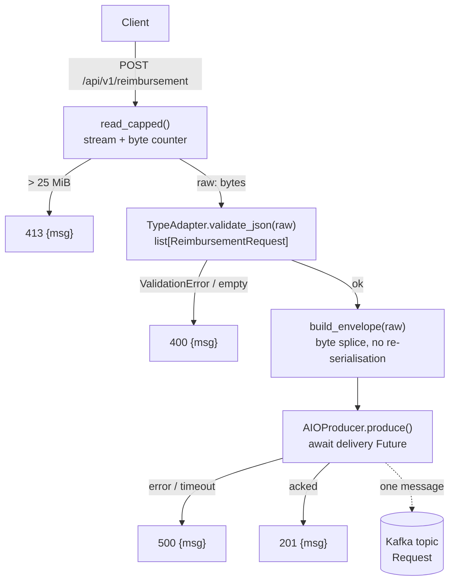

# POST /api/v1/reimbursement Design

**Spec**: `.specs/features/api-post-reimbursement/spec.md`
**Context**: `.specs/features/api-post-reimbursement/context.md`
**Status**: Implemented — see `validation.md`

---

## Architecture Overview

One request path, four stages, each with a single failure mode. The body is
read once under a byte cap, validated once by pydantic-core, wrapped verbatim
in an envelope, and published with a per-message delivery await.

The controlling insight: **the raw bytes are the product**. Validation exists
only to reject garbage — it never produces the thing we publish. So the design
keeps the original `bytes` alive from the socket to the producer and never
re-serialises a parsed model.



### Why the raw bytes survive

`build_envelope` concatenates bytes rather than dumping a model:

```python
prefix = b'{"retry":0,"published_at":"' + stamp + b'","payload":'
envelope = prefix + raw + b'}'
```

`raw` was already proven to be valid JSON by `validate_json`, so splicing it
into a JSON object is safe. This is what makes `RCV-04` (byte-for-byte
identical payload) true by construction rather than by careful serialiser
configuration.

---

## File Structure

`api` is organised as **vertical slices**: one directory per resource, one
directory per operation, holding everything that operation needs. A flat module
list forces every reader to hold the whole service in their head to find one
endpoint; a slice is a unit you can open, understand, and delete whole.

`+` new · `~` modified · `·` untouched (listed for orientation)

```
reimbursementanalyzer/
├── docker-compose.yml                        ~ 3 size vars on the kafka service
├── pyproject.toml                            ~ pytest pythonpath + import-mode
└── src/
    ├── agent/                                ·
    ├── publisher/                            ·
    ├── shared/
    │   ├── pyproject.toml                    ~ pydantic[email] (EmailStr)
    │   └── src/shared/models.py              ~ 2 cross-service models appended
    └── api/
        ├── Dockerfile                        ·
        ├── pyproject.toml                    ·
        ├── src/api/
        │   ├── __init__.py                   ·
        │   ├── config.py                     + infra constants + env readers
        │   ├── errors.py                     + app-wide {"msg"} handlers
        │   ├── kafka.py                      + AIOProducer lifecycle
        │   ├── main.py                       ~ lifespan + include_router
        │   ├── migrate.py                    ·  (db-schema-migrations)
        │   ├── migrations/                   ·  (db-schema-migrations)
        │   ├── responses.py                  + MessageResponse — api-only
        │   └── reimbursement/
        │       ├── __init__.py               +
        │       └── create/
        │           ├── __init__.py           +
        │           ├── producer.py           + build_envelope + publish
        │           ├── route.py              + the POST route
        │           └── validation.py         + byte cap + batch validation
        └── tests/
            ├── conftest.py                   ~ EXTENDED — never overwritten
            ├── helpers.py                    ·  (postgres helpers)
            ├── test_compose_parity.py        +
            ├── test_health.py                +
            ├── test_migrat*.py               ·
            ├── test_fixtures.py              ·
            └── reimbursement/create/
                ├── conftest.py               + kafka container + fake producer
                ├── test_integration.py       +
                ├── test_openapi.py           +
                ├── test_producer.py          +
                ├── test_route.py             +
                └── test_validation.py        +
```

### Slice rules

**1 — The slice is the operation, not the resource.** `reimbursement/create/`,
later `reimbursement/list/` and `reimbursement/update/` (`SCOPE.md:146-204`).
Fine-grained because these operations barely overlap: `create` is a Kafka write
path with a 25 MiB body; `list` and `update` are small database reads and
writes. A single `reimbursement/` module holding all three would put unrelated
machinery in one file, which is the problem being solved.

**2 — A thin slice is still a slice.** `list/` will likely hold one `route.py`.
That is fine — consistency of shape beats balanced file counts. The reader's
question is always "where does POST live", never "which directory has the most
files".

**3 — What stays outside a slice: cross-cutting contracts and infrastructure.**
Three things resist slicing and belong at the `api` root:

- `errors.py` — the `{"msg"}` contract is the API's, not this route's. Registered
  app-wide so `list`/`update` inherit it rather than each re-implementing it.
- `kafka.py` — the `AIOProducer` is an app-lifetime singleton opened and closed
  by the FastAPI lifespan. Burying it in `reimbursement/create/` would make
  `main.py` reach three levels into a slice for an object it owns the lifecycle
  of, inverting ownership. See the note below.
- `config.py` — only the constants something *outside* a slice compares against:
  `KAFKA_MAX_MESSAGE_BYTES` and `MAX_BODY_BYTES` (their 1 MiB gap is an
  invariant a test asserts, and `test_compose_parity.py` reads the first),
  plus `bootstrap_servers()`.

**4 — Slice-local constants stay in the slice.** `REQUEST_TOPIC` and
`PUBLISH_TIMEOUT_SECONDS` live in `create/producer.py`, next to their only
caller. The rule: a constant leaves the slice only when something outside the
slice must compare it to something else.

**5 — Tests mirror the slices, one-to-one.** `tests/reimbursement/create/`
mirrors `src/api/reimbursement/create/`, and the Kafka container fixture lives
in the slice's own `conftest.py` — so the migration tests never pay for it. Two
`pyproject.toml` settings make this work, both verified on the installed pytest
9.1.1:

```toml
[tool.pytest.ini_options]
testpaths = ["src/api/tests"]
pythonpath = ["src/api/tests"]        # keeps `from helpers import ...` working at any depth
addopts = "--import-mode=importlib"   # lets sibling slices both have a test_route.py
```

Verified by experiment, both directions: two same-named `test_route.py` files in
sibling directories plus a root-`conftest.py` fixture pass with these settings,
and fail collection with `import file mismatch` without them. Without
`pythonpath`, pytest puts each test file's *basedir* on `sys.path` instead of
the tests root, which breaks the existing `from helpers import ...` in
`conftest.py`. Neither setting is decoration.

**6 — `shared` holds cross-service wire contracts, and nothing else.**
`RequestEnvelope` and `ReimbursementRequest` are the api↔publisher contract — a
*different service* parses what this slice writes, so no slice inside `api` can
own them. `MessageResponse` is **not** one of them: `publisher` and `agent` will
never construct an HTTP response body, so it lives in `api/responses.py`. Two
models added to `shared/models.py`, which stays one file.

`HealthStatus` is api-only too and predates this rule. Moving it is a two-line
change outside this feature's scope (`SCOPE.md` `/health` is untouched), so it
stays put and is recorded as a deferred idea — the one knowing exception to the
rule, not a second precedent.

**7 — Packaged resources live under the module root (AD-007).** Slices sit
inside `src/api/src/api/`, never at `src/api/`. The `prod` Dockerfile target
copies only `/app/.venv`, so anything outside the installed package is absent
from the production image.

### Notes on two calls

**`producer.py`, not `publisher.py`.** The workspace already has a service named
`publisher` (`src/publisher/`) that *consumes* this topic. A file named
`publisher.py` inside `api` would invite exactly the wrong reading.

**`kafka.py` is the one file added beyond the proposed three.** It owns config
and lifecycle: build the producer config dict, construct the `AIOProducer`,
stop it. `create/producer.py` owns the feature logic: build the envelope,
produce to `REQUEST_TOPIC`, await the delivery verdict, raise `PublishFailed`.
The split is what keeps lifespan ownership at the app level while the slice
still owns everything about *this* publish. Collapsing the two into
`create/producer.py` is a defensible alternative — it costs one import in
`main.py` reaching into the slice, and buys one fewer file.

---

## Code Reuse Analysis

### Existing Components to Leverage

| Component | Location | How to Use |
| --------- | -------- | ---------- |
| `HealthStatus` pattern | `src/shared/src/shared/models.py:4` | Same style for the two new *cross-service* models; `MessageResponse` goes to `api/responses.py` instead |
| FastAPI app instance | `src/api/src/api/main.py:4` | Extend with `lifespan` + `include_router`; `/health` is untouched |
| `KAFKA_BOOTSTRAP_SERVERS` env var | `docker-compose.yml:267` | Already injected into the `api` container; read the same name |
| Kafka broker service | `docker-compose.yml:53-83` | Add three size env vars; `test_compose_parity.py` asserts they match `config.py` |
| pytest wiring | `pyproject.toml` `[dependency-groups] dev`, `testpaths = ["src/api/tests"]` | Established by the migrations feature; add `pythonpath` + `--import-mode=importlib` so tests can mirror the slices |
| testcontainers | `pyproject.toml` dev group, already installed at 4.15.0 | `KafkaContainer` from `testcontainers.community.kafka`, mirroring AD-008's postgres pattern |
| `src/api/tests/conftest.py` | Exists — written by `db-schema-migrations` | **Extend**, do not overwrite — see Risks |

### Integration Points

| System | Integration Method |
| ------ | ------------------ |
| Kafka | `confluent_kafka.aio.AIOProducer`, one instance per app, owned by the FastAPI lifespan |
| Publisher service | Contract is the envelope schema; `RequestEnvelope` ships in `shared` so the publisher parses what the API writes |
| OpenAPI / Swagger | `openapi_extra` on the route + `responses=` for the four status codes (`SCOPE.md:282-284`) |

---

## Components

### `ReimbursementRequest` / `RequestEnvelope`

- **Purpose**: The **cross-service** wire contract — the minimum request shape
  and the envelope the publisher consumes.
- **Location**: `src/shared/src/shared/models.py`
- **Interfaces**: Pydantic models (see Data Models below)
- **Dependencies**: `pydantic`, `email-validator` (new dep on `shared`)
- **Reuses**: Existing module and its `BaseModel` conventions

### `MessageResponse`

- **Purpose**: The single `{"msg": ...}` HTTP response body.
- **Location**: `src/api/src/api/responses.py`
- **Dependencies**: `pydantic`
- **Note**: api-only by definition — `publisher` and `agent` never build HTTP
  responses. It sits at the `api` root rather than in the slice because
  `errors.py` renders it app-wide and every future route returns it.

### `validation.py` — the slice's reject-before-we-act stage

- **Purpose**: Everything that turns a bad request away before anything is
  published: the streaming byte ceiling and the batch schema check.
- **Location**: `src/api/src/api/reimbursement/create/validation.py`
- **Interfaces**:
  - `async read_capped(request: Request) -> bytes` — streams the body, raising
    `PayloadTooLarge` the moment the running total exceeds `MAX_BODY_BYTES`
  - `validate_batch(raw: bytes) -> list[ReimbursementRequest]` — raises
    `BatchInvalid` carrying an index-and-field message
  - `BATCH_ADAPTER` — module-level `TypeAdapter(list[ReimbursementRequest])`
- **Dependencies**: `starlette.Request`, `shared.models`, `api.config`
- **Reuses**: Starlette's `request.stream()`; `TypeAdapter` built once at import
  (constructing one per request re-compiles the validator)
- **Note**: The counter is checked *after* each chunk is added, so the limit is
  inclusive — exactly `MAX_BODY_BYTES` passes, `+ 1` fails (`RCV-19`).
  `Content-Length` is never consulted (`RCV-03`, `RCV-04`).
- **Two failure modes in one module** (`413` and `400`) — deliberate. The slice
  is organised by request *stage*, not by status code, and both of these reject
  the request before any side effect.

### `producer.py` — the slice's publish stage

- **Purpose**: Turn "publish this batch" into a single awaited delivery verdict.
- **Location**: `src/api/src/api/reimbursement/create/producer.py`
- **Interfaces**:
  - `build_envelope(raw: bytes, published_at: datetime) -> bytes` — pure, unit-testable
  - `async publish(producer: AIOProducer, raw: bytes) -> None` — builds the
    envelope, produces to `REQUEST_TOPIC`, awaits the delivery Future; raises
    `PublishFailed` on broker error or timeout
- **Owns**: `REQUEST_TOPIC`, `PUBLISH_TIMEOUT_SECONDS`
- **Dependencies**: the `AIOProducer` handed in by the route — never constructed
  here, so unit tests pass a fake and the integration test passes a real one

### `kafka.py` — producer lifecycle

- **Purpose**: Construct and dispose the app's single `AIOProducer`.
- **Location**: `src/api/src/api/kafka.py`
- **Interfaces**:
  - `producer_config() -> dict` — bootstrap servers, `acks=all`,
    `enable.idempotence=true`, `message.max.bytes`, `message.timeout.ms`
  - `async lifespan_producer(app) -> AsyncIterator[None]` — sets
    `app.state.producer`, stops it on shutdown
  - `get_producer(request: Request) -> AIOProducer` — FastAPI dependency
- **Dependencies**: `confluent_kafka.aio.AIOProducer`, `api.config`
- **Reuses**: `KAFKA_BOOTSTRAP_SERVERS` env var already wired into the container

### `route.py` — the slice's entry point

- **Purpose**: Orchestrate cap → validate → publish → respond. No logic of its own.
- **Location**: `src/api/src/api/reimbursement/create/route.py`
- **Interfaces**:
  - `POST /api/v1/reimbursement` → `201 | 400 | 413 | 500`, always `{"msg": ...}`
- **Dependencies**: `validation.read_capped`, `validation.validate_batch`,
  `producer.publish`, `kafka.get_producer`
- **Note**: Exports `router`; `main.py` includes it and knows nothing else about
  the slice.

### Error handlers

- **Purpose**: Guarantee every error response is `{"msg": ...}` — including the
  `422 detail[]` FastAPI would otherwise emit.
- **Location**: `src/api/src/api/errors.py`
- **Interfaces**: handlers for `PayloadTooLarge`, `BatchInvalid`,
  `PublishFailed`, `RequestValidationError`, `HTTPException`, `Exception`
- **Dependencies**: `fastapi`
- **Reuses**: FastAPI's `app.exception_handler` registration
- **Note**: Registered app-wide, not per-route, so the future `GET`/`PUT`
  endpoints inherit the contract instead of re-implementing it.

### Configuration

- **Purpose**: Only the constants something *outside* a slice compares against.
- **Location**: `src/api/src/api/config.py`
- **Interfaces**: `MAX_BODY_BYTES`, `KAFKA_MAX_MESSAGE_BYTES`,
  `MESSAGE_TIMEOUT_MS`, `bootstrap_servers()`
- **Reuses**: The `os.environ.get(name, local_default)` convention
  (`CONVENTIONS.md:30-31`) — no settings framework, consistent with the repo
- **Note**: `REQUEST_TOPIC` and `PUBLISH_TIMEOUT_SECONDS` are deliberately *not*
  here — nothing outside `create/` reads them (slice rule 4). The two size
  constants are, because their 1 MiB gap is an invariant a test asserts and
  `test_compose_parity.py` reads `KAFKA_MAX_MESSAGE_BYTES` from here.

---

## Data Models

### `ReimbursementRequest`

```python
class ReimbursementRequest(BaseModel):
    model_config = ConfigDict(extra="allow")

    request_id: Annotated[str, StringConstraints(strip_whitespace=True, min_length=1)]
    submitted_by: EmailStr
    submitted_at: AwareDatetime
```

`extra="allow"` implements "accept any payload" (`SCOPE.md:124`) — `raw_ocr_text`,
`claimed_amount_brl`, `attachments` and anything else pass validation untouched.
The stripped/coerced values never reach Kafka, because the publish path uses
`raw`, not this model.

### `RequestEnvelope`

```python
class RequestEnvelope(BaseModel):
    retry: int
    published_at: AwareDatetime
    payload: list[dict[str, Any]]
```

**Write path does not use this model** — the envelope is byte-spliced. It exists
so the publisher service can `model_validate_json()` what it consumes, and so
the envelope contract has one authoritative definition.

**Relationships**: `payload` carries the batch verbatim; the publisher iterates
it (`SCOPE.md:210`) and creates one `reimbursement` row per item.

### `MessageResponse` — `src/api/src/api/responses.py`

```python
class MessageResponse(BaseModel):
    msg: str
```

The `{"msg": ""}` body from `SCOPE.md:140-144`, used as `response_model` for
`201` and in `responses=` for `400` / `413` / `500`.

---

## Error Handling Strategy

| Error Scenario | Handling | User Impact |
| -------------- | -------- | ----------- |
| Body exceeds 26 214 400 bytes | `read_capped` raises `PayloadTooLarge` mid-stream; remaining bytes are not read | `413 {"msg": "payload exceeds 25 MiB limit"}` |
| Body is not valid JSON | `validate_json` raises `ValidationError` | `400 {"msg": "body is not valid JSON"}` |
| Body is not a JSON array | `ValidationError` with `loc == ()` | `400 {"msg": "body must be a JSON array of requests"}` |
| Body is `[]` | Explicit length check after validation | `400 {"msg": "batch must contain at least one request"}` |
| Item fails field validation | First error's `loc` → `(index, field)` | `400 {"msg": "item 1: submitted_by — value is not a valid email address"}` |
| Broker returns a delivery error | Delivery Future raises → `PublishFailed` | `500 {"msg": "failed to publish request"}` |
| Broker unreachable / no ack | `message.timeout.ms` fails the Future first; `asyncio.wait_for` is the backstop | `500 {"msg": "failed to publish request"}` |
| Client disconnects mid-upload | Starlette `ClientDisconnect` propagates; nothing published | No response (connection already gone) |
| Any unhandled exception | Catch-all handler | `500 {"msg": "internal error"}` |

**Message content rule (`RCV-11`)**: error text names the item index and field
name only. Pydantic's `ValidationError` includes the offending `input` value —
the handler reads `loc` and `msg`, never `input`, and never `str(exc)`.

**Logging rule (`RCV-17`)**: publish failures log the batch's `request_id`
values (available from the validated models) and the broker error. The body is
never logged — it may be 25 MB and may carry PII (`SCOPE.md:59`).

---

## Risks & Concerns

| Concern | Location | Impact | Mitigation |
| ------- | -------- | ------ | ---------- |
| `AIOProducer` defaults batch 1000 messages / 1.0 s before flushing | `confluent_kafka/aio/producer/_AIOProducer.py:47-48,218` | Every request would wait ~1 s for the buffer timeout, and 1000 buffered 25 MB messages is 25 GB of RAM | `batch_size=1` — verified at `_AIOProducer.py:218`, buffer flushes as soon as size ≥ batch_size |
| `asyncio.wait_for` firing before librdkafka gives up would return `500` for a message that later succeeds | `reimbursement/create/producer.py` (new) | Phantom failures: client retries, broker gets the batch twice | `message.timeout.ms` (8 s) set *below* `PUBLISH_TIMEOUT_SECONDS` (10 s) so librdkafka always fails first and the Future resolves as an error |
| `src/api/tests/conftest.py` already exists — `db-schema-migrations` shipped it | `src/api/tests/conftest.py:1-61` | A `Write` on this path silently deletes the `server_url` / `migrated_db` / `conn` fixtures | Confirmed present in the working tree. The task list says **Edit, never Write**, and the gate for that task runs the *whole* suite so a clobber fails loudly |
| Root `pyproject.toml` `[tool.pytest.ini_options]` is shared with `db-schema-migrations` | `pyproject.toml:16-17` | Adding `pythonpath`/`addopts` touches a block the other feature owns | Additive only — `testpaths` is untouched, and the gate runs the full suite including the migration tests, so a regression there fails the task |
| The 25 MiB ceiling is a number in three places: `config.py`, `docker-compose.yml`, the test container | three files | Two can drift apart while every test still passes | `config.KAFKA_MAX_MESSAGE_BYTES` is the single source; the test container is configured *from* it, and `test_compose_parity.py` parses `docker-compose.yml` and asserts the literal matches |
| `docs/codebase/` is absent on the current branch (`feature/3-migration`) | tracked only in `38a2133` | Design references `ARCHITECTURE.md` / `CONVENTIONS.md` line numbers that are not resolvable in this working tree | Content was read earlier in this session and is unchanged; the files return on `feature/3-api_receive_reimbursement_endpoint` |
| Raising broker `message.max.bytes` lets 25 MB messages be written but not read | `docker-compose.yml` | Publisher consumer will fail on oversized fetches | Out of scope by decision; recorded in spec Assumptions and as a Deferred Idea so the publisher feature inherits it |
| Unauthenticated 25 MB ingress | `reimbursement/create/route.py` (new) | Trivial memory/bandwidth exhaustion vector | Streaming cap bounds per-request memory; auth is a deliberate project-level cut (`SCOPE.md:295-297`). Documented, not solved |
| `KafkaContainer` defaults to `confluentinc/cp-kafka:7.6.0`; compose runs `apache/kafka:4.3.1` | `testcontainers/community/kafka/__init__.py:60` | A different broker distribution could accept a size the shipped one rejects | Pin the container to the compose image and verify it boots under `KafkaContainer`'s KRaft start script during the task; if it will not, fall back to `cp-kafka` and rely on `test_compose_parity.py` for the shipped-config claim |
| `enable.idempotence=true` constrains other producer settings | `kafka.py` (new) | librdkafka rejects the config if `acks` ≠ `all` or `retries` = 0 | Both are set consistently (`acks=all`, retries left at default). This is a second reason the spec's "retry = 0 is the envelope counter" reading is the correct one |
| No test currently covers `/health` | `src/api/src/api/main.py:7-9` | Refactoring `main.py` for lifespan/router could silently break it | Add a `/health` regression test — cheap, and the spec's last success criterion demands it |

---

## Tech Decisions

| Decision | Choice | Rationale |
| -------- | ------ | --------- |
| `api` module layout | Vertical slices, one directory per operation | A flat module list makes the reader hold the whole service in their head to find one endpoint, and gets worse with every route. A slice is openable, understandable, and deletable whole. Cross-cutting concerns (`errors.py`, `kafka.py`, `config.py`) stay at the root by exception, each with a stated reason |
| Test layout | Mirrors the slices, `pythonpath` + `--import-mode=importlib` | Both settings verified on pytest 9.1.1 by experiment; without them nested tests fail with `import file mismatch` and `from helpers import ...` breaks. Keeps the Kafka container fixture in the slice's `conftest.py` so migration tests never pay for it |
| Producer client | `confluent_kafka.aio.AIOProducer` with `batch_size=1` | Verified present in the pinned 2.15.0. Manages its own poll thread and returns a per-message `asyncio.Future` — exactly `RCV-14`/`RCV-16`. Replaces a hand-rolled poller-thread + `call_soon_threadsafe` bridge, deleting an entire concurrency component |
| Envelope assembly | Byte splice, not `model_dump_json` | Makes `RCV-04` true by construction. Also forced: `AIOProducer.produce()` raises `NotImplementedError` on `headers` in batch mode, so the "retry in a Kafka header" alternative was never viable |
| Body parsing | `TypeAdapter(...).validate_json(raw)` | Parses the 25 MB body once in pydantic-core's Rust parser. The typed-route alternative walks it three times (`body()` → `json.loads` → validate), twice in Python |
| `TypeAdapter` lifetime | Module-level singleton | Constructing one per request rebuilds the validator on every call |
| OpenAPI body schema | `openapi_extra` fed by `BATCH_ADAPTER.json_schema()` | Manual parsing means no automatic schema; deriving it from the same adapter keeps docs and validation from drifting |
| Error handler scope | App-wide | The `{"msg"}` contract is the API's, not this route's — `GET`/`PUT` (`SCOPE.md:146-204`) inherit it |
| Publish timeouts | `message.timeout.ms=8000` < `PUBLISH_TIMEOUT_SECONDS=10` | Guarantees the broker-side deadline fires first, so a `500` means "definitely not delivered" rather than "not delivered yet" |
| Compression | None | 25 MB of JSON compresses well and would ease the size limits, but it changes the bytes the broker measures and adds a variable this feature does not need. Recorded as a deferred optimisation |
| Kafka size ceiling | 27 262 976 (26 MiB) at broker, replica fetch, and producer | 1 MiB headroom over the HTTP cap covers the ~75-byte envelope prefix plus protocol framing. `KAFKA_SOCKET_REQUEST_MAX_BYTES` needs no change — its 100 MB default already clears this |
| Test broker | `KafkaContainer` (testcontainers), sized from `config.KAFKA_MAX_MESSAGE_BYTES` | Conforms to **AD-008**, which superseded AD-006 and made hermetic containers the project pattern. Reverses this design's earlier compose-broker choice |
| Proving the *shipped* broker config | `test_compose_parity.py` — parse `docker-compose.yml`, assert its `KAFKA_MESSAGE_MAX_BYTES` equals `config.KAFKA_MAX_MESSAGE_BYTES` | The one thing a throwaway container genuinely cannot prove. Splitting the claim gives both halves: the container proves 25 MiB *flows*, the parity test proves we *ship* that number. Cheaper and stricter than a broker that only ever tested one of them |

> **Project-level decisions** proposed for `.specs/STATE.md`: AD-009 (vertical
> slice layout for `src/api`, with the three stated exceptions), AD-010
> (AIOProducer as the project's Kafka producer pattern), AD-011 (app-wide
> `{"msg"}` error contract), AD-012 (26 MiB Kafka message ceiling). Appended on
> approval. Numbered from 009 — `db-schema-migrations` took 008 while this
> design was open.
>
> AD-009 is the one that binds work beyond this feature: it commits `list` and
> `update` to the same shape, and it is the reason `errors.py` is registered
> app-wide rather than on this router.

---

## Test Plan

Tests mirror the slice one-to-one (slice rule 5); `tests/reimbursement/create/`
is shorthand for `src/api/tests/reimbursement/create/`.

| Layer | Type | Location | Covers |
| ----- | ---- | -------- | ------ |
| Byte cap + batch validation | unit | `tests/reimbursement/create/test_validation.py` | RCV-07…RCV-13, RCV-18, RCV-19 (boundary: exactly at limit vs limit+1), RCV-03/04 via chunked + lying `Content-Length` |
| `build_envelope` + publish | unit (fake producer) | `tests/reimbursement/create/test_producer.py` | RCV-03, RCV-04, RCV-05, RCV-14…RCV-17 |
| Route orchestration | unit (fake producer) | `tests/reimbursement/create/test_route.py` | RCV-01, RCV-02, RCV-06 + the concurrency crossover case; asserts the fake recorded zero publishes on every reject path |
| OpenAPI | unit | `tests/reimbursement/create/test_openapi.py` | RCV-21 |
| Real broker | integration | `tests/reimbursement/create/test_integration.py` | RCV-20 (half 2) — 25 MiB round-trip through a `KafkaContainer` sized from the same constant, consumed back and compared byte-for-byte |
| Health regression | unit | `src/api/tests/test_health.py` | Success criterion: `/health` unchanged |
| Compose parity | unit | `src/api/tests/test_compose_parity.py` | RCV-20 (half 1) — the shipped `docker-compose.yml` carries `config.KAFKA_MAX_MESSAGE_BYTES` |

**Gate commands** (mirroring AD-008's shape — no compose stack required):

| Level | Command |
| ----- | ------- |
| Quick | `uv run pytest src/api/tests -q -m "not integration"` |
| Full | `uv run pytest src/api/tests -q` (Docker daemon required, per AD-008) |
| Build | `uv sync --all-packages && docker compose config -q` |

The integration test is marked so the Quick gate runs with no Docker at all.
