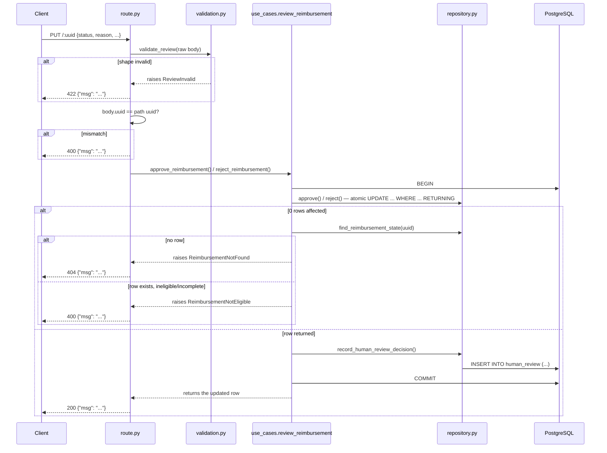

# PUT /api/v1/reimbursement/:uuid — Human Review Decision Design

**Spec**: `.specs/features/api-put-reimbursement/spec.md`
**Status**: Draft

---

## Architecture Overview

`route.py` stays thin — parse, delegate, respond — mirroring `create/route.py`'s
own stated philosophy ("every failure mode is still a raise from one of the
collaborators, caught by the app-wide handlers"). The payload is validated
manually (so a shape failure returns `422`, distinct from FastAPI's
automatic-validation `400` path). All business orchestration — the atomic
transition, the conditional `human_review` insert, and 404/400/400
disambiguation — lives in a new `shared.reimbursement.use_cases.review_reimbursement`
module, which raises typed exceptions rather than returning a code for
`route.py` to branch on. This mirrors the codebase's existing precedent
exactly: `publisher/processing.py` calls bare repository functions
(`insert_pending`, `is_duplicate`) for plain SQL with no branching, but goes
through the `send_human_review` **use case** for anything that orchestrates
a repository call plus real logic — approve/reject is squarely the second
category.



---

## Code Reuse Analysis

### Existing Components to Leverage

| Component | Location | How to Use |
| --------- | -------- | ---------- |
| `create/validation.py`'s manual-`TypeAdapter` + custom-exception pattern | `src/api/src/reimbursement/create/validation.py` | Mirrored exactly for the `422` path — this codebase already has the precedent for "bypass FastAPI's automatic body validation to get a non-default status code." |
| `shared.reimbursement.use_cases.send_human_review` — the use-case shape itself | `src/shared/src/shared/reimbursement/use_cases/send_human_review.py` | Direct precedent: `conn`-taking, framework-agnostic function that orchestrates one or more repository calls plus real branching logic. `review_reimbursement.py` follows the identical shape. |
| `publisher/processing.py`'s repository-vs-use-case boundary | `src/publisher/src/processing.py:141-143` (use case) vs. `:201-215` (bare repository call) | Confirms the actual bar already in use: plain SQL with no branching stays a repository call; orchestration + typed outcomes goes through a use case. Applied here, not just asserted. |
| `shared.errors.{PayloadTooLarge,BatchInvalid,PublishFailed}` shape | `src/shared/src/shared/errors.py` | New `ReviewInvalid`, `ReimbursementNotFound`, `ReimbursementNotEligible` exceptions added alongside them — same framework-agnostic, message-carrying shape. |
| `errors.register_handlers` | `src/api/src/errors.py` | Three new handlers registered alongside the existing five (`422`, `404`, `400`). |
| AD-017's `async with conn.transaction():` discipline | (pattern, not a file) | Reused directly inside the use case: the `human_review` insert happens *inside* the same transaction as the `reimbursement` update. |
| `shared.db.managed_pool` + `dependencies.get_pool` (AD-029) | shared with `api-get-reimbursement`'s design | Same pool, same dependency, same relocated module — not re-added or re-relocated if GET's Tasks already did it. |
| `human_review_append_only` trigger | `src/api/src/migrations/0002.create-human-review.sql` | Already guarantees the DB-level "never overwrite a review" invariant — the design doesn't need its own enforcement. |

### Integration Points

| System | Integration Method |
| ------ | ------------------- |
| PostgreSQL | Atomic `UPDATE ... RETURNING` + `INSERT INTO human_review`, one transaction, orchestrated by the use case, over the shared pool. |
| `api-get-reimbursement` (sibling feature) | Shares the DB-pool-wiring component and the `AD-029` `shared/db.py` relocation — see that design; not duplicated here. |

---

## Components

### `shared.errors` — three new exceptions, existing file

- **Purpose**: typed, framework-agnostic outcomes the use case raises instead of returning a code.
- **Location**: `src/shared/src/shared/errors.py`
- **Interfaces**:
  ```python
  class ReviewInvalid(Exception):
      """The review payload failed its own shape contract (missing/malformed field)."""

  class ReimbursementNotFound(Exception):
      """No reimbursement row matches the given uuid."""

  class ReimbursementNotEligible(Exception):
      """The row exists but its current state doesn't allow this decision —
      wrong status, or (reject only) missing receipts_value/date/currency."""
  ```
- **Reuses**: same shape as the three exceptions already there (`PayloadTooLarge`, `BatchInvalid`, `PublishFailed`).

### `api.errors` — three new handlers, existing file

- **Purpose**: translate the new exceptions to the app-wide `{"msg"}` contract.
- **Location**: `src/api/src/errors.py`
- **Interfaces**: `_review_invalid_handler` → `422`, `_reimbursement_not_found_handler` → `404`, `_reimbursement_not_eligible_handler` → `400`, each registered in `register_handlers()`.
- **Reuses**: `_msg_response`, same as every other handler in the file.

### `shared.reimbursement.repository` — four new functions, existing file (pure SQL only)

- **`approve(conn, uuid, *, eligible_statuses, receipts_value, receipts_date, receipts_currency, reason) -> asyncpg.Record | None`** — `UPDATE reimbursement SET status='human-approved', receipts_value=$3, receipts_date=$4, currency=$5, decision_reason=$6, updated_at=now() WHERE uuid=$1 AND status = ANY($2) RETURNING *`. **Column is `currency`, not `receipts_currency`** — corrected during Execute (T2): the migration never defined a `receipts_currency` column (only `receipts_value`/`receipts_date` carry that prefix; the currency column is bare `currency`). The `receipts_currency` name is kept for the function's own parameter and the PUT payload's wire field (`SCOPE.md`'s documented JSON key), mapped onto the real column inside the SQL only.
- **`reject(conn, uuid, *, eligible_statuses, reason) -> asyncpg.Record | None`** — `UPDATE reimbursement SET status='human-rejected', decision_reason=$3, updated_at=now() WHERE uuid=$1 AND status = ANY($2) AND receipts_value IS NOT NULL AND receipts_date IS NOT NULL AND currency IS NOT NULL RETURNING *`.
- **`find_reimbursement_state(conn, uuid) -> asyncpg.Record | None`** — `SELECT uuid, status, receipts_value, receipts_date, currency FROM reimbursement WHERE uuid=$1`. Called only by the use case's disambiguation path.
- **`record_human_review_decision(conn, reimbursement_uuid, status, reviewed_by, reason) -> UUID`** — `INSERT INTO human_review (reimbursement_uuid, status, reviewed_by, reason) VALUES ($1,$2,$3,$4) RETURNING uuid`. **Deliberately not named `insert_human_review`** — that name is already taken by the existing function that inserts into `reimbursement` (not `human_review`) for the publisher's retry-ceiling path; see Risks & Concerns.
- **Naming note**: `approve`/`reject` here are the raw-SQL primitives, called *only* by the use case below — never named `approve_reimbursement`/`reject_reimbursement` themselves, to avoid colliding with the use case's public verbs.
- **Dependencies**: none beyond `asyncpg`.
- **Reuses**: `shared.db.managed_pool` (post-AD-029), same file's docstring-enforced invariant.

### `shared.reimbursement.use_cases.review_reimbursement` — new module

- **Purpose**: orchestrate one review decision atomically — the one piece of real business logic this feature has (eligibility, the reject-completeness gate, the two-write transaction, error disambiguation) — kept out of `route.py` and out of `repository.py` alike.
- **Location**: `src/shared/src/shared/reimbursement/use_cases/review_reimbursement.py` (new file, new sibling to `send_human_review.py`)
- **Interfaces**:
  ```python
  ELIGIBLE_STATUSES = ["human-review", "auto-rejected", "human-rejected"]

  async def approve_reimbursement(
      conn: asyncpg.Connection, uuid: UUID, *,
      receipts_value: Decimal, receipts_date: date, receipts_currency: str,
      reason: str, approved_by: str,
  ) -> asyncpg.Record: ...

  async def reject_reimbursement(
      conn: asyncpg.Connection, uuid: UUID, *, reason: str, approved_by: str,
  ) -> asyncpg.Record: ...
  ```
  Both: attempt the atomic repository update; on a returned row, call
  `record_human_review_decision` (same transaction) and return the row; on
  `None`, call `find_reimbursement_state` and raise `ReimbursementNotFound`
  (no row) or `ReimbursementNotEligible` (row exists, wrong status, or —
  reject only — an incomplete entity).
- **Dependencies**: `shared.reimbursement.repository`, `shared.errors`.
- **Reuses**: the exact shape `send_human_review` already established — a `conn`-taking, framework-agnostic function with no FastAPI/HTTP awareness, callable by any future service the way `send_human_review` is already documented as Agent-reusable (AD-014's implication note).

### `reimbursement/update/route.py` — new slice, now thin

- **Purpose**: parse, delegate to the use case, respond. No branching logic of its own beyond the body/path `uuid` consistency check.
- **Location**: `src/api/src/reimbursement/update/route.py`
- **Interfaces**: `PUT /api/v1/reimbursement/{uuid}` handler, `Depends(get_pool)`.
- **Dependencies**: `validation.py`, `shared.reimbursement.use_cases.review_reimbursement.{approve_reimbursement,reject_reimbursement}`.

### `reimbursement/update/validation.py` — new slice file (unchanged from prior draft)

- **Purpose**: parse and validate the review payload; raise `ReviewInvalid` on any shape failure.
- **Location**: `src/api/src/reimbursement/update/validation.py`
- **Interfaces**:
  ```python
  class ApproveReview(BaseModel):
      status: Literal["approved"]
      reason: str
      receipts_date: date
      receipts_value: Decimal  # >= 0, mirrors the DB CHECK
      receipts_currency: str   # ^[A-Z]{3}$, mirrors the DB CHECK
      approved_by: EmailStr
      uuid: UUID | None = None

  class RejectReview(BaseModel):
      status: Literal["rejected"]
      reason: str
      approved_by: EmailStr
      uuid: UUID | None = None

  ReviewRequest = Annotated[ApproveReview | RejectReview, Field(discriminator="status")]
  REVIEW_ADAPTER = TypeAdapter(ReviewRequest)

  def validate_review(raw: bytes) -> ApproveReview | RejectReview: ...
  ```
- **Reuses**: `create/validation.py`'s exact manual-`TypeAdapter`-then-catch-`ValidationError`-then-raise-typed-exception shape. Discriminated-union syntax verified against Context7/Pydantic docs (2026-08-08) — `Annotated[Union, Field(discriminator=...)]` is the current, non-deprecated Pydantic v2 API.

---

## Data Models

### `ApproveReview` / `RejectReview` (api-local request models)

See `validation.py`'s interface above — request-shape models, kept out of
`shared` for the same reason GET's response models are: HTTP-payload
shaping is API-specific, only `api` serves HTTP (`CONVENTIONS.md`
shared-kernel discipline).

**Relationships**: neither persists directly — `route.py` maps validated
fields onto the use case's keyword arguments; the DB row is the system of
record, not these models.

---

## Error Handling Strategy

| Error Scenario | Handling | User Impact |
| --------------- | -------- | ------------ |
| Missing/malformed payload field (either decision type) | `validate_review()` raises `ReviewInvalid` | `422 {"msg": "<field>: ..."}` |
| Body `uuid` present and ≠ path `uuid` | `route.py` raises `HTTPException(400)` (reuses the existing Starlette-exception handler, no new type) | `400 {"msg": "..."}` |
| Path `uuid` matches no row | use case raises `ReimbursementNotFound` | `404 {"msg": "..."}` |
| Row exists, status not eligible | use case raises `ReimbursementNotEligible` | `400 {"msg": "..."}` |
| Row exists, reject with an incomplete entity | use case raises `ReimbursementNotEligible` (same type, distinct message) | `400 {"msg": "..."}` |
| Two concurrent PUTs, same `uuid` | Postgres's row-level write serialization — the second `UPDATE`'s `WHERE` re-evaluates against the already-committed new status and matches 0 rows, so the use case raises `ReimbursementNotEligible` for the loser | Winner: `200`. Loser: `400` |
| DB/transaction failure | Falls through to the existing `_unhandled_exception_handler` | `500 {"msg": "internal error"}` — zero new code |

---

## Risks & Concerns

| Concern | Location (file:line) | Impact | Mitigation |
| ------- | --------------------- | ------ | ---------- |
| Existing `insert_human_review()` inserts into `reimbursement`, not `human_review` — a misleading name for anyone skimming the module for "where do I insert into human_review" | `src/shared/src/shared/reimbursement/repository.py:73-74` | A future author could call the wrong function, or duplicate one that already exists under an unexpected name | New function named distinctly (`record_human_review_decision`); add a one-line docstring cross-reference on the existing `insert_human_review` clarifying it targets `reimbursement`, not `human_review` |
| No explicit row lock (`SELECT ... FOR UPDATE`) before the atomic `UPDATE` | `use_cases/review_reimbursement.py` | None functionally — flagged so a future reader doesn't "fix" this by adding a redundant lock | Confirmed with user (2026-08-08); document the reasoning in the use case's module docstring |
| Two features (`api-get-reimbursement`/`api-put-reimbursement`) both need `main.py`/`dependencies.py`'s pool wiring, and both depend on the `AD-029` `shared/db.py` relocation | `src/api/src/{main,dependencies}.py`, `src/shared/src/shared/db.py` | Independent task lists risk a duplicate/conflicting edit, or one feature's Tasks silently assuming the relocation already happened | Tasks phase: whichever feature is executed first owns both the relocation and the pool wiring; the other's tasks reference them as already-done |
| This design's own SQL literals named the currency column `receipts_currency` | `repository.py`'s `approve`/`reject`/`find_reimbursement_state` (T2, discovered during Execute) | The migration only ever defined `currency` — a literal implementation from this design as originally written would have targeted a nonexistent column | Corrected during Execute: SQL now targets `currency`; `receipts_currency` is kept only as the function parameter and PUT payload's wire field name (matching `SCOPE.md`'s documented JSON key), never as a column reference |

---

## Tech Decisions

| Decision | Choice | Rationale |
| -------- | ------ | --------- |
| Approve/reject atomicity | Single `UPDATE ... WHERE ... RETURNING`, no explicit lock | Confirmed with user (2026-08-08) — Postgres's own row-level locking already serializes concurrent writers correctly. |
| 404/400/400 disambiguation | One extra `SELECT`, only on the 0-rows-affected path | Confirmed with user (2026-08-08) — zero added cost on the (common) success path. |
| Payload validation → `422` | Manual `TypeAdapter` + `ReviewInvalid`, not FastAPI's automatic body param | Confirmed with user (2026-08-08) — FastAPI's automatic path routes through the existing global handler to `400` (AD-011), which would silently violate `SCOPE.md`'s documented `422` for this route. |
| `422` vs `400` boundary | `422` = payload failed its own shape contract; `400` = well-formed request, target row's state disallows it | Confirmed with user (2026-08-08) — corrected `spec.md`'s `REVIEW-03` from `400` to `422` for coherence with `REVIEW-02`. |
| Discriminated union on `status` | `Annotated[ApproveReview \| RejectReview, Field(discriminator="status")]` | Verified against Context7/Pydantic docs (2026-08-08) — current Pydantic v2 API, not deprecated. |
| **Business orchestration → a use case, not inline `route.py` branching** | `shared.reimbursement.use_cases.review_reimbursement`, raising typed exceptions the app-wide handlers translate | Confirmed with user (2026-08-08) — matches the codebase's existing, already-demonstrated bar (`send_human_review`, `processing.py`'s repository-vs-use-case split) and `CONVENTIONS.md`'s own rule that domain code raises typed exceptions rather than building responses itself. Also keeps `route.py` as thin as `create/route.py` already is. |
| `managed_pool` location | `shared/db.py` (AD-029), shared with GET's design | Same decision, same rationale — not repeated here. |

> **Project-level decisions:** `AD-029` (`managed_pool` → `shared.db`) is already appended to `.specs/STATE.md`, shared with `api-get-reimbursement`'s design. The DB-pool-*wiring* pattern into `api` still waits on Tasks to confirm build order before its own `AD-NNN`. The use-case-for-orchestration choice here is an *application* of the already-established `AD-025` (`shared` owns `repository`/`failure_log`/`usecases`), not a new project-level decision — no new AD needed for it.
