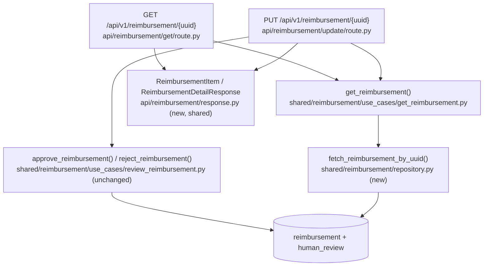

# Reimbursement Detail (GET by uuid & PUT payload) Design

**Spec**: `.specs/features/api-reimbursement-detail/spec.md`
**Status**: Draft

---

## Architecture Overview

Both endpoints end up sharing one read path: a single-row equivalent of the
list endpoint's `fetch_reimbursement_page` query (row + its most recent
`human_review`, via the same `LEFT JOIN LATERAL` shape), wrapped in a new
`get_reimbursement` use case, shaped by one shared Pydantic model. `PUT`
calls its existing write use case unchanged, then calls the *same*
`get_reimbursement` use case on the same connection to build its response —
this is what makes the spec's "byte-identical to a follow-up GET" edge case
structural rather than a discipline two authors have to keep in sync.



---

## Code Reuse Analysis

### Existing Components to Leverage

| Component | Location | How to Use |
| --- | --- | --- |
| `ReimbursementNotFound` | `packages/shared/src/shared/errors.py:29` | Reuse directly for GET's 404 — already registered app-wide (`api/errors.py`) as a 404 handler; matches the exact message convention `review_reimbursement.py`'s `_disambiguate` already uses. |
| `fetch_reimbursement_page` / `_FETCH_REIMBURSEMENT_PAGE` | `packages/shared/src/shared/reimbursement/repository.py:41-60` | Copy its `LEFT JOIN LATERAL ... hr_*` shape for the new single-row query — same enrichment, different `WHERE`. |
| `uuid: UUID` path param + app-wide `_validation_handler` | `packages/api/src/api/reimbursement/update/route.py:29`, `packages/api/src/api/errors.py:74` | Reuse as-is for GET's `{uuid}` param — malformed input already becomes `400 {"msg": "..."}` with zero extra code. |
| `pool.acquire(timeout=...)` + `get_pool` dependency | `packages/api/src/api/reimbursement/list/route.py:33`, `packages/api/src/api/dependencies.py` | Same DI/acquire pattern for the new GET route. |
| `async with conn.transaction()` (AD-017) | `packages/shared/src/shared/reimbursement/use_cases/review_reimbursement.py:44,73` | Unchanged — PUT's write stays exactly as-is; only what happens *after* it commits changes. |
| Vertical-slice layout (AD-009) | `packages/api/src/api/reimbursement/{create,list,update}/` | New `get/` slice follows the same shape: `route.py` (+ `__init__.py`). |

### Integration Points

| System | Integration Method |
| --- | --- |
| Postgres (`reimbursement`, `human_review`) | New read-only query via the existing `asyncpg` pool; no schema change. |
| FastAPI app (`api/main.py`) | New router import + `app.include_router(...)`, same as the three existing slices. |

---

## Components

### `api/reimbursement/response.py` (new)

- **Purpose**: The one place that shapes "what a reimbursement looks like" for every route that returns it — currently only `list/`, from this feature on also `get/` and `update/`.
- **Location**: `packages/api/src/api/reimbursement/response.py`
- **Interfaces**:
  - `class HumanReviewSummary(BaseModel)` — moved here verbatim from `list/response.py`.
  - `class ReimbursementItem(BaseModel)` — moved and renamed from `ReimbursementListItem` (no longer list-specific); `from_record(record: asyncpg.Record) -> Self` moves with it, unchanged.
  - `class ReimbursementDetailResponse(BaseModel): msg: str; data: ReimbursementItem` — new; used by both `get/route.py` and `update/route.py`.
- **Dependencies**: `asyncpg`, `pydantic`.
- **Reuses**: `HumanReviewSummary`/`ReimbursementListItem.from_record`'s existing field mapping — moved, not rewritten.

### `api/reimbursement/list/response.py` (modified)

- **Purpose**: List-specific envelope only, now importing the item shape instead of owning it.
- **Interfaces**: `class ReimbursementListResponse(BaseModel): msg: str; data: list[ReimbursementItem]` — imports `ReimbursementItem` from `api.reimbursement.response`.
- **Reuses**: Nothing else changes — `list/route.py`'s call to `ReimbursementListItem.from_record(row)` becomes `ReimbursementItem.from_record(row)`.

### `api/reimbursement/get/route.py` (new)

- **Purpose**: `GET /api/v1/reimbursement/{uuid}` — single-item read.
- **Location**: `packages/api/src/api/reimbursement/get/route.py`
- **Interfaces**: `async def get_reimbursement_by_uuid(uuid: UUID, pool: asyncpg.Pool = Depends(get_pool)) -> ReimbursementDetailResponse`
- **Dependencies**: `get_pool` (DI), `get_reimbursement` use case, `ReimbursementDetailResponse`/`ReimbursementItem`.
- **Reuses**: Acquire/timeout pattern from `list/route.py`; `uuid: UUID` param + validation-handler pattern from `update/route.py`.

### `shared/reimbursement/use_cases/get_reimbursement.py` (new)

- **Purpose**: Fetch one reimbursement enriched with its last human review, or raise `ReimbursementNotFound`.
- **Location**: `packages/shared/src/shared/reimbursement/use_cases/get_reimbursement.py`
- **Interfaces**: `async def get_reimbursement(conn: asyncpg.Connection, uuid: UUID) -> asyncpg.Record`
- **Dependencies**: `fetch_reimbursement_by_uuid` (repository), `shared.errors.ReimbursementNotFound`.
- **Reuses**: Same raise-on-`None` shape as `review_reimbursement.py`'s `_disambiguate`, same message convention (`f"no reimbursement with uuid {uuid}"`).

### `shared/reimbursement/repository.py` (modified)

- **Purpose**: Add the single-row, enriched read statement.
- **Interfaces**: `async def fetch_reimbursement_by_uuid(conn: asyncpg.Connection, uuid: UUID) -> asyncpg.Record | None`, backed by a new `_FETCH_REIMBURSEMENT_BY_UUID` constant — `_FETCH_REIMBURSEMENT_PAGE`'s `SELECT r.*, hr.* ... LEFT JOIN LATERAL ...` with `WHERE r.uuid = $1` instead of the status/limit/offset clause.
- **Reuses**: The LATERAL-join enrichment shape verbatim; kept a separate statement (not a parameterized branch of `_FETCH_REIMBURSEMENT_PAGE`) so each query stays single-purpose, matching this module's own docstring convention ("every SQL statement against the reimbursement table" — one statement, one job).

### `api/reimbursement/update/route.py` (modified)

- **Purpose**: Unchanged decision logic; after the write use case commits, re-fetch via `get_reimbursement` on the same `conn` and return it.
- **Interfaces**: Return type changes `MessageResponse` → `ReimbursementDetailResponse`; `response_model=` updated to match. Error `responses={}` entries (`400/404/413/422/500`) are untouched.
- **Reuses**: `get_reimbursement` (the same function `get/route.py` calls) — the single source of truth for "current state of a reimbursement," called from both routes.

### `api/main.py` (modified)

- Add `from api.reimbursement.get.route import router as get_reimbursement_router` and `app.include_router(get_reimbursement_router)`, alongside the three existing includes.

---

## Data Models

```python
class HumanReviewSummary(BaseModel):
    status: Literal["approved", "rejected"]
    reviewed_by: str
    reason: str
    created_at: AwareDatetime

class ReimbursementItem(BaseModel):          # renamed from ReimbursementListItem
    uuid: UUID
    request_id: str
    submitted_by: str | None
    submitted_at: AwareDatetime | None
    original_payload: dict[str, Any]
    status: str
    receipts_value: Decimal | None
    receipts_date: date | None
    currency: str | None
    decision_reason: str | None
    human_review_notes: str | None
    created_at: AwareDatetime
    updated_at: AwareDatetime
    last_human_review: HumanReviewSummary | None

    @classmethod
    def from_record(cls, record: asyncpg.Record) -> Self: ...  # unchanged mapping

class ReimbursementDetailResponse(BaseModel):   # new
    msg: str
    data: ReimbursementItem

class ReimbursementListResponse(BaseModel):     # unchanged shape, now imports ReimbursementItem
    msg: str
    data: list[ReimbursementItem]
```

**Relationships**: `ReimbursementDetailResponse` and `ReimbursementListResponse` both wrap `ReimbursementItem` — one as a single object, one as a list — so a list element and a detail response's `data` are always structurally identical.

---

## Error Handling Strategy

| Error Scenario | Handling | User Impact |
| --- | --- | --- |
| GET: uuid matches no row | `get_reimbursement` raises `ReimbursementNotFound`, caught by existing app-wide handler | `404 {"msg": "no reimbursement with uuid ..."}` |
| GET: malformed uuid path segment | FastAPI's own path coercion raises `RequestValidationError` before the handler runs — no query executed | `400 {"msg": "path.uuid: ..."}` |
| GET/PUT re-fetch: DB pool/connection failure | Uncaught exception falls through to `_unhandled_exception_handler` (existing, logs + generic message) | `500 {"msg": "internal error"}` |
| PUT: write succeeds, re-fetch somehow returns no row | Structurally shouldn't happen (same `conn`, uuid just written) — if it ever did, `get_reimbursement` raises `ReimbursementNotFound`, surfacing as `404` rather than crashing | `404` (defensive; not an expected path) |

---

## Risks & Concerns

| Concern | Location (file:line) | Impact | Mitigation |
| --- | --- | --- | --- |
| Renaming `ReimbursementListItem` → `ReimbursementItem` and relocating it ripples into every import site | `packages/api/src/api/reimbursement/list/response.py`, `list/route.py`, `packages/api/tests/reimbursement/list/test_response.py`, `test_route.py` | Compile/import breakage if any site is missed | Mechanical rename, done in one task, verified by the existing list test suite (unchanged assertions, only the import path/class name moves) still passing green. |
| PUT now does a second DB round-trip (write, then read) inside the same `pool.acquire` block | `packages/api/src/api/reimbursement/update/route.py` | One extra `SELECT` per PUT request; negligible next to the existing transaction, but worth naming since it wasn't there before | Same `conn`, no second pool acquisition; well inside the existing `acquire_timeout_seconds` budget already applied to the whole block. |
| `update/route.py` (a write slice) now imports a read use case from a different domain concern (`get_reimbursement`) | `packages/api/src/api/reimbursement/update/route.py` | Slight tension with AD-009's "operations barely overlap" framing | Deliberate, narrow exception: importing one read-only use case is what makes the spec's "byte-identical to GET" guarantee structural instead of duplicated logic in two places. No route imports another route; the shared surface stays at the use-case layer, which is where AD-025 already expects cross-cutting reimbursement logic to live. |

---

## Tech Decisions

| Decision | Choice | Rationale |
| --- | --- | --- |
| Where the shared item/detail response model lives | New `api/reimbursement/response.py`, sibling to the operation slices, not inside `list/` and not duplicated in `get/`/`update/` | Mirrors AD-009's existing precedent of promoting genuinely cross-slice things out of a slice (`errors.py` at the `api` root); scoped to `reimbursement` here since only this resource's three routes share it. |
| Single shared read use case (`get_reimbursement`) called by both GET and PUT | New `shared/reimbursement/use_cases/get_reimbursement.py`, called from both `get/route.py` and `update/route.py` (post-commit) | Only way to make "PUT's response is byte-identical to a follow-up GET" (spec edge case) a structural guarantee rather than two independently-maintained mappings. |
| New dedicated SQL statement (`fetch_reimbursement_by_uuid`) rather than parameterizing `fetch_reimbursement_page` with an optional uuid filter | Separate `_FETCH_REIMBURSEMENT_BY_UUID` constant | Keeps each statement single-purpose per `repository.py`'s own convention; avoids overloading the list use case's pagination/filter contract with an unrelated single-row mode. |

> **Project-level decision candidate, declined**: the first row (shared response-model placement) sets a pattern future reimbursement routes should follow — flagged as an `AD-032` candidate and raised with the user, who chose to keep it feature-local rather than log it in `.specs/STATE.md`. Stays scoped to this table only.
