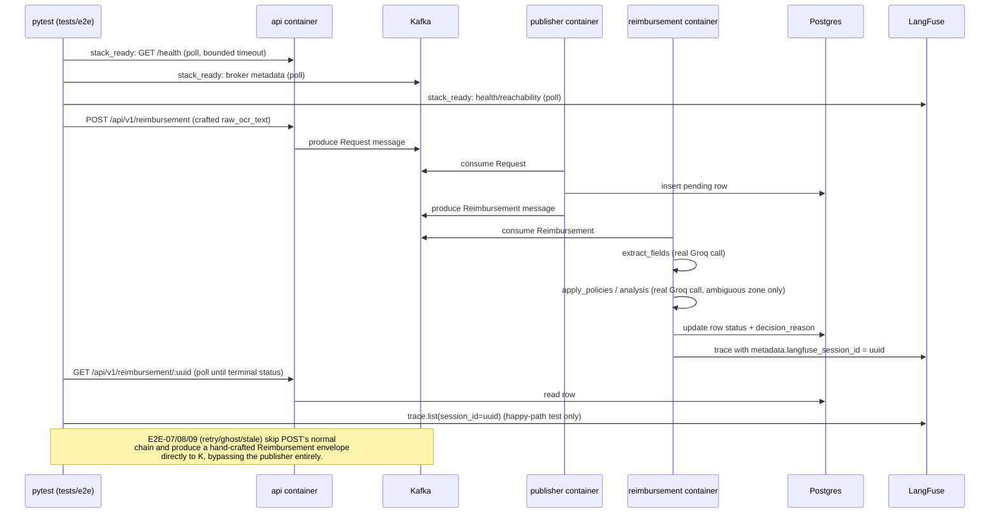

# E2E Pipeline Flow & Dotenv-First Runtime Configuration Design

**Spec**: `.specs/features/e2e-pipeline-flow/spec.md`
**Status**: Draft

---

## Architecture Overview

Two independent mechanisms, bundled per the user's explicit choice:

1. **Dotenv-first config delivery** — `.env` is bind-mounted read-only into
   `api`/`publisher`/`reimbursement`/`migrate` at container *runtime*
   (never baked into an image); their existing `load_dotenv()` calls
   resolve config from it directly. `docker-compose.yml`'s `environment:`
   blocks shrink to only the 3 Docker-network-topology values no shared
   `.env` file can correctly hold (`KAFKA_BOOTSTRAP_SERVERS`, `DATABASE_URL`,
   `LANGFUSE_HOST`).
2. **A new top-level `tests/e2e/` suite** drives the real `docker compose`
   stack purely through its external surfaces (HTTP for `api`, a direct
   Kafka producer for the 3 branches that need a hand-crafted envelope) and
   asserts on `GET` responses and a real LangFuse trace lookup — no direct
   Postgres access from test code at all.

### Approaches considered (E2E stack-lifecycle handling)

The one open architectural fork left after Specify/Discuss: **who starts and
manages the real compose stack the e2e suite depends on?**

| # | Approach | Trade-off |
| - | -------- | --------- |
| 1 (recommended) | **Poll-and-fail-fast** — the fixture never calls `docker compose up`/`down`; it polls each dependency's health (`api` `/health`, Kafka broker metadata, LangFuse) for a bounded timeout, then fails with a named diagnostic if the stack isn't already up. Bringing the stack up is a documented manual prerequisite (`README`/`E2E-11`). | Simplest, zero risk of test code mutating a developer's persistent dev stack (which carries stateful LangFuse volumes). Matches the suite's already-manual, opt-in nature — the developer already has to supply a real `GROQ_API_KEY` by hand. Con: one extra manual step (`docker compose up -d`) before running `-m e2e`, not automated away. |
| 2 | **Fixture-managed lifecycle** — a session-scoped fixture shells out `docker compose up -d --wait` itself, optionally tearing the stack down afterward. | Fully automated — one command to go from cold to a passing e2e run. Con: real risk of accidentally tearing down (or leaving running against the developer's will) a stack they're also using interactively; couples test code to compose CLI subprocess quirks (build staleness, `--wait` semantics); the spec's own edge-case wording ("doesn't become healthy within a bounded startup timeout") already reads as *waiting*, not *invoking `up`*. |

**Recommendation: Approach 1.** It's the smaller, safer surface, consistent
with Simplicity First and with how the spec's edge cases are worded. This
design proceeds on that basis; flagged explicitly here rather than silently
assumed, per this session's own practice for non-trivial autonomous calls.

---

## Code Reuse Analysis

### Existing Components to Leverage

| Component | Location | How to Use |
| --------- | -------- | ---------- |
| `shared.config.load_config`/`KafkaConfig` | `packages/shared/src/shared/config.py` | `dataclasses.replace(load_config().kafka, bootstrap_servers="localhost:9092")` — same override pattern `reimbursement`'s own integration tests already use, just pointed at the host-exposed port instead of an in-container one. |
| `shared.producer.managed_producer` / `publish` | `packages/shared/src/shared/producer.py` | Direct-produce a hand-crafted `Reimbursement` envelope for the retry-ceiling/ghost/stale branches (E2E-07/08/09) — identical call shape to `reimbursement/tests/test_integration.py`'s `_produce` helper. |
| `shared.models.ReimbursementEnvelope` | `packages/shared/src/shared/models.py` | Build the envelope payload for the same 3 branches. |
| `shared.testing.valid_reimbursement_item` | `packages/shared/src/shared/testing.py` | Base payload builder for `tests/e2e/payload_builders.py` — overrides `raw_ocr_text`/`claimed_amount_brl` per target bucket instead of using it as-is. |
| `test_compose_parity.py`'s YAML-parse-once pattern | `packages/api/tests/test_compose_parity.py` | Directly reused shape for the new `test_dotenv_config_parity.py` (ENV-04) — parse `docker-compose.yml` once at import time, assert against maintained allowlists. |
| `_run_agent`'s bounded-poll-with-deadline style | `packages/reimbursement/tests/test_integration.py` | Adapted (not reused verbatim — polls `GET` instead of a Kafka committed-offset) into `tests/e2e/polling.py::wait_for_status`. |

### Integration Points

| System | Integration Method |
| ------ | ------------------- |
| `api` container | Real HTTP via `httpx.Client(base_url="http://localhost:8000")` — the host-exposed compose port. No `TestClient`/`dependency_overrides` (those exercise in-process fakes; this suite exercises the real container). |
| Kafka | Real `confluent_kafka` producer via `shared.producer.managed_producer`, pointed at `localhost:9092` (host-exposed) — used only for E2E-07/08/09's hand-crafted envelopes; every other scenario reaches Kafka only indirectly, through `api`'s real POST. |
| Postgres | **Not touched directly.** Every assertion goes through `GET`/`PUT` against the real `api` container — deliberate, see Tech Decisions. |
| LangFuse | Real `langfuse` Python SDK client (already a `reimbursement` dependency, resolved into the shared workspace venv) against `http://localhost:3000`, using `LANGFUSE_PUBLIC_KEY`/`LANGFUSE_SECRET_KEY` read from `.env` — `trace.list(session_id=...)` per Context7-verified SDK surface (`langfuse.api.trace.list`, accepts `session_id`). Exact attribute chain off the top-level `Langfuse(...)` client to confirm against the pinned version in Tasks (see Risks & Concerns).
| Groq | No direct integration — reached only indirectly, inside the real `reimbursement` container's own `extract_fields`/`analysis` nodes. The e2e suite never calls Groq itself. |

---

## Components

### `tests/e2e/conftest.py`

- **Purpose**: Shared fixtures — env loading, stack-readiness gate, HTTP client, Kafka producer config.
- **Location**: `tests/e2e/conftest.py`
- **Interfaces**:
  - `e2e_env() -> E2EEnv` (session-scoped) — calls `load_dotenv()` against the repo-root `.env` (the suite runs on the host, so this is a normal, working `load_dotenv()` call, not the no-op it is inside a container); returns a small frozen dataclass (`api_base_url`, `kafka_bootstrap`, `langfuse_public_key`/`secret_key`/`host`) and fails immediately (clear message) if `GROQ_API_KEY` is absent.
  - `stack_ready(e2e_env) -> None` (session-scoped, autouse) — polls `api`'s `/health`, a Kafka broker-metadata request, and a LangFuse reachability check, each within a bounded timeout; `pytest.fail`s naming whichever dependency never became ready. Implements Approach 1 (no `docker compose up`/`down` calls).
  - `api_client(e2e_env) -> httpx.Client`
  - `kafka_producer_config(e2e_env) -> KafkaConfig`
- **Dependencies**: `python-dotenv`, `httpx`, `confluent_kafka` (via `shared.producer`).
- **Reuses**: `shared.config.load_config`, `shared.producer.managed_producer`/`publish`.

### `tests/e2e/langfuse_helper.py`

- **Purpose**: Thin wrapper querying LangFuse for a trace by `session_id`.
- **Location**: `tests/e2e/langfuse_helper.py`
- **Interfaces**: `trace_exists_for_session(client: Langfuse, session_id: str, timeout: float) -> bool` — polls `trace.list(session_id=...)` until a result appears or the timeout elapses.
- **Dependencies**: `langfuse` (already resolves via the shared workspace venv — `reimbursement`'s own dependency).

### `tests/e2e/payload_builders.py`

- **Purpose**: Build `raw_ocr_text`/payload fixtures engineered to reliably land a **real** Groq extraction in each target bucket (approve/reject/ambiguous-consistent/ambiguous-inconsistent).
- **Location**: `tests/e2e/payload_builders.py`
- **Reuses**: `shared.testing.valid_reimbursement_item` as the base, overriding only the fields each scenario needs to steer.
- **Risk**: live-model steering reliability — see Risks & Concerns.

### `tests/e2e/polling.py`

- **Purpose**: `wait_for_status(api_client, uuid, expected_terminal_statuses, timeout) -> dict` — polls `GET /api/v1/reimbursement/:uuid` until the row's status is terminal or the timeout elapses, raising `AssertionError` with the last-seen status on timeout.
- **Location**: `tests/e2e/polling.py`

### Test files (one per P1 story)

| File | Requirement IDs |
| ---- | ---------------- |
| `tests/e2e/test_happy_path.py` | E2E-01, E2E-02 |
| `tests/e2e/test_auto_reject.py` | E2E-03 |
| `tests/e2e/test_human_review.py` | E2E-04, E2E-05, E2E-06 |
| `tests/e2e/test_retry_ghost_stale.py` | E2E-07, E2E-08, E2E-09 |

### `packages/api/tests/test_dotenv_config_parity.py` (ENV-04)

- **Purpose**: Parse `docker-compose.yml` + `.env.sample`; assert each of `api`/`publisher`/`reimbursement`'s `environment:` block contains **only** its topology allowlist, and that `.env.sample` defines every var each service's config loader reads.
- **Location**: `packages/api/tests/test_dotenv_config_parity.py` (alongside the existing `test_compose_parity.py` — same file-parsing precedent, same package).
- **Reuses**: `test_compose_parity.py`'s parse-once-at-import-time YAML pattern.

### `docker-compose.yml` changes (ENV-01, ENV-02)

- Add `volumes: - ./.env:/app/.env:ro` to `api`, `publisher`, `reimbursement`, and `migrate`.
- Prune `environment:` blocks to the topology allowlists per spec's `ENV-02` ACs.

### `.env.sample` change (ENV-03)

- Add `LANGFUSE_SECRET_KEY=sk-lf-local-dev` (mirroring `LANGFUSE_INIT_PROJECT_SECRET_KEY`'s existing placeholder value) so `reimbursement`'s dotenv-loaded config resolves it directly.

### `pyproject.toml` changes

- `testpaths` gains `"tests/e2e"`.
- `markers` gains `"e2e: requires a live docker-compose stack and a real GROQ_API_KEY"`.
- `addopts` gains `-m "not e2e"` (pytest's CLI `-m` replaces, not appends to, the `addopts`-injected one — `uv run pytest -m e2e` on the command line overrides the default exclusion; standard pytest argument-parsing behavior).

### Documentation (E2E-11)

`README.md`, `docs/codebase/TESTING.md`, `docs/codebase/INTEGRATIONS.md` — document the `.env`-mount convention (superseding the old "compose duplicates `.env`" description) and the `e2e` marker's prerequisites/command.

---

## Data Models

None new. Reuses the existing `reimbursement`/`human_review` schema and `shared.models.ReimbursementEnvelope` as-is.

---

## Error Handling Strategy

| Error Scenario | Handling | User Impact |
| --------------- | -------- | ------------ |
| Compose stack not healthy within the bounded startup timeout | `stack_ready` fixture calls `pytest.fail` naming the unready dependency | Immediate, named failure — no hang, no cryptic connection-refused traceback |
| `GROQ_API_KEY` unset | `e2e_env` fixture fails at setup, before any live call | Fails fast, no wasted API cost or hang |
| `GET` polling exceeds its bounded timeout | `wait_for_status` raises `AssertionError` naming the last-seen status | Normal, readable test failure |
| Real Groq call lands in an unexpected bucket (strict assertion) | Normal `assert` failure, no retry/suppress | Treated as a real signal per the user's own chosen strictness |
| LangFuse trace not found within its polling timeout | `trace_exists_for_session` returns `False` → the calling test's `assert` fails | Normal test failure |

---

## Risks & Concerns

| Concern | Location | Impact | Mitigation |
| ------- | -------- | ------ | ---------- |
| Live-model steering reliability — real Groq must land in a *specific* bucket for strict assertions to pass | `tests/e2e/payload_builders.py` | Occasional flake from model drift/nondeterminism | Construct fixture values to be maximally unambiguous (round numbers, far-past/near dates); per the user's own confirmed strictness choice, a failure here is a real signal, not masked by retry logic |
| E2E runs leave permanent rows in the persistent dev Postgres — unlike every other integration test, which uses an ephemeral testcontainer wiped per session | `tests/e2e/*` | Dev database slowly accumulates test rows across repeated local runs | Each test uses a uuid-suffixed unique `request_id`; documented in the README as accepted dev-only data — automated cleanup is out of scope for this spec |
| LangFuse Python SDK's exact trace-query accessor chain off the top-level `Langfuse(...)` client is confirmed to exist (`trace.list(session_id=...)`, verified via Context7 against the SDK source) but not yet confirmed against the exact version pinned in `packages/reimbursement/pyproject.toml` | `tests/e2e/langfuse_helper.py` | A wrong accessor path would surface immediately as an `AttributeError` at Tasks/Execute time | First Tasks-phase task for this component re-confirms the exact accessor against the pinned version before writing the real call |
| The `stack_ready` fixture never manages the compose stack's own lifecycle (Approach 1) | `tests/e2e/conftest.py` | A developer who forgets `docker compose up -d` first gets a clear, named failure rather than automatic remediation | Documented as an explicit prerequisite (`E2E-11`); consistent with the suite's already-manual, opt-in design |

> No fragile-code/tech-debt/security findings beyond the above surfaced while reading `docker-compose.yml`, the three services' `config.py` files, and the existing integration test suites.

---

## Tech Decisions

| Decision | Choice | Rationale |
| -------- | ------ | --------- |
| E2E stack lifecycle | Poll-and-fail-fast (Approach 1) — no `docker compose up`/`down` from test code | Smallest, safest surface; matches the spec's own edge-case wording; avoids test code mutating a developer's persistent, stateful dev stack. |
| Gate exclusion mechanism | `tests/e2e` added to `testpaths`; `e2e` marker registered; `addopts` gains `-m "not e2e"` | Lets `uv run pytest -m e2e` work standalone (CLI `-m` overrides `addopts`), while plain `uv run pytest`/`-m "not integration"` never collect it — a deliberately stricter default-exclusion than the `integration` marker gets today, per the spec's own ACs. |
| Rows created via the real `POST` endpoint only, never a direct DB insert from test code | Chosen | Keeps `tests/e2e` free of any Postgres dependency — the suite proves the system through its real external surfaces (HTTP + Kafka) only, unlike the existing single-hop integration tests, which legitimately reach into the DB directly as part of proving one service's own slice. |
| `.env` mounted read-only, at container runtime only | Chosen (user-confirmed) | Makes `load_dotenv()` the real resolution mechanism inside Docker too, while `.dockerignore` still keeps `.env` out of every build context — no secret ever lands in a distributable image layer. |

> **Project-level decision**: the dotenv-first config-delivery convention (mounted `.env` + pruned `environment:` blocks, topology-only exceptions) applies to every current and future uv-workspace service, not just this feature's three. Recorded as `AD-038` in `.specs/STATE.md`.
