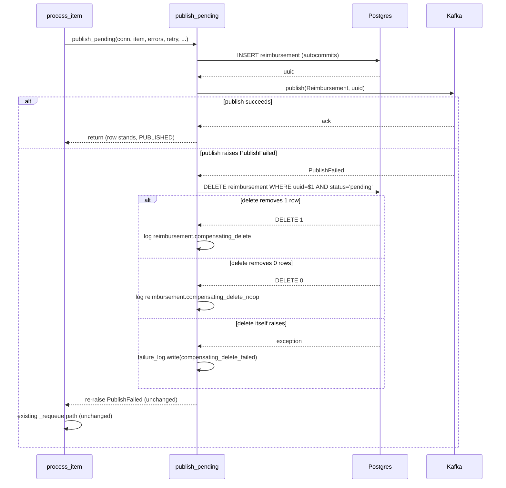

# Publisher Compensating-Delete Design

**Spec**: `.specs/features/publisher-compensating-delete/spec.md`
**Status**: Draft

**Approach exploration skipped**: the mechanism (insert-commits-immediately,
compensating delete on publish failure) was already locked in during Specify
through direct discussion with the user, including the SCOPE.md-conflict
resolution. There is one viable shape here, not several to weigh — see
spec.md's Assumptions table for the handful of implementation-detail
defaults (WHERE-clause gating, event names, connection reuse), all
low-stakes and already resolved.

---

## STATE.md Decisions — conflict check (mandatory, per design.md)

**AD-017** (`asyncpg pool + implicit-transaction as the project's async DB
pattern`) is active and directly conflicts with this feature: it requires
"any write-plus-side-effect unit of work" to be wrapped in
`async with conn.transaction():`, and names the publisher's insert+publish
specifically as its motivating case.

**Resolution: scoped supersede, not blanket.** AD-017's pattern stays active
for every *other* write-plus-side-effect unit of work in the codebase
(`escalate_item`'s `send_human_review` insert, `review_reimbursement`'s
`approve`/`reject` + `record_human_review_decision`) — none of those are
touched by this feature and the transactional guarantee is still exactly
right for them. Only the publisher's `process_item` → `_insert_and_publish` →
`publish_pending` unit of work moves to the new pattern. `AD-033` (below,
appended to `.specs/STATE.md`) records this precisely: AD-017 gets a
"amended by AD-033 (publisher insert+publish only)" note, not a full
supersession.

**Confirmed lessons applied**: `L-003` (spec-writing — acceptance criteria
claiming an observable property need a stated proxy to test it by). Already
satisfied in spec.md: PCD-04/05/06 each name the exact log event / sink the
test asserts against, not just "is traceable."

---

## Architecture Overview

The unit of work moves from one DB transaction wrapping insert+publish, to
two independent, auto-committing statements (insert, and — only on publish
failure — delete) with the publish call sitting *between* them, uninstrumented
by any transaction.

No transaction spans the publish call anywhere in this diagram — `insert`
and `delete` are each a single autocommitting statement.

---

## Code Reuse Analysis

### Existing Components to Leverage

| Component | Location | How to Use |
| --- | --- | --- |
| `shared.reimbursement.repository.insert_pending` | `packages/shared/src/shared/reimbursement/repository.py:139` | Unchanged — still the insert call, just no longer wrapped by a caller-owned transaction |
| `shared.errors.PublishFailed` | `packages/shared/src/shared/errors.py` | Unchanged — still the exception `publish()` raises and `process_item` catches |
| `shared.failure_log.write` / `render_errors` | `packages/shared/src/shared/failure_log.py` | Reused as-is for the new `compensating_delete_failed` durable record — same call shape every other last-resort record already uses |
| `shared.producer.publish` | `packages/shared/src/shared/producer.py` | Unchanged |
| `publisher.processing._requeue` | `packages/publisher/src/publisher/processing.py:301` | Unchanged — still fires on the re-raised `PublishFailed`, exactly as today |
| `publisher.processing.process_item`'s `is_duplicate` branch | `packages/publisher/src/publisher/processing.py:203-206` | Unchanged — still fires on the INSERT's own `UniqueViolationError`, unaffected by removing the transaction |

### Integration Points

| System | Integration Method |
| --- | --- |
| Postgres (`reimbursement` table) | New `DELETE ... WHERE uuid = $1 AND status = 'pending'` statement, autocommitting like the existing `insert_pending`/`update_decision` statements — no schema change |
| Kafka (`Reimbursement` topic) | Unchanged — same `publish()` call, same topic, same envelope shape |
| `failure_log` sink | One new event (`reimbursement.compensating_delete_failed`), same sink and record shape convention as every existing failure-log call site |

---

## Components

### `shared.reimbursement.repository.delete_pending` (new)

- **Purpose**: Compensating delete for a publish failure — removes the row
  `publish_pending` just inserted, gated to avoid ever touching a row that
  isn't still `pending`.
- **Location**: `packages/shared/src/shared/reimbursement/repository.py`
- **Interfaces**:
  - `delete_pending(conn: asyncpg.Connection, uuid: UUID) -> bool` — issues
    `DELETE FROM reimbursement WHERE uuid = $1 AND status = 'pending'`,
    returns whether exactly one row was removed (parsed from asyncpg's
    `DELETE n` status string, same pattern `update_decision` already uses
    for `UPDATE 1`).
- **Dependencies**: `asyncpg.Connection` (caller-supplied, already acquired).
- **Reuses**: The `DELETE n` status-string parsing pattern from
  `update_decision` (`repository.py:182-185`).

### `shared.reimbursement.use_cases.publish_pending` (restructured)

- **Purpose**: Insert `item`, let it commit, publish its `Reimbursement`
  message; on publish failure, compensate with a delete and a durable trace,
  then re-raise so the caller's existing retry path is untouched.
- **Location**: `packages/shared/src/shared/reimbursement/use_cases/publish_pending.py`
- **Interfaces**:
  - `publish_pending(conn: asyncpg.Connection, producer: AIOProducer, item: dict[str, Any], errors: list[AttemptError], publish_timeout_seconds: float, failure_log_config: FailureLogConfig, retry: int) -> None`
    — two new parameters vs. today: `failure_log_config` (to write the
    delete-failed record) and `retry` (so the traceability log carries the
    envelope's actual retry count rather than inferring it from
    `len(errors)`, which is correct by construction today but shouldn't be
    load-bearing for a log line).
- **Dependencies**: `shared.reimbursement.repository.{insert_pending,delete_pending}`, `shared.producer.publish`, `shared.failure_log`.
- **Reuses**: `ReimbursementEnvelope` construction (unchanged), the
  `reimbursement.<snake_case>` event-naming convention already established
  by `processing.py`'s `DUPLICATE_DROPPED_EVENT`/`GHOST_DROPPED_EVENT`-style
  constants.

### `publisher.processing._insert_and_publish` (simplified)

- **Purpose**: Acquire a connection and call `publish_pending` — same role
  as today, minus the transaction it no longer needs.
- **Location**: `packages/publisher/src/publisher/processing.py:285-298`
- **Interfaces**: Signature unchanged (`_insert_and_publish(deps, envelope, item) -> None`); body drops the `async with conn.transaction():` wrapper and passes `deps.config.failure_log` and `envelope.retry` through to `publish_pending`.
- **Dependencies**: Unchanged.
- **Reuses**: `deps.pool.acquire(...)`, exactly as today.

---

## Data Models

No schema change. `delete_pending` operates on the existing `reimbursement`
table and its existing `status` column/CHECK constraint (AD-003) — `pending`
is already a valid status value, no migration needed.

---

## Error Handling Strategy

| Error Scenario | Handling | User Impact |
| --- | --- | --- |
| Publish succeeds | No change from today | Row stands, item `PUBLISHED` |
| Publish raises `PublishFailed`, delete removes 1 row | Structured info log (`compensating_delete`), item requeued via existing `_requeue` | None — same requeue behavior as today, now traceable |
| Publish raises `PublishFailed`, delete removes 0 rows (row already non-`pending` — should not happen given no other writer reaches this uuid pre-publish, but defended against) | Structured info log (`compensating_delete_noop`), item still requeued | None — anomaly is visible in logs, not silently ignored |
| Publish raises `PublishFailed`, the delete itself raises (DB unreachable, etc.) | Durable `failure_log` record (`compensating_delete_failed`) with both errors and the item; item still requeued via `_requeue` (requeue does not depend on the delete's outcome) | The orphaned row is not auto-recovered — an operator must find it via the failure log and clean it up manually. This is the feature's accepted residual risk (spec Edge Cases, R-001 AC10). |
| DB insert itself fails (not publish) | Unchanged — `is_duplicate` branch or generic `db-insert` requeue, exactly as today | None — this path is untouched |
| Process crashes between publish failure and delete completing | Not caught by any handler — this is the residual gap this feature knowingly accepts, not a scenario this design attempts to recover from | Orphaned `pending` row with no automatic trace; out of scope per spec.md |

---

## Risks & Concerns

| Concern | Location (file:line) | Impact | Mitigation |
| --- | --- | --- | --- |
| Stale comment describing "a COMMIT that fails after a successful publish" | `packages/publisher/src/publisher/processing.py:196-202` | That scenario cannot occur anymore — there is no commit step after publish to fail (insert commits before publish is even attempted) — a reader would be misled | Task in Tasks phase: rewrite/remove this comment as part of the `_insert_and_publish` edit, not left stale |
| Existing test asserting transactional rollback | `packages/publisher/tests` (PUB-09 coverage — "publish failure rolls back the insert") | Will fail once the transaction is removed, since there's no rollback anymore — the row is deleted, not rolled back | Task in Tasks phase: update this test to assert deletion (`get_by_uuid` → `None` post-delete) instead of transactional rollback; do not delete the test, retarget it — PUB-09's *outcome* (no orphaned row survives a publish failure) still holds, only the mechanism changed |
| `publish_pending`'s new `retry`/`failure_log_config` parameters change its call signature | `packages/shared/src/shared/reimbursement/use_cases/publish_pending.py` | Breaks any existing caller not updated | Confirmed via repo-wide reference check: one production caller (`publisher.processing._insert_and_publish`) and one direct-call test file (`packages/shared/tests/reimbursement/use_cases/test_publish_pending.py`, 3 call sites) — both are Tasks-phase edits, not surprises found later |
| Compensating delete's `status = 'pending'` gate is currently unreachable-as-false in practice (no other writer can reach this uuid before the Agent sees a `Reimbursement` message) | `packages/shared/src/shared/reimbursement/repository.py` (new `delete_pending`) | The no-op branch (AC5) may be effectively dead code today | Not a defect — kept as defense-in-depth per spec's Assumptions table; the anomaly log makes it observable if the assumption ever stops holding (e.g. a future feature adds another writer) |

---

## Tech Decisions

| Decision | Choice | Rationale |
| --- | --- | --- |
| Where the compensation logic lives | Inside `publish_pending` itself (shared/use_cases layer), not in `publisher.processing` | Keeps "insert, publish, compensate" as one cohesive domain action per AD-025's existing layering (`publish_pending` already owns the insert+publish unit of work); `processing.py`'s `process_item` needs zero changes to its `except PublishFailed` branch — it still just requeues on the same re-raised exception |
| Delete WHERE clause | `WHERE uuid = $1 AND status = 'pending'` | Spec's Assumptions table default — defense-in-depth, matches `approve`/`reject`'s existing eligible-status-gating style |
| Connection reuse for the delete | Same `conn` already held by `_insert_and_publish`'s `pool.acquire()` | Spec's Assumptions table default — no second acquire, no new acquire-timeout failure mode |
| `retry` threaded as an explicit parameter rather than inferred from `len(errors)` | Explicit `retry: int` parameter | `len(errors) == envelope.retry` holds by construction (AD-014) but making a log field depend on an unstated invariant is fragile; explicit is one parameter, not a real cost |
| No-op delete (AC5) logged via structured `logger.info`, not `failure_log` | stdout structured log only | Matches the existing precedent for `DUPLICATE_DROPPED_EVENT`/`GHOST_DROPPED_EVENT` (R-004) — an anomaly worth surfacing, not (yet) a data-loss event needing the durable sink; only genuine delete failure (AC6) escalates to `failure_log` |
| AD-017 handling | Scoped "amended by AD-033", not full supersession | AD-017's transactional pattern is still correct for every other write-plus-side-effect unit of work in the codebase; only the publisher's insert+publish moves |

> **Project-level decision**: appended as `AD-033` to `.specs/STATE.md` `## Decisions` (see below) — this sets the pattern for the publisher's insert+publish path specifically, and documents the AD-017 scoping precisely so a future reader doesn't assume the whole codebase moved off implicit transactions.
