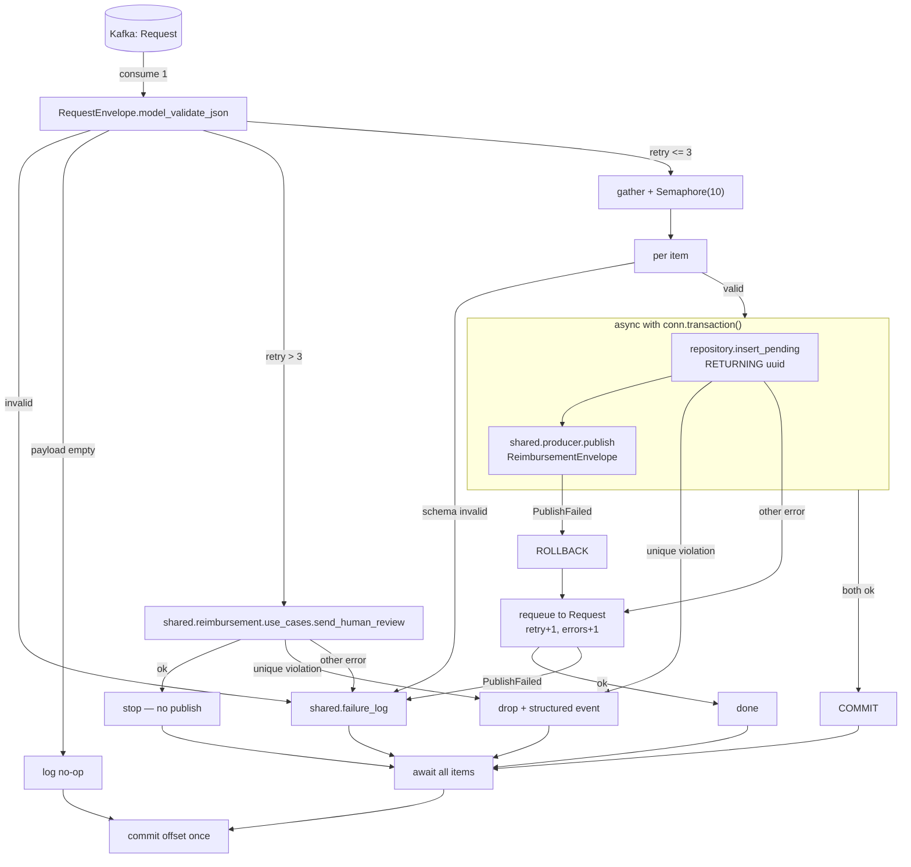

# Publisher — Consume `Request`, Produce `Reimbursement` Design

**Spec**: `.specs/features/publisher-consume-request/spec.md`
**Context**: `.specs/features/publisher-consume-request/context.md`
**Risks**: `.specs/RISKS.md` (R-001 … R-005)
**Status**: Draft — v3, reconciled against `docs/codebase/` (commit `1ea1eba`)
and the shared-kernel refactors `93b96ad`, `0c6d35f`, `7da0697`

---

## Reconciliation log

v2 was written against the codebase before the last three refactors. What it
got wrong, and the current truth:

| v2 assumed | Reality (verified in source) |
| ---------- | ---------------------------- |
| `shared/kafka.py` | Renamed **`shared/producer.py`** (`93b96ad`) — `publish`, `managed_producer` |
| `DatabaseConfig.from_env()` etc. | `from_env()` **removed** (`0c6d35f`). `load_config()` is the single `@lru_cache(maxsize=1)` entrypoint; frozen dataclasses hold no env logic (`ARCHITECTURE.md:112`) |
| `api/producer.py` holds the DI accessor | Renamed **`api/dependencies.py`** (`7da0697`) |
| Byte cap inside `validation.py` | Split into `create/payload.py` |
| `shared/database.py` as a separate module | Folded into `shared/reimbursement/repository.py` — mirrors `shared/producer.py`, which already holds lifecycle *and* operation in one file |
| `shared/consumer.py` for consumer lifecycle | **Rejected** (user, 2026-08-08): a producer's `publish()` is stateless and topic-agnostic; a consumer carries `group.id`, subscription and offset-commit semantics that differ per service. Consumer lifecycle stays publisher-local |
| Async tests need no marker | anyio is **not** auto-mode — async tests set `pytestmark = pytest.mark.anyio` explicitly (`TESTING.md:6`) |

Unchanged and still correct: AD-013 timing, the per-item transaction model,
duplicate short-circuiting, the `retry > 3` escalation path.

---

## Architecture Overview

One consumer loop, one message at a time, items fanned out under a semaphore
of 10, offset committed at the barrier.

Two properties the structure guarantees rather than promises:

**The DB transaction outlives the publish.** `asyncpg`'s
`conn.transaction()` wraps both the insert and the publish, so a publish
failure rolls back with no explicit rollback call (PUB-09).

**No item task raises.** Each returns an `ItemOutcome`, so `asyncio.gather`
cannot let one item's failure touch another (PUB-38), and every outcome is a
countable enum value (R-004's interim mitigation).



---

## Shared-kernel placement

`CONVENTIONS.md:17` scopes `shared` to "code with more than one real consumer
across services, or a documented cross-service wire contract." The agent is
still a stub, so the three shared modules below have one *implemented*
consumer today. Placing them in `shared` anyway is a **deliberate, recorded
decision** (user, 2026-08-08), resting on three things:

1. **Precedent** — `shared/producer.py` today has exactly one real consumer
   (`api`). The project already places infrastructure primitives in `shared`
   ahead of the second consumer.
2. **AD-018 makes deferral expensive** — flattening `publisher` forces
   `package = false` (uv_build's `find_roots` requires a package directory),
   so `publisher` becomes uninstallable and the agent *cannot* import from
   it. A later move is cross-package, not a local refactor.
3. **`SCOPE.md` names both consumers explicitly** — the last-resort log is
   mandated twice (`:216-217` publisher, `:272-273` agent), as is the
   `retry > 3` escalation.

**`shared` is sliced by domain** (user, 2026-08-08): persistence and business
actions live under `shared/<domain>/`, not as flat root modules. `reimbursement/`
lands now; `review/` follows when the `human_review` table gets a consumer.
Cross-domain infrastructure (`config`, `errors`, `producer`, `failure_log`,
`models`) stays at the root. This mirrors AD-009's operation-level slicing in
`api`, one level up — the slice is the domain, and its `use_cases/` hold the
actions that span more than a single statement.

| Module | Placement | Note |
| ------ | --------- | ---- |
| `shared/reimbursement/repository.py` | shared | Publisher inserts; Agent reads and updates the same table |
| `shared/failure_log.py` | shared | Mandated independently for both services |
| `shared/reimbursement/use_cases/send_human_review.py` | shared | Both services escalate on `retry > 3` |
| consumer lifecycle | **publisher-local** | Layer-specific — see Reconciliation log |

`shared` gains an **`asyncpg`** dependency (it currently declares only
`confluent-kafka` and `pydantic[email]`). `CONCERNS.md:21` notes asyncpg is
declared-but-unused across `api`/`agent`/`publisher`; this feature is the
first real consumer.

---

## File Structure

`+` new · `~` modified · `·` untouched

```
src/
├── shared/
│   ├── pyproject.toml       ~ + asyncpg
│   ├── src/shared/
│   │   ├── config.py        ~ + DatabaseConfig, FailureLogConfig, PublisherConfig
│   │   │                      + REIMBURSEMENT_TOPIC, MAX_RETRY; load_config() extended
│   │   ├── errors.py        ~ + sanitize()
│   │   ├── failure_log.py   +  named-logger sink — cross-domain, stays at root
│   │   ├── models.py        ~ + AttemptError, ReimbursementEnvelope,
│   │   │                      RequestEnvelope.errors
│   │   ├── producer.py      ·  already generic — publish() + managed_producer()
│   │   └── reimbursement/   +  DOMAIN SLICE
│   │       ├── __init__.py  +
│   │       ├── repository.py         +  managed_pool() + statements
│   │       └── use_cases/
│   │           ├── __init__.py       +
│   │           └── send_human_review.py  +
│   └── tests/               (mirrors src/, per TESTING.md:13)
│       ├── test_config.py            ~ extend
│       ├── test_failure_log.py       +
│       └── reimbursement/
│           ├── test_repository.py    +
│           └── use_cases/
│               └── test_send_human_review.py  +
├── api/src/reimbursement/create/producer.py   ~ envelope prefix gains "errors":[]
└── publisher/
    ├── pyproject.toml       ~ [tool.uv] package = false; drop [build-system]
    ├── Dockerfile           ~ ENV PYTHONPATH=/app/src/publisher/src
    ├── src/                 ~ FLATTENED — src/publisher/ package dir removed
    │   ├── consumer.py      ~ REPLACES the SampleMessage placeholder
    │   └── processing.py    +
    └── tests/
        ├── conftest.py      +
        ├── test_consumer.py +
        ├── test_integration.py +
        └── test_processing.py  +
```

Root `pyproject.toml`: `pythonpath = ["src/api/tests", "src/api/src", "src/publisher/src"]`.

### Flat-module namespace — no action needed, but a constraint to carry

Because `api` is `package = false`, its modules import as **bare** names on
the pytest `sys.path`: `dependencies`, `errors`, `main`, `migrate`.
Flattening `publisher` puts `src/publisher/src` on that same path, so its
modules are bare too. Bare names resolve first-match-wins across one
`sys.path`.

Publisher's `consumer.py` and `processing.py` do not collide with any of the
four. **Nothing in `api` changes.**

The constraint bites later: `agent` is currently a normal installable package
(`src/agent/src/agent/consumer.py` → imports as `agent.consumer`, namespaced
and immune). If the agent is ever flattened, its natural `consumer.py`
collides head-on with the publisher's. Recorded as a risk; the decision
belongs to the agent feature.

---

## Configuration

Follows the established pattern exactly: plain frozen dataclasses with **no
env-reading logic**, assembled by the one cached `load_config()`.

```python
REIMBURSEMENT_TOPIC = "Reimbursement"
MAX_RETRY = 3                                   # SCOPE.md:215 — "retry > 3"


@dataclass(frozen=True)
class DatabaseConfig:
    dsn: str | None                             # None when unset — see below
    pool_min_size: int
    pool_max_size: int


@dataclass(frozen=True)
class FailureLogConfig:
    logger_name: str            # e.g. "reimbursementanalyzer.failures" — the routing handle
    max_message_chars: int


@dataclass(frozen=True)
class PublisherConfig:
    consumer_group_id: str
    item_concurrency: int                       # AD-013 — 10
    consume_timeout_seconds: float

    def to_consumer_config(self, kafka: KafkaConfig) -> dict[str, Any]:
        return {
            "bootstrap.servers": kafka.bootstrap_servers,
            "group.id": self.consumer_group_id,
            "auto.offset.reset": "earliest",
            "enable.auto.commit": False,                    # load-bearing
            "fetch.max.bytes": KAFKA_MAX_MESSAGE_BYTES,     # PUB-34
            "max.partition.fetch.bytes": KAFKA_MAX_MESSAGE_BYTES,
        }


@dataclass(frozen=True)
class Config:
    kafka: KafkaConfig
    database: DatabaseConfig
    failure_log: FailureLogConfig
    publisher: PublisherConfig
```

`to_consumer_config` mirrors the existing `KafkaConfig.to_producer_config` —
the SASL/TLS branches are reused from `kafka`, not re-derived.

**`dsn` is `str | None`, read with `os.getenv`, never `os.environ[...]`.**
`load_config()` is process-wide and cached, so an unconditional read would
make `DATABASE_URL` mandatory for *every* service — including `api`, which
never touches Postgres. Compose happens to set it for `api` today, but a bare
`uv run uvicorn` outside compose would then fail on a value it never uses.
The publisher validates presence at its own startup.

**The pool/concurrency invariant is asserted at the publisher's composition
root**, not inside a dataclass: it spans `DatabaseConfig` and
`PublisherConfig`, and neither can see the other. This is R-005's requested
refuse-to-boot.

`asyncpg.create_pool` defaults to `min_size=10, max_size=10` — exactly our
concurrency, i.e. zero headroom. Both are set explicitly.

`shared/tests/conftest.py` already clears `load_config`'s `lru_cache` before
every test (`TESTING.md:63`), so new config values need no new fixture.

---

## Components

### `shared/reimbursement/repository.py`

- **Purpose**: pool lifecycle plus every SQL statement against
  `reimbursement`. Nothing else in the workspace touches `asyncpg`.
- **Interfaces**:
  - `managed_pool(config: DatabaseConfig) -> AsyncIterator[Pool]`
  - `async insert_pending(conn, item: dict) -> UUID` — `INSERT ... RETURNING uuid`,
    `status` left at its `pending` default
  - `async insert_human_review(conn, item: dict, reason: str) -> UUID`
  - `is_duplicate(exc: Exception) -> bool`
- **Reuses**: the `@asynccontextmanager` construct/yield/close shape of
  `shared.producer.managed_producer`, and its single-file
  lifecycle-plus-operation organisation.
- **Note**: `is_duplicate` matches `isinstance(exc, UniqueViolationError) and
  exc.constraint_name == "reimbursement_request_submitter_key"`. Verified:
  asyncpg exposes `.constraint_name`, sqlstate `23505`. Matching the
  *specific* constraint matters — a primary-key collision is not a business
  duplicate and must not take the silent-drop path.

### `shared/reimbursement/use_cases/send_human_review.py`

- **Purpose**: the one action "preserve this request for a human, with an
  explanation." Owns both the row shape and the rendering of *why*.
- **Interfaces**:
  - `async send_human_review(conn, item: dict, errors: list[AttemptError]) -> UUID`
  - `render_history(errors) -> str`
- **Note**: `render_history` lives here because the usecase is its only
  consumer — the failure log writes structured JSON, not prose. Each message
  is truncated to `FailureLogConfig.max_message_chars`. PUB-25: when `errors`
  is empty despite `retry > 3`, the reason still states the ceiling was
  reached and no detail was carried — never null.

### `shared/failure_log.py`

- **Purpose**: emit one structured JSON record, at critical level, to a
  dedicated named logger when nothing else worked.
- **Interfaces**: `write(config: FailureLogConfig, record: dict) -> None` —
  synchronous; stdlib logging to stdout needs no thread hop.
- **Note**: **must never raise** — it is the bottom of every fallback chain,
  so any failure inside it is swallowed rather than propagated into the
  consumer loop (there is, by definition, nowhere left to report it).
- **Why a logger, not a file** (user, 2026-08-08): a container-local file is
  destroyed by the very restart it exists to survive. `SCOPE.md:216-217`'s
  "log the error in a file" is satisfied at the layer that owns it — ops
  attach a `FileHandler` or log shipper to `logger_name` with no code change.
  Cross-domain, so it stays at the `shared` root rather than in a slice.

### `shared/errors.py` — extended

- `sanitize(exc) -> str` (exception type + constraint name, **never** the
  driver's `DETAIL`). Duplicates are classified by
  `repository.is_duplicate(exc)` on the driver's own exception, so no
  dedicated exception type is defined.
- **Note**: Postgres embeds offending column values in `DETAIL` — a unique
  violation quotes the submitter's email, so routine logging must not echo it.
  The failure log deliberately carries the payload; `sanitize` is for
  everything else. Both reach stdout (the failure logger propagates to the
  root handler, which is how fluentd collects it), so the separation is about
  *what routine logs say*, not about two isolated sinks — stdout is a
  privileged sink either way. Two renderings that must be hard to confuse,
  hence a named function.

### `publisher/src/consumer.py`

- **Purpose**: composition root and the loop — config, pool, producer,
  consumer; run; shut down. Owns `consumer_config` assembly and the offset
  commit.
- **Note**: `AIOConsumer.__init__` calls `asyncio.get_event_loop()`
  (`confluent_kafka/aio/_AIOConsumer.py:47`), so it must be constructed
  **inside** a running loop, never at import.
- **Replaces** the `SampleMessage` / `sample-queue` placeholder entirely.

### `publisher/src/processing.py`

- **Purpose**: the decision tree. The only module with business branching.
- **Interfaces**:
  - `async handle_message(deps, raw: bytes) -> list[ItemOutcome]` — never raises
  - `async process_item(deps, envelope, index, item) -> ItemOutcome` — never raises
  - `ItemOutcome` — `PUBLISHED | DUPLICATE | REQUEUED | ESCALATED | LOGGED | INVALID`
- **Reuses**: `shared.reimbursement.repository`, `shared.producer.publish`,
  `shared.reimbursement.use_cases.send_human_review`, `shared.failure_log`,
  `shared.errors.sanitize`
- **Note**: separate from `consumer.py` so the branches carrying
  PUB-01…PUB-33 unit-test with no Kafka at all. The `retry > 3` check happens
  **once, before fan-out** — `retry` is envelope-level.

---

## Concurrency and Offset Model

```python
async def run(deps) -> None:
    while not deps.stopping.is_set():
        msgs = await deps.consumer.consume(num_messages=1, timeout=deps.config.publisher.consume_timeout_seconds)
        if not msgs:
            continue
        msg = msgs[0]
        if msg.error():
            ...continue
        await handle_message(deps, msg.value())          # never raises
        await deps.consumer.commit(message=msg, asynchronous=False)
```

**`enable.auto.commit=False` is load-bearing.** At its default of `true`,
librdkafka commits offsets on a ~5s timer regardless of whether items
settled — a crash mid-batch would silently skip unprocessed items, exactly
the loss mode `SCOPE.md:293` forbids. A unit test asserts the config value.

**`consume(num_messages=1)` over `poll()`** — `AIOConsumer`'s own docstring
recommends `consume()`; `num_messages=1` preserves the one-message-at-a-time
semantics the offset model depends on.

```python
sem = asyncio.Semaphore(config.publisher.item_concurrency)     # 10

async def guarded(i, item):
    async with sem:
        return await process_item(deps, envelope, i, item)     # never raises

outcomes = await asyncio.gather(*(guarded(i, it) for i, it in enumerate(envelope.payload)))
```

No `return_exceptions=True` — that would also swallow genuine bugs. Instead
`process_item` maps every failure to an `ItemOutcome`, so an escaping
exception is a real defect and should be loud in tests.

**Timing** (AD-013): `500 ÷ 10 × ~15ms ≈ 0.75s` against
`max.poll.interval.ms = 300s`. Item-count driven, so AD-020's smaller byte
ceilings do not change it.

**Shutdown** (PUB-33): a signal handler sets `stopping`; the loop exits after
the current message commits. An interrupted transaction rolls back and its
offset is never committed, so the message redelivers and is absorbed by the
duplicate path.

---

## Data Models

```python
class AttemptError(BaseModel):
    attempt: int
    occurred_at: AwareDatetime
    stage: Literal["db-insert", "publish"]
    error_type: str
    message: str

    @classmethod
    def next(cls, errors: list[AttemptError], stage, exc) -> AttemptError: ...


class RequestEnvelope(BaseModel):          # modified
    retry: int
    published_at: AwareDatetime
    errors: list[AttemptError] = []        # AD-014
    payload: list[dict[str, Any]]


class ReimbursementEnvelope(BaseModel):    # new — AD-015
    uuid: UUID
    retry: int
    published_at: AwareDatetime
    errors: list[AttemptError] = []
```

`errors` defaulting to empty keeps envelopes already on the topic parsing
unchanged.

Row written by `insert_pending`: `uuid` (DB `uuidv7()`), `request_id`,
`submitted_by`, `submitted_at`, `original_payload` (JSONB), `status`
(`pending`). The three identity columns are **required** — without them the
unique index cannot function as a dedup guard.

---

## Error Handling Strategy

| Scenario | Handling | Outcome |
| -------- | -------- | ------- |
| Message not valid JSON / not `RequestEnvelope` | `failure_log`, commit offset | `LOGGED` (PUB-29) |
| `payload == []` | log no-op, commit offset | — (PUB-31) |
| Item fails `ReimbursementRequest` validation | `failure_log`, no retry — `request_id` is `NOT NULL`, so a human-review row is impossible and retrying cannot fix bad data | `INVALID` (PUB-30) |
| Unique violation on `reimbursement_request_submitter_key` | Structured info event; drop | `DUPLICATE` (PUB-17…21) |
| Any other insert error | Rollback; requeue `retry+1` + `AttemptError(stage="db-insert")` | `REQUEUED` (PUB-08, PUB-10) |
| `PublishFailed` on the `Reimbursement` publish | Propagates out of `conn.transaction()` → rollback; requeue with `stage="publish"` | `REQUEUED` (PUB-09) |
| `PublishFailed` on the requeue itself | `failure_log` with full history | `LOGGED` (PUB-16) |
| `retry > 3` | `send_human_review` | `ESCALATED` (PUB-22…26) |
| `retry > 3`, escalation insert fails | `failure_log` with history | `LOGGED` (PUB-27) |
| `retry > 3`, escalation hits unique constraint | Duplicate path, not the file log | `DUPLICATE` (PUB-28) |
| `failure_log` itself fails | Swallowed — nowhere left to report to; never propagates | — |
| Signal mid-processing | Current message finishes; uncommitted offsets redeliver | — (PUB-33) |

**Rollback is implicit** — publish inside `async with conn.transaction():`
makes PUB-09 true by construction.

Both publish paths raise the same `PublishFailed` (AD-021); they are
distinguished by *where* they are caught, not by type — the requeue call site
is the only one that falls back to the failure log.

---

## Risks & Concerns

| Concern | Location | Impact | Mitigation |
| ------- | -------- | ------ | ---------- |
| `enable.auto.commit` defaults `true` | `shared/config.py` | Timer-based commits regardless of settlement — silent loss | Set `False` explicitly; unit test asserts it |
| `asyncpg.create_pool` defaults `max_size=10` | `shared/reimbursement/repository.py` | Equals concurrency — zero headroom | Both sizes explicit; startup assertion `pool_max_size >= item_concurrency` (R-005) |
| `DATABASE_URL` in a process-wide cached loader | `shared/config.py` | An `os.environ[...]` read would make it mandatory for `api` too | `os.getenv` → `str \| None`; publisher validates at its own startup |
| Flat-module names share one pytest `sys.path` | root `pyproject.toml` | `agent`'s natural `consumer.py` would collide with publisher's | Publisher's names are clear today; **decide before flattening `agent`** (it is namespaced and immune while it stays a package) |
| `AIOConsumer.__init__` calls `get_event_loop()` | `_AIOConsumer.py:47` | Import-time construction binds the wrong loop | Constructed inside `run()` |
| `shared` gains `asyncpg` | `src/shared/pyproject.toml` | Widens the shared kernel's dependency surface | All three services already declare it (`CONCERNS.md:21` — declared but unused; this closes that gap) |
| Three shared modules have one real consumer today | `shared/{reimbursement,failure_log}` | Tension with `CONVENTIONS.md:17` | Deliberate — precedent (`shared/producer.py`), AD-018 deferral cost, and `SCOPE.md`'s two documented consumers. Recorded above |
| Dual-write window | `processing.py` | Ghost `Reimbursement` messages after a crash | **Accepted — R-001**; Agent-side mitigation belongs to the Agent's spec |
| Requeue duplication under at-least-once | `processing.py` | Crash after requeue, before offset commit → item requeued twice | Benign — the loser hits the duplicate path. Stated because it looks like a bug in logs |
| Envelope change modifies passing tests | `shared/models.py`, `create/producer.py` | `test_producer.py` / `test_integration.py` assert envelope bytes | Own task, existing suite as the gate |
| `submitted_at` CHECK vs API's declined bound | `0001.create-reimbursement.sql:43` | Future-dated payloads burn 4 attempts then land in a file | **Accepted — R-002** |
| No metric behind duplicate drops | `processing.py` | A duplicate flood is invisible | `ItemOutcome` structured event is the floor — **R-004** |
| `usecases/` is a new project concept | `shared/reimbursement/use_cases/` | One-member layers often stay one-member | Justified only by the Agent's second caller; if that fails to materialise, collapse into the slice's `repository.py` |

---

## Tech Decisions

| Decision | Choice | Rationale |
| -------- | ------ | --------- |
| No publisher `producer.py` | Call `shared.producer.publish` directly | Already topic- and domain-agnostic; a wrapper would add a file to pass three arguments through |
| No `reporting.py` | Split three ways | `render_history` → its only consumer (the usecase); `next_error` → `AttemptError.next` (a constructor belongs on its type); `sanitize` → `shared/errors.py` (it operates on exceptions) |
| `shared` sliced by domain (`shared/reimbursement/{repository,use_cases}`) | — | User, 2026-08-08. Keeps the `human_review` table's future access (`shared/review/`) from landing beside reimbursement statements in one flat module. Cross-domain infrastructure stays at the root |
| Consumer lifecycle stays publisher-local | — | User, 2026-08-08: `publish()` is stateless and topic-agnostic; a consumer's `group.id`, subscription and offset semantics are layer-specific |
| `managed_pool` inside `repository.py` | One file | Mirrors `shared/producer.py`, which holds `managed_producer` and `publish` together |
| Config as plain frozen dataclasses in `load_config()` | — | The established pattern (`0c6d35f`, `ARCHITECTURE.md:112`) — no `from_env()`, one cached env-reading site |
| Keep `processing.py` separate from `consumer.py` | Two files | `consumer.py` owns the `AIOConsumer`, so anything there needs a consumer to test; PUB-01…PUB-33 then unit-test with none |
| Loop shape | One message, items concurrent, commit at barrier | Makes "commit only after every item settles" structural. Offset-watermark pipelining is where at-least-once systems lose data |
| Duplicate detection | `constraint_name` equality | Text matching breaks on locale/version; bare sqlstate would misclassify a PK collision |
| Item tasks never raise | Return `ItemOutcome` | Per-item independence becomes structural; gives R-004 a countable enum |

> **Project-level decisions** proposed for `.specs/STATE.md`. Numbering
> reconciled 2026-08-08: AD-023/AD-024 — which design v2 proposed — were
> claimed in the meantime by `0c6d35f` and `7da0697`. AD-016 and AD-017
> remain reserved-but-never-appended.
>
> - **AD-016 — vacate.** Reserved for "centralised config in `shared`, frozen
>   `Settings` + `from_env()`". That decision was actually taken, in a
>   different shape, as AD-022 + AD-023 (`load_config()`, no `from_env()`).
>   The reservation should be formally released so the gap in the log is
>   explained rather than dangling.
> - **AD-017 — claim as reserved.** "`asyncpg` pool + implicit-transaction
>   (publish inside `conn.transaction()`) as the project's async DB access
>   pattern." Still unclaimed, and exactly this design's DB decision. The
>   Agent inherits it.
> - **AD-025 — new.** `shared` owns cross-service persistence
>   (the `reimbursement` slice + `failure_log`) and gains `asyncpg`, accepting
>   the documented tension with `CONVENTIONS.md:17`.
> - **AD-026 — new.** `publisher` flattens to `src/publisher/src` and becomes
>   a virtual `package = false` member, like `api` (AD-018).
>
> Appended on approval. AD-017 and AD-025 bind the Agent feature.

---

## Test Plan

Conventions per `TESTING.md`: `Describe*`/`it_*`, async tests set
`pytestmark = pytest.mark.anyio` explicitly, `testpaths = ["src"]` collects
`src/publisher/tests` automatically.

| Layer | Type | Location | Covers |
| ----- | ---- | -------- | ------ |
| Decision tree, all branches | unit (fake pool + fake producer) | `src/publisher/tests/test_processing.py` | PUB-01…PUB-33 |
| Concurrency | unit (instrumented fake recording max in-flight) | `src/publisher/tests/test_processing.py` | PUB-36…PUB-42 |
| Consumer config invariants | unit | `src/publisher/tests/test_consumer.py` | `enable.auto.commit=False`, fetch sizing (PUB-34) |
| Repository + duplicate detection | integration (testcontainers Postgres) | `src/shared/tests/reimbursement/test_repository.py` | PUB-03, PUB-17, PUB-21 |
| `send_human_review` + rendering | integration + unit | `src/shared/tests/reimbursement/use_cases/test_send_human_review.py` | PUB-23, PUB-24, PUB-25 |
| Failure log never raises | unit | `src/shared/tests/test_failure_log.py` | PUB-16, PUB-27, PUB-29, PUB-30 |
| Config invariants | unit | `src/shared/tests/test_config.py` (extend) | R-005 refuse-to-boot |
| End-to-end round trip | integration (Postgres + Kafka) | `src/publisher/tests/test_integration.py` | PUB-02, PUB-07, PUB-35, PUB-40 |

`src/shared/tests/` needs the Postgres container fixture that currently lives
in `src/api/tests/conftest.py`. `helpers.py`'s `disposable_database_name` /
`guard_is_test_database` are reused — the fixture is lifted, not duplicated;
where it finally lives is a task-level call.

**Gate commands** (`TESTING.md`):

| Level | Command |
| ----- | ------- |
| Quick | `uv run pytest -m "not integration"` |
| Full | `uv run pytest` |

**What these tests must not become.** Fakes make it easy to assert "the fake
was called", which proves nothing. The rules: the duplicate test asserts **no
second row exists** against a real Postgres; the rollback test asserts **no
row remains** after a publish failure; the concurrency test asserts
**observed max in-flight ≤ 10**, not that a `Semaphore` was constructed.
