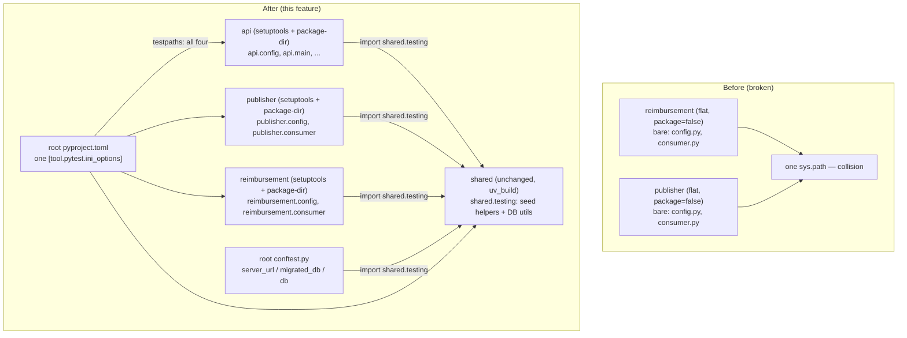

# Fix Service Module-Name Collision via Real Package Namespacing — Design

**Spec**: `.specs/features/refactoring-package-namespacing/spec.md`
**Status**: Draft

---

## Architecture Overview

`api`, `publisher`, and `reimbursement` switch build backend from `uv_build` to `setuptools`, using `[tool.setuptools.package-dir]` to map each package's import name onto its existing `src/` directory — `setuptools`' own explicit-layout discovery (`_analyse_explicit_layout`, verified via Context7) then auto-discovers every nested subpackage under it, so `api.reimbursement.create` etc. need no separate declaration. No file moves, no new subdirectories — only `pyproject.toml`, bare-name imports (now dotted), Dockerfile entrypoints, and one new `__init__.py` per package (matching how the original `agent` package worked before AD-018/AD-026 flattened it).

Once none of the three collide, the root `pyproject.toml`'s `[tool.pytest.ini_options]` collapses back to one unified block, and `shared/testing.py` becomes the single home for every cross-package test helper — removing the `pythonpath` reach into `api/tests/`.

---

## Code Reuse Analysis

### Existing Components to Leverage

| Component                                              | Location                              | How to Use                                                                                  |
| -------------------------------------------------------- | ---------------------------------------- | ----------------------------------------------------------------------------------------------- |
| `shared/testing.py`'s existing `FakeProducer` + seed helpers | `src/shared/src/shared/testing.py`   | Extend in place — add `valid_reimbursement_item` and the DB-provisioning utilities alongside the existing seed helpers, reconciling signatures |
| `shared`'s existing `[build-system]` (`uv_build`)          | `src/shared/pyproject.toml`             | Reference pattern for "how a real installed workspace member looks" — `api`/`publisher`/`reimbursement` become the same *kind* of thing, just via a different backend |
| Original `agent` package's `__init__.py`/build-system shape (pre-AD-018/AD-026, visible in git history) | `git log -- src/agent` | Reuse the same shape (one `__init__.py`, real `[build-system]`) for `api`/`publisher`/`reimbursement` now |
| Root `conftest.py`'s `TEST_DATABASE_URL` override branch on `server_url` | `conftest.py`                | Unused by this design (we keep one unified pytest run), but confirms the fixture already supports external provisioning if ever needed later |

### Integration Points

| System                          | Integration Method                                                                                     |
| ---------------------------------- | ----------------------------------------------------------------------------------------------------------- |
| `uv` workspace (`[tool.uv.workspace]`) | No change — `uv` already supports per-member build backends; `api`/`publisher`/`reimbursement` simply declare a different one than `shared` |
| Docker builds                      | Each service's Dockerfile's `ENV PYTHONPATH` / CMD entrypoint updates to the dotted form; build context unchanged |
| Root `pytest` config                | Single `[tool.pytest.ini_options]` block regains authority over all four packages; nested `reimbursement/pyproject.toml` pytest block is deleted |

---

## Components

### `api` package namespacing

- **Purpose**: Make `api` a real, dotted-import package (`api.main`, `api.config`, `api.dependencies`, `api.errors`, `api.migrate`, `api.reimbursement.*`) without changing its on-disk `src/api/src/*.py` layout.
- **Location**: `src/api/pyproject.toml`, `src/api/src/__init__.py` (new, minimal), `src/api/src/**/*.py` (import statements only), `src/api/Dockerfile`.
- **Interfaces**:
  - `[build-system] requires = ["setuptools"] build-backend = "setuptools.build_meta"`
  - `[tool.setuptools.package-dir] api = "src"`
  - Uvicorn ASGI target: `api.main:app` (was bare `main:app`)
- **Dependencies**: `shared` (unchanged, `workspace = true`).
- **Reuses**: The vertical-slice sub-packages under `src/api/src/reimbursement/` already carry their own `__init__.py` (AD-009) — they nest under `api.reimbursement.*` with zero structural change, only their own internal imports (if any reach siblings by bare name) need the `api.` prefix.

### `publisher` package namespacing

- **Purpose**: Same treatment as `api`, for `publisher.consumer`, `publisher.config`, `publisher.processing`.
- **Location**: `src/publisher/pyproject.toml`, `src/publisher/src/__init__.py` (new), `src/publisher/src/*.py`, `src/publisher/Dockerfile`.
- **Interfaces**:
  - `[tool.setuptools.package-dir] publisher = "src"`
  - CMD entrypoint: `python -m publisher.consumer` (was `python -m consumer`)
- **Dependencies**: `shared`.
- **Reuses**: Same pattern as `api`.

### `reimbursement` package namespacing

- **Purpose**: Same treatment, restoring the pre-flatten shape but under the `reimbursement` name (directory name stays `src/reimbursement`, per the hard constraint from the grilling session) — `reimbursement.consumer`, `reimbursement.config`, `reimbursement.schema`, `reimbursement.validation`, and the already-nested `reimbursement.agent.agent`, `reimbursement.agent.nodes.*`, `reimbursement.agent.prompts.*` (the LangGraph agent internals already live one level deeper, under `src/reimbursement/src/agent/`, not flattened to the top — confirmed by inspecting the actual working tree, not assumed).
- **Location**: `src/reimbursement/pyproject.toml`, `src/reimbursement/src/__init__.py` (new), `src/reimbursement/src/agent/__init__.py` (new — `agent/` currently has no `__init__.py`), `src/reimbursement/src/*.py`, `src/reimbursement/src/agent/*.py`, `src/reimbursement/Dockerfile`.
- **Interfaces**:
  - `[tool.setuptools.package-dir] reimbursement = "src"`
  - CMD entrypoint: `python -m reimbursement.consumer`
  - `[tool.pytest.ini_options]` block **removed entirely** from this file — no standalone pytest root, no `--confcutdir`.
- **Dependencies**: `shared`.
- **Reuses**: Same pattern as `api`/`publisher`. `src/reimbursement/tests/agent_fakes.py` keeps its current bare-name-via-`pythonpath` resolution (unaffected — test-support modules are orthogonal to production namespacing, per `CONVENTIONS.md`'s existing "test doubles as a module... reachable by bare name" pattern).

### `shared.testing` extension (test-helper consolidation)

- **Purpose**: Single home for every cross-package test fixture — the concrete fix for `publisher`/`reimbursement` depending on `api`'s private test tree.
- **Location**: `src/shared/src/shared/testing.py`.
- **Interfaces** (additions):
  - `valid_reimbursement_item(request_id="REQ-0001", **extra) -> dict` — moved from `api/tests/helpers.py`, unchanged behavior.
  - `seed_reimbursement(...)`, `seed_reimbursement_with_receipts(...)`, `seed_human_review(...)` — reconciled: extend `shared.testing`'s existing signatures to accept `original_payload` (currently only `api/tests/helpers.py`'s versions have it), then delete the `api/tests/helpers.py` copies.
  - `POSTGRES_IMAGE`, `MAINTENANCE_DATABASE`, `database_name(url)`, `with_database(url, name)`, `maintenance_url(url)`, `disposable_database_name()`, `guard_is_test_database(url)` — moved from `api/tests/helpers.py`, unchanged behavior.
- **Dependencies**: `asyncpg` (already a `shared` dependency via `db.py`); no new dependency.
- **Reuses**: Existing `FakeProducer` class and module docstring stay; the docstring's scope statement ("test doubles... for the contracts `shared` itself defines") gets broadened in-file to also cover the now-relocated generic DB-provisioning utilities — this is the `CONVENTIONS.md`-scope change the user pre-authorized ("we can change the conventions if needed"); the `docs/codebase/CONVENTIONS.md` wording itself stays deferred, per spec Out of Scope.

### Root pytest config unification

- **Purpose**: Restore one `[tool.pytest.ini_options]` block covering all four packages.
- **Location**: `pyproject.toml` (workspace root).
- **Interfaces**:
  - `testpaths = ["src/api", "src/publisher", "src/reimbursement", "src/shared"]`
  - `pythonpath` trimmed to each package's own `tests/` dir only (`src/api/tests`, `src/publisher/tests`, `src/reimbursement/tests`) — the `src/api/src`, `src/publisher/src` entries are dropped (real installed packages resolve without them).
  - No `addopts` change beyond what's already there (`--import-mode=importlib` stays).
- **Dependencies**: None new.
- **Reuses**: Existing `markers`, `python_classes`, `python_functions` config, unchanged.

### Root `conftest.py` import source change

- **Purpose**: Stop resolving `helpers`/DB-utility functions via `pythonpath` bare-name import into `api`'s test tree.
- **Location**: `conftest.py` (workspace root).
- **Interfaces**: `from helpers import (...)` → `from shared.testing import (...)`. `from migrate import apply_migrations` stays unchanged (still resolved via `api`'s own `pythonpath`-listed `tests`/`src`, since migrations remain `api`-owned).
- **Dependencies**: `shared` must be importable from the root conftest's execution context — already true today (every workspace member's venv includes `shared` since it's a real installed package).
- **Reuses**: Fixture bodies (`server_url`, `migrated_db`, `db`) are unchanged — only the import line changes.

### Decision log entry

- **Purpose**: Record AD-031, amend AD-018/AD-026's status, fix the stale "AD-030" citation.
- **Location**: `.specs/STATE.md`, `pyproject.toml` (inline comment).
- **Interfaces**: N/A (documentation).
- **Dependencies**: None.
- **Reuses**: Existing AD template/format in `STATE.md` (see AD-009's "Amended by AD-018... — 2026-08-08" status-line style).

---

## Data Models

N/A — this feature changes build/test tooling and import paths, not data models or schemas.

---

## Error Handling Strategy

| Error Scenario                                                                 | Handling                                                                                                    | User Impact                                              |
| ---------------------------------------------------------------------------------- | ------------------------------------------------------------------------------------------------------------------ | ------------------------------------------------------------ |
| `uv sync` fails to resolve `setuptools` as a build backend for a workspace member    | Fixed as part of the task that edits that package's `pyproject.toml` — `uv sync` is run and its output inspected before moving to the next task; `uv.lock` diff is reviewed for sanity | None if caught before commit; a broken lock never gets committed |
| A Docker image fails to start after the entrypoint changes to dotted form            | Each affected Dockerfile's build+run is verified (`docker build` + a live request/consume check, matching AD-018's own prior verification pattern) before that task is marked done | None if caught before commit                              |
| Reconciling `shared.testing`'s seed-helper signature silently drops `original_payload` behavior | Explicit AC (spec PKG-13) + a task that runs every test currently depending on `original_payload` before and after the move | None — caught by the existing test suite, not user-facing |
| A bare-name import site is missed during the dotted-import conversion                | `grep -rn` for each package's own former bare module names across its `src/` and `tests/` after conversion, as a task-level verification step, before relying on `pytest` alone to catch it (pytest would only catch it if that code path is covered) | None if caught before commit; flagged as a residual test-coverage gap otherwise (see Risks & Concerns) |

---

## Risks & Concerns

| Concern                                                                                       | Location (file:line)                                    | Impact                                                                                                   | Mitigation                                                                                                                     |
| ------------------------------------------------------------------------------------------------ | ------------------------------------------------------------ | -------------------------------------------------------------------------------------------------------------- | ------------------------------------------------------------------------------------------------------------------------------ |
| Bare-name imports of `dependencies`/`errors` inside `api/tests/helpers.py` (`FakePool`, `_build_client`) become invalid once `api` is namespaced | `src/api/tests/helpers.py` (`from dependencies import get_pool`, `from errors import register_handlers`) | Silent `ImportError` at test-collection time if missed | Explicitly listed as a conversion site in Tasks; covered by the same `grep` sweep as other bare-name sites |
| This applies identically to `api` and `publisher`: every file stays exactly where it is on disk — no directory moves anywhere — but any bare cross-import between sibling modules within the same package (e.g. `reimbursement/consumer.py` importing `from config import X`; `api/main.py` importing `from dependencies import get_pool`) must become the dotted form (`from reimbursement.config import X`, `from api.dependencies import get_pool`) or a relative import; easy to miss one and get a working-until-runtime `ImportError` | `src/{api,publisher,reimbursement}/src/**/*.py` and their `tests/**/*.py` | Broken import at collection or call time if a cross-import is missed | Per-package `grep -rn` sweep for each package's own former bare module names across its `src/` and `tests/`, as a task-level verification step, before relying on `pytest` alone to catch it (pytest only catches it if that code path is covered) |
| `shared/testing.py` accumulating both "test doubles for a shared contract" and "generic DB-provisioning utilities" blurs its documented single purpose | `src/shared/src/shared/testing.py` | Future readers may not know where new test-support code belongs | Docstring updated in this feature to state the broadened scope explicitly (the `CONVENTIONS.md` prose sync stays deferred, per spec) |
| No CI exists to catch a regression here before merge | (repository-wide) | A missed bare-name import site could reach `main` undetected if local `uv run pytest` isn't run before commit | Out of scope to add CI in this feature (see spec Out of Scope) — mitigated procedurally: the gate check (`uv run pytest`) is mandatory per task before each atomic commit, per this skill's own Execution Contract |

> All identified concerns have a mitigation — no unmitigated risk carried forward.

---

## Tech Decisions (only non-obvious ones)

| Decision                                                                                     | Choice                                                                                          | Rationale                                                                                                                                                                                 |
| ------------------------------------------------------------------------------------------------ | ---------------------------------------------------------------------------------------------------- | ---------------------------------------------------------------------------------------------------------------------------------------------------------------------------------------- |
| Build backend for `api`/`publisher`/`reimbursement`                                             | `setuptools` (`package-dir` mapping), not `uv_build`                                                | `uv_build` cannot decouple an import name from a same-named directory even in `namespace = true` mode (verified against its Rust source via Context7); `setuptools`' `package-dir` can, without doubling the path (verified against its discovery source via Context7) |
| Package discovery config                                                                        | Single `[tool.setuptools.package-dir] <pkg> = "src"` entry, no explicit `packages` list             | `setuptools`' `_analyse_explicit_layout` auto-discovers nested subpackages under a `package-dir`-mapped root — verified via Context7, so no manual enumeration of `api.reimbursement.create` etc. is needed |
| `setuptools` version pin                                                                        | Unpinned (`requires = ["setuptools"]`) — let `uv` resolve current                                    | Avoids citing a specific version from memory; `uv sync` resolves and locks a current version, reviewed in the `uv.lock` diff at task time |
| `shared`'s build backend                                                                        | Left on `uv_build`, untouched                                                                        | Not part of the collision; consistent with spec Out of Scope |
| AD-018/AD-026 disposition                                                                       | **Amended** by AD-031 (not superseded) — their flat-layout *intent* (no wrapping dir visible on disk) still holds; only the *mechanism* (build backend) changes | Matches this project's own precedent for mechanism-only changes (AD-009's "Amended by AD-018... AD-019" status-line style), rather than marking two still-substantially-correct decisions as fully superseded |

> **Project-level decision:** AD-031 will be appended to `.specs/STATE.md` `## Decisions` as part of Execute (Task covering spec PKG-16/PKG-17), with AD-018's and AD-026's `**Status:**` lines updated to `Amended by AD-031 (build backend) — [date]`.
