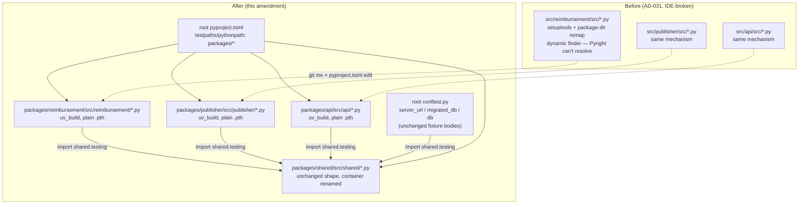

# Fix Service Module-Name Collision via Real Package Namespacing — Design

**Spec**: `.specs/features/refactoring-package-namespacing/spec.md`
**Status**: Approved

---

## Amendment (2026-08-09) — mechanism correction

The original design below (still shown, since most of it — P2's `shared.testing` consolidation, root conftest wiring, decision-log housekeeping — is already implemented and unaffected) chose `setuptools` + `[tool.setuptools.package-dir]` for `api`/`publisher`/`reimbursement`'s namespacing. That shipped and fixed the pytest collision, but its editable install generates a dynamic `MetaPathFinder`-based finder script that Pyright-family static analyzers can't resolve — confirmed via direct `pyright` CLI runs (see spec's own Amendment section for the exact error output and the empirical repro proving `uv_build`'s plain-`.pth` editable install resolves cleanly instead).

**What changes in this amendment:**
- Build backend for `api`/`publisher`/`reimbursement`: `setuptools` → `uv_build` (matching `shared`, which was never touched by the original design and already resolves cleanly).
- Layout: flat `src/<pkg>/src/*.py` → nested `packages/<pkg>/src/<pkg>/*.py` (one new directory per package, matching `shared`'s existing shape).
- Workspace-member container: `src/` → `packages/` (repo-wide), matching uv's documented workspace example.

**What does NOT change:** import statements (already dotted from the original implementation — `reimbursement.schema`, `api.dependencies`, etc.), `shared.testing`'s consolidated helpers and their callers (P2), the root `conftest.py`'s fixture bodies, the decision to keep `reimbursement` named `reimbursement` (not reverted to `agent`).

Original Tech Decisions row "`uv_build` cannot decouple an import name from a same-named directory even in `namespace = true` mode" is **still factually correct** — but this amendment no longer needs that decoupling, because the layout now makes the import name and the directory name match directly. That's the actual fix; see spec's Amendment section for the full alternatives comparison (flat-layout, decoupled-name, symlink workaround — all considered and rejected).

---

## Architecture Overview

`api`, `publisher`, and `reimbursement` switch build backend to `uv_build` and gain one directory level, so each package's on-disk shape matches `shared`'s exactly: `packages/<pkg>/src/<pkg>/*.py`. The workspace-member container renames from `src/` to `packages/` for all four packages. No import statements change — AD-031's original dotted-import conversion (`api.main`, `publisher.consumer`, `reimbursement.schema`, etc.) already did that work and stays as-is; only the physical directories the dotted names resolve to move.

---

## Code Reuse Analysis

### Existing Components to Leverage

| Component                                              | Location                              | How to Use                                                                                  |
| -------------------------------------------------------- | ---------------------------------------- | ----------------------------------------------------------------------------------------------- |
| `shared`'s existing `[build-system]` block (`uv_build`, exact version pin) | `src/shared/pyproject.toml` → `packages/shared/pyproject.toml` | Copy verbatim into `api`/`publisher`/`reimbursement`'s `pyproject.toml` — don't re-derive the pin from memory or docs |
| `shared`'s existing nested layout (`src/shared/src/shared/*.py`) | `src/shared/` → `packages/shared/` | Copy the shape (one more directory, same name as the package) for the other three |
| `shared.testing`'s consolidated helpers (P2, already delivered) | `src/shared/src/shared/testing.py` → `packages/shared/src/shared/testing.py` | Unchanged — every caller's `from shared.testing import ...` statement stays as-is |
| Root `conftest.py`'s fixture bodies (`server_url`, `migrated_db`, `db`) | `conftest.py` | Unchanged — only `testpaths`/`pythonpath` values pointing at them change |

### Integration Points

| System                          | Integration Method                                                                                     |
| ---------------------------------- | ----------------------------------------------------------------------------------------------------------- |
| `uv` workspace (`[tool.uv.workspace]`) | `members = ["src/*"]` → `["packages/*"]`; per-member build backend already supported today, no `uv` behavior change |
| Docker builds                      | Each service's Dockerfile's `COPY`/`ENV`/CMD paths update from `src/...` to `packages/...`; entrypoints stay dotted (unchanged from the original implementation) |
| `docker-compose.yml`               | `dockerfile:` and bind-mount paths (10 lines across `api`, `publisher`, `reimbursement` services) update from `src/...` to `packages/...` |
| `.gitignore`                       | Whitelist entries `!src`/`!src/**` → `!packages`/`!packages/**` |
| Root `pytest` config                | `testpaths`/`pythonpath` values update from `src/...` to `packages/...`; config *shape* unchanged (still one unified block) |
| `docs/codebase/STRUCTURE.md`       | Literal `src/<pkg>` path references corrected to `packages/<pkg>` (mechanical fix, not the deferred wording/convention sync) |

---

## Components

### `api`/`publisher`/`reimbursement` package namespacing (corrected mechanism)

- **Purpose**: Real, dotted-import packages resolvable by both the interpreter and static analyzers.
- **Location**: `packages/{api,publisher,reimbursement}/pyproject.toml`, `packages/{api,publisher,reimbursement}/src/{api,publisher,reimbursement}/**/*.py` (moved one level deeper, `git mv` to preserve history), each service's `Dockerfile`.
- **Interfaces**:
  - `[build-system] requires = ["uv_build>=<shared's exact pin>"] build-backend = "uv_build"` (no `[tool.setuptools.package-dir]`, no `setuptools` reference anywhere)
  - Entrypoints stay as already implemented: `api.main:app`, `python -m publisher.consumer`, `python -m reimbursement.consumer`
- **Dependencies**: `shared` (unchanged, `workspace = true`).
- **Reuses**: `shared`'s exact `pyproject.toml` build-system block and directory shape (see Code Reuse Analysis). `reimbursement`'s already-nested `agent/` subpackage (`agent.py`, `nodes/`, `prompts/`) moves as a unit one level deeper — no internal restructuring needed there, it already had its own `__init__.py` for `agent`/`nodes`; `prompts/` remains a PEP 420 implicit namespace package (no `__init__.py`), unchanged — this shape resolves fine under `uv_build`'s plain-`.pth` mechanism (unlike under `setuptools`' dynamic finder, which is exactly what broke).

### Workspace container rename (`src/` → `packages/`)

- **Purpose**: Match uv's documented workspace convention repo-wide.
- **Location**: root `pyproject.toml` (`[tool.uv.workspace] members`, `testpaths`, `pythonpath`), `.gitignore`, `docker-compose.yml`, all four packages' physical directories (including `shared`, container-only — its internal shape is untouched).
- **Interfaces**: N/A (config/path changes only).
- **Dependencies**: Must land atomically with the per-package moves — an inconsistent intermediate state (some paths renamed, others not) breaks `uv sync`, pytest collection, and Docker builds simultaneously.
- **Reuses**: N/A.

### `shared.testing` extension (P2 — already delivered, unaffected)

Already implemented and verified (`validation.md`, PKG-10–15, all PASS): `valid_reimbursement_item`, the seed helpers (with `original_payload` preserved), and the DB-provisioning utilities all live in `shared.testing` today. This amendment moves the file from `src/shared/src/shared/testing.py` to `packages/shared/src/shared/testing.py` — same content, no interface change, no caller change.

### Root pytest config (paths updated, shape unchanged)

- **Purpose**: Keep one unified `[tool.pytest.ini_options]` block covering all four packages.
- **Location**: `pyproject.toml` (workspace root).
- **Interfaces**:
  - `testpaths = ["packages/api", "packages/publisher", "packages/reimbursement", "packages/shared"]` (was `src/...`)
  - `pythonpath = ["packages/api/tests", "packages/publisher/tests", "packages/reimbursement/tests"]` (was `src/.../tests`)
- **Dependencies**: None new.
- **Reuses**: Existing `markers`, `python_classes`, `python_functions`, `addopts` config, unchanged.

### Root `conftest.py` (unaffected in substance)

Already imports from `shared.testing` (P2, delivered) — no import-statement change in this amendment. The file's physical location doesn't move (it's at the repo root, not inside `src/`/`packages/`).

### Decision log amendment

- **Purpose**: Amend AD-031 in place with the corrected mechanism and rationale, without minting a new AD number.
- **Location**: `.specs/STATE.md` (AD-031 entry).
- **Interfaces**: N/A (documentation).
- **Dependencies**: None.
- **Reuses**: AD-031's existing structure — append an "Amendment" subsection following the same style as AD-018/AD-026's "Amended by..." status-line convention, but inline within AD-031 itself since this is a mechanism correction to the same decision, not a new decision.

---

## Data Models

N/A — this feature changes build/directory/path config, not data models or schemas.

---

## Error Handling Strategy

| Error Scenario | Handling | User Impact |
| -------------- | -------- | ------------ |
| `uv sync` fails to resolve `uv_build` for a package mid-move (pyproject.toml edited but directory not yet moved, or vice versa) | Land the `pyproject.toml` edit and the `git mv` in the same task/commit, `uv sync` run and inspected before moving to the next task | None if sequenced correctly — task-ordering constraint, not a runtime fallback |
| A Docker/compose path reference is missed | `grep -rn "src/"` across `docker-compose.yml` and all Dockerfiles as an explicit task Done-when check | Caught before commit, not at `docker compose up` time |
| A doc reference to the old `src/` path is missed | `grep -rln "src/"` across `docs/codebase/*.md` as an explicit task Done-when check | Caught before commit |
| `pyright` still reports `reportMissingImports` after the move (mechanism didn't actually fix it) | Task-level verification: run `pyright` against each package's entry module before marking the task done, not deferred to a final check | Caught immediately, not assumed from the empirical repro alone |

---

## Risks & Concerns

| Concern | Location (file:line) | Impact | Mitigation |
| ------- | -------------------- | ------ | ---------- |
| `uv_build`'s exact version pin may not match what's implied by Context7's generic doc example | `packages/shared/pyproject.toml` (currently `src/shared/pyproject.toml:17-18`) | Wrong pin could cause `uv sync` to fail or resolve an unintended version | Copy `shared`'s existing pin verbatim (read the actual file, don't trust the doc example) |
| Repo-wide `src/` → `packages/` rename is a large mechanical diff | Whole repo | Higher chance of a missed reference than a narrower fix | Tasks phase enumerates every known reference site (already found via `grep -rn "src/"` across `pyproject.toml`, `docker-compose.yml`, 3 Dockerfiles, `.gitignore`) as explicit per-task Done-when checks |
| `docs/codebase/STRUCTURE.md` may contain more `src/` references than currently known, or other `docs/codebase/*.md` files might too | `docs/codebase/*.md` | Stale doc after the rename | Task includes a `grep -rln "src/"` sweep across all of `docs/codebase/*.md`, not scoped to `STRUCTURE.md` alone |
| No CI exists to catch a regression before merge | (repository-wide) | A missed path reference could reach `main` undetected if local verification isn't run before commit | Out of scope to add CI (see spec Out of Scope) — mitigated procedurally: `uv run pytest` + `pyright` + `docker compose up` are all mandatory gate checks per task before each atomic commit |

> All identified concerns have a mitigation — no unmitigated risk carried into Tasks.

---

## Tech Decisions (only non-obvious ones)

| Decision | Choice | Rationale |
| -------- | ------ | --------- |
| Build backend for `api`/`publisher`/`reimbursement` | `uv_build` (corrected from `setuptools`) | Plain `.pth` editable install, statically resolvable by Pyright — proven via empirical repro (spec's Amendment section); `setuptools`' `package-dir` remap produces a dynamic finder that isn't |
| Per-package layout | Nested src-layout (`packages/<pkg>/src/<pkg>/*.py`), matching `shared` | Flat-layout (`packages/<pkg>/<pkg>/*.py`) was empirically verified to also resolve correctly but trades away src-layout's protection against accidental uninstalled-package imports — not worth it for one fewer path segment |
| Workspace container name | `packages/` (corrected from `src/`) | Matches uv's own documented workspace example exactly (Context7-verified) |
| `uv_build` version pin | Whatever `shared`'s existing `pyproject.toml` already declares — read at task time, not assumed | Avoids citing a version from memory or a generic doc example; `shared` is the known-working reference |
| AD-031 disposition | Amended in place, not superseded by a new AD | Same underlying decision ("namespace api/publisher/reimbursement"); only the *mechanism* changed — matches the project's existing precedent for mechanism-only corrections |

> **Project-level decision:** This amends `.specs/STATE.md`'s existing `AD-031` entry directly (Tasks phase, mapped to spec PKG-18) — not a new `AD-032`, since the decision itself is unchanged, only its mechanism is corrected.
