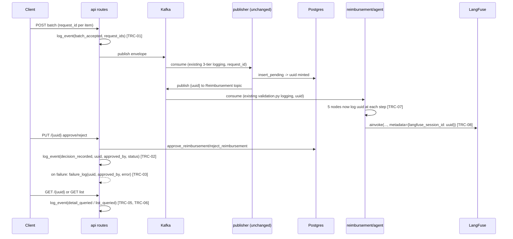

# Traceability Correlation IDs Design

**Spec**: `.specs/features/traceability-correlation-ids/spec.md`
**Status**: Draft

---

## Architecture Overview

**Approaches considered:**

| Approach | Shape | Verdict |
| --- | --- | --- |
| **A — Minimal helper + surgical edits (chosen)** | One small `shared.logging.log_event()` helper; each of the 4 api routes, `errors.py`'s catch-all, the 5 agent nodes, and `agent.py`'s `decide()` get targeted 1-4 line additions at existing or new call sites | Matches the codebase's existing explicit, hand-rolled-call convention exactly (no repo file does logging any other way); smallest possible surface area; fastest to implement and review |
| B — Request-scoped middleware + contextvars | A FastAPI middleware auto-generates/propagates a correlation id and logs every request/response uniformly | Rejected — reintroduces the "new server-generated id" option the user already declined during Discuss, and is architecture the narrowed scope doesn't need (only 4 known routes, not an open-ended set) |
| C — Decorator-based logging wrapper | `@log_traceable(...)` applied to route handlers/nodes, auto-extracting uuid/request_id from arguments | Rejected — no decorator-based logging exists anywhere in this repo (`CONVENTIONS.md` shows explicit inline calls throughout); introduces a new, more "magic" pattern to save ~6-10 call sites that don't need DRY-ing |

Approach A is used throughout. No new cross-cutting infrastructure, no new
dependency, no change to any route/node's public contract.

---

## Code Reuse Analysis

### Existing Components to Leverage

| Component | Location | How to Use |
| --- | --- | --- |
| `failure_log.write()` | `packages/shared/src/shared/failure_log.py:41-63` | Reused as-is for TRC-03's PUT decision-write failure record — same CRITICAL-tier, `default=str`-safe JSON shape already established |
| `sanitize(exc)` | `packages/shared/src/shared/errors.py:42-66` | Reused as-is to render the error field in TRC-03's failure record, matching every other tier-2/3 call site's convention |
| `logging.basicConfig(level=logging.INFO)` pattern | `packages/publisher/src/publisher/consumer.py:142`, `packages/reimbursement/src/reimbursement/consumer.py:100` | Same one-line call, added to `api/main.py`'s own startup (TRC-11) — parity, not a new pattern |
| Module-level `EVENT` string constants | `packages/publisher/src/publisher/processing.py` (`DUPLICATE_DROPPED_EVENT`, etc.), `packages/reimbursement/src/reimbursement/validation.py` (`RESOLVED_EVENT`, `DECIDED_EVENT`, etc.) | Same naming convention applied to the 5 new event constants this feature introduces |
| `asyncpg.Record` returned by `approve`/`reject` (`RETURNING *`) | `packages/shared/src/shared/reimbursement/repository.py:86-105` | `row["status"]` already gives the exact resulting status string (`human-approved`/`human-rejected`) for TRC-02 — no extra query needed |
| `state["reimbursement"].uuid` | `packages/reimbursement/src/reimbursement/schema.py` (`State`), already threaded into every node | TRC-07 reads this directly — the value is already there, just never logged |

### Integration Points

| System | Integration Method |
| --- | --- |
| `api`'s 4 routes | Each gets a module-level `logger = logging.getLogger(__name__)` (currently absent in all 4) plus 1-3 new `log_event(...)` calls |
| `api/errors.py` | `_unhandled_exception_handler` reads `request.path_params.get("uuid")` — zero new imports, `Request` is already the handler's first argument |
| `reimbursement/agent/nodes/*.py` (5 files) | Each existing `logger.info("FLOW: ...")` call gains a `uuid=%s` / `%s` argument sourced from `state["reimbursement"].uuid` — no new imports, no new log calls, only existing ones extended |
| `reimbursement/agent/agent.py::decide()` | `config` dict passed to `graph.ainvoke` gains a `"metadata": {"langfuse_session_id": str(reimbursement.uuid)}` key, alongside the existing `callbacks` key |

---

## Components

### `shared.logging` (new module)

- **Purpose**: One JSON log-event envelope for this feature's new call
  sites — `{"event": ..., **fields}` — so they don't each hand-roll
  `json.dumps(...)`.
- **Location**: `packages/shared/src/shared/logging.py`
- **Interfaces**:
  - `log_event(logger: logging.Logger, level: int, event: str, **fields: Any) -> None` — builds the JSON payload (`json.dumps({"event": event, **fields}, default=str)`, matching `failure_log.write`'s own `default=str` handling of non-JSON-native values like `UUID`/`Decimal`), emits it via `logger.log(level, "%s", payload)`, and never raises — an internal `try/except Exception` mirrors `failure_log.write`'s own defensive shape (logs via a fallback logger name on failure) so a logging call can never break the caller's business flow.
- **Dependencies**: stdlib `logging`, `json`.
- **Reuses**: `failure_log.write`'s `default=str` + defensive-try/except shape (`packages/shared/src/shared/failure_log.py:56-63`), without adopting its file-specific truncation logic (`_truncated`) — this helper's payloads are small, structured fields, not arbitrary large records.
- **Calling convention**: always imported as `from shared.logging import log_event` — never `from shared import logging` — to avoid reading like the stdlib module at the call site (see Risks & Concerns).

### `api/reimbursement/create/route.py` (modified)

- **Purpose**: Log the accepted batch (TRC-01) after a successful publish.
- **Change**: add `logger = logging.getLogger(__name__)`; after `await publish(...)` succeeds, before `return`, call `log_event(logger, logging.INFO, BATCH_ACCEPTED_EVENT, request_ids=request_ids, accepted_count=accepted_count)`.
- **Reuses**: `request_ids`/`accepted_count`, already computed in the existing code (`route.py:42-43`) for the response message — no new computation.

### `api/reimbursement/update/route.py` (modified)

- **Purpose**: Log the recorded decision (TRC-02) and any decision-write
  failure (TRC-03).
- **Change**: add `logger = logging.getLogger(__name__)`; wrap the existing
  `approve_reimbursement(...)`/`reject_reimbursement(...)` call in
  `try/except Exception`, writing `failure_log.write(load_config().failure_log, {"event": DECISION_WRITE_FAILED_EVENT, "uuid": str(uuid), "approved_by": review.approved_by, "error": sanitize(exc)})` then re-raising on failure. On success, call `log_event(logger, logging.INFO, DECISION_RECORDED_EVENT, uuid=str(uuid), status=row["status"], approved_by=review.approved_by)`.
- **Reuses**: `row["status"]` from the already-returned `asyncpg.Record` — no extra query. The existing post-commit re-fetch failure path (`RuntimeError`, `route.py:61-64`) is untouched — this try/except wraps only the decision-write call, not the re-fetch.

### `api/reimbursement/list/route.py` (modified)

- **Purpose**: Log the applied filter and result count (TRC-05).
- **Change**: add `logger = logging.getLogger(__name__)`; before `return`, call `log_event(logger, logging.INFO, LIST_QUERIED_EVENT, status_filter=status or "none", result_count=len(rows))`.

### `api/reimbursement/get/route.py` (modified)

- **Purpose**: Log the query outcome (TRC-06).
- **Change**: add `logger = logging.getLogger(__name__)`; wrap `await get_reimbursement(conn, uuid)` in `try/except ReimbursementNotFound`, logging `log_event(logger, logging.INFO, DETAIL_QUERIED_EVENT, uuid=str(uuid), found=False)` then re-raising; on success, `log_event(logger, logging.INFO, DETAIL_QUERIED_EVENT, uuid=str(uuid), found=True)`.

### `api/errors.py` (modified)

- **Purpose**: Include the path `uuid` in the catch-all's log line (TRC-04).
- **Change**: `_unhandled_exception_handler` becomes `logger.exception("unhandled exception on %s %s uuid=%s", request.method, request.url.path, request.path_params.get("uuid"))` — `path_params.get("uuid")` is `None` on `POST`/`GET` list, harmless.

### `api/main.py` (modified)

- **Purpose**: Make api's own new INFO-level logs actually emit (TRC-11).
- **Change**: add `logging.basicConfig(level=logging.INFO)` near the top of the module (mirroring `publisher`/`reimbursement`'s own entrypoints), not inside `lifespan()` — it must run once at import/startup, before any request-handling code can log.

### `reimbursement/agent/nodes/{validate,extract_fields,apply_policies,analysis,apply_agent_decision}.py` (modified, 5 files)

- **Purpose**: Carry the reimbursement uuid on every existing node log line (TRC-07).
- **Change**: each existing `logger.info("FLOW: ...", ...)` call gains `uuid=%s` in its format string and `state["reimbursement"].uuid` as an added argument — no new log calls, no new imports, no change to log content otherwise.

### `reimbursement/agent/agent.py::decide()` (modified)

- **Purpose**: Attach the uuid to the LangFuse trace (TRC-08), without touching the existing fallback (TRC-09).
- **Change**: the `config` dict gains one key: `"metadata": {"langfuse_session_id": str(reimbursement.uuid)}`, alongside the untouched `"configurable"` and `"callbacks"` keys. `_langfuse_handlers()` itself — including its fallback branches — is not modified.

---

## Data Models

None — this feature adds no persisted data, only log-line shapes and one
LangFuse `config` key. No migration, no schema change.

---

## Error Handling Strategy

| Error Scenario | Handling | User Impact |
| --- | --- | --- |
| `PUT`'s `approve_reimbursement`/`reject_reimbursement` raises an unexpected exception | New: `failure_log.write(...)` (CRITICAL, uuid+approved_by+sanitized error) before re-raising | Unchanged — still a 500 `{"msg": "internal error"}` via the existing catch-all; the difference is a durable record now exists |
| `GET /{uuid}` raises `ReimbursementNotFound` | New: logged (`found=False`) before re-raising | Unchanged — still the existing 404 response |
| `log_event()` itself fails (e.g. an unexpected non-serializable field) | Caught internally, falls back to a named fallback logger, never propagates | None — the business flow (the route's actual response) is unaffected |
| LangFuse `CallbackHandler` construction fails | Unchanged — existing `_langfuse_handlers()` fallback to `failure_log`, now simply invoked with one more (unused) metadata key already computed by the caller | None — TRC-09 asserts this stays byte-identical |

---

## Risks & Concerns

| Concern | Location | Impact | Mitigation |
| --- | --- | --- | --- |
| Without a `basicConfig` call, `api`'s new INFO logs never print (verified via Context7 against uvicorn's default logging setup + Python's root-logger/`lastResort` semantics) | `packages/api/src/api/main.py` | TRC-01/02/05/06 would be silently non-functional in production | TRC-11 — one-line `logging.basicConfig(level=logging.INFO)` added to `api/main.py`, mirroring the other 2 services' entrypoints |
| `shared.logging` as a module name can read like the stdlib `logging` module if imported carelessly (`from shared import logging`) | `packages/shared/src/shared/logging.py` (new) | Readability confusion for future maintainers; no functional collision (Python 3 absolute imports resolve `import logging` inside the module to the stdlib, not itself) | Enforce `from shared.logging import log_event` as the only import form; documented in the module's own docstring |
| `PUT`'s new try/except could produce a duplicate `failure_log` record if a DB error also surfaces through a secondary path | `packages/api/src/api/reimbursement/update/route.py` (new), `packages/shared/src/shared/reimbursement/use_cases/review_reimbursement.py` (unchanged transaction boundary) | At most one harmless duplicate CRITICAL record, not data loss or a correctness bug | Accepted as-is — `failure_log` records are additive/informational, not a state machine |
| No new automated tests for TRC-01..11 | All files touched by this feature | A future refactor could silently break correlation-id logging with nothing to catch it | Explicit, twice-confirmed user decision (spec.md Assumptions); the existing full suite staying green is the only gate for this feature's own changes |
| `producer.py`'s existing failure log (`create/producer.py:33`) is not migrated onto `shared.logging.log_event` | `packages/api/src/api/reimbursement/create/producer.py:33` | Two slightly different logging call shapes coexist in the same package (old hand-rolled `%s`, new JSON `log_event`) | Accepted, out of scope per spec.md's Out of Scope table — tracked here for future-cleanup awareness, not a defect this feature introduces |

---

## Tech Decisions

| Decision | Choice | Rationale |
| --- | --- | --- |
| `log_event()` skips `publisher/processing.py`'s `_LazyJSON` deferred-formatting optimization | Eager `json.dumps(...)` on every call | That optimization exists for publisher's high-volume per-item logging; api requests and agent-node invocations are comparatively low-volume — no measurable cost to building the dict eagerly, and it keeps the new helper simpler |
| `log_event()`'s correlation-id field is a free-form kwarg (`request_id=...` or `uuid=...`), not a normalized/required parameter | Free-form `**fields` | Matches the codebase's genuine two-phase identity model (pre-uuid `request_id`, post-uuid `uuid`) — forcing one common key name would falsely unify two different identifiers |
| `api/main.py` gets its own local `logging.basicConfig()` call, not a new `shared.logging_config` module | One-line local fix, mirroring the existing per-service pattern | Keeps TRC-11 minimal; a shared/unified logging-config module is explicitly out of scope per spec.md |
| `PUT`'s new failure handling wraps only the two use-case calls, not the whole route body | Narrow `try/except` around `approve_reimbursement`/`reject_reimbursement` only | The post-commit re-fetch failure path already has its own dedicated handling (`RuntimeError`, from `api-put-reimbursement`'s prior work) — wrapping it too would double-handle an already-solved case |

> No new `AD-NNN` is warranted — every choice above is feature-local scoping,
> not a new project-wide convention. `shared.logging`'s existence itself is
> arguably future-reusable, but its adoption is deliberately scoped to this
> feature's own new call sites only (spec.md Out of Scope), so recording it
> as a binding project-wide pattern now would overstate what was decided.
