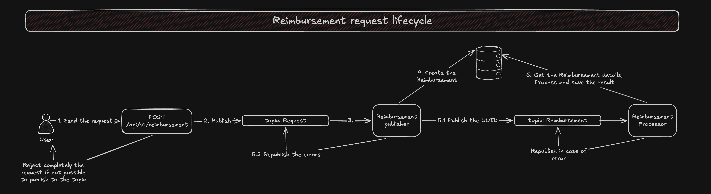
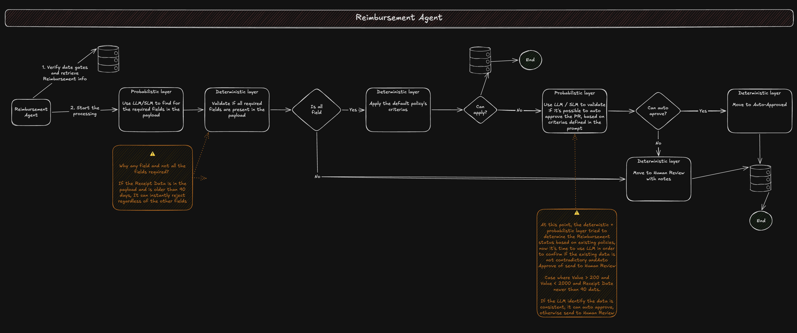

# Scope

- The service must decide 
	- Which requests can be auto-approved
	- Which must be routed to Human Review
	- Which must be rejected (wth a justification)

# Requirements

## Functional
- **Process reimbursement requests**: Accept reimbursement requests and produce a decision for each
- **Apply business rules**: validate each request against a defined set of business rules
- **Classify decisions**: Each requests must be classified as auto-approved, sent for human review, or rejected
- **Human review**: Cases requiring human judgment must be made available for review, with the reviewer's decision recorded
- **Audit trail**: every decision, automated or human, must be traceable

## Non-functional

- This service is missions-critical.
- It operates in a financial domain, where incorrect decisions may result in financial loss, policy violations, or audit failure
- Given that the service rives monetary decisions based on probabilistic outputs from a LLM, full traceability of all operations is imperative to facilitate auditing and reproducibility

# Approval Policy

- Requests less or equal than 200 may be auto-approved when all validation checks pass
- Requests higher than 2000 must always be routed to human review. This is a hard-requirement
- Receipts dated more than 90 days before the submittions date must be rejected
- State explicitly any assumptions about locale, currency, date format, and how theese thresholds interact with other validation outcomes

# Sample Data Set

- A sample data set is located under docs/original/sample.json

# Technical Scope



## Tech Stack

- Python 3.4.7
    - FastAPI 0.141.1
    - LangChain v1.3.0
    - LangGraph v1.2.1
    - Confluent Kafka for Python 2.15.0
    - Pydantic 2.13.4
    - Asyncpg 0.3.10
- PostgreSQL 18
- Kafka 4.3.1 (KRaft, single node — 3.2.1 as originally scoped has no official Docker image; 3.7.0 is the earliest available)
- LangFuse

## Project bootstrap

- Kafka / PostgreSQL must be confirmed working on bootstraping
- Kafka topics must be created
- PostgreSQL DB structure must be created / updated

## Constraints

- (?) Prompts must remove as much as possible PII
- Prompts can't act other than the scope of the task
- Prompts must be created to have 95% of assurance in the answers

## Data Schema

- Use migrations to create the schemas

### Reimbursement

- UUID
- Original payload
- Status
    - Auto-Approved
    - Human-Approved
    - Human Review
    - Auto-Rejected
    - Human-Rejected
- Request ID
- Submited By
- Submited Date
- Reciepets Value
- Reciepets Date
- Currency
- Decision
- Published
- Human Review notes
- Created At
- Updated At

#### Constraints

- Unique constraint against Request ID / submited By together
- Status must be in set of values defined in the schema
- Decision Layer must be in the set of values defiend in the schema
- Submited By must be a valid email
- Required fields
    - UUID
    - Original payload
    - Request ID

### Human Review

- UUID
- Reimbursement UUID©
- Status
    - Approved
    - Rejected
- Review By
- Reason
- Created At

#### Constraints

- Status must be in set of values defined in the schema
- Review By must be valid email

## API


### POST /api/v1/reimbursement
- Publish to the topic `Request` with `retry = 0`
    If fails, reject completely the payload
- Publish to Kafka the entire payload
- **Payload**
    - Accept any payload with max size of 1mb
    - Those are the minimum required fields in order to have an acceptable payload
    ```json
    {
        "request_id": "REQ-0001",
        "submitted_by": "ana.silva@company.com",
        "submitted_at": "2026-04-10T09:15:00Z",
        ...
    }
    ```
- **Responses**
    - 201
    - 400
    - 413
    - 500
    - Response body
        ```json
        {
            "msg": ""
        }
        ```

### GET /api/v1/reimbursement
- Pagination (query params)
    - limit 
        - Not required
        - Default = 100
    - offset
        - Not required
        - Default = 0
- Filter (query params)
    - status
        - Values: `auto-approved` | `human-approved` | `human-review` | `auto-rejected` | `human-rejected`
        - Not required
        - Default = empty
        - Accepts more than one value, comma-separated
- Return the last `Human Review` if any
- **Responses**
    - 200
    - 400
    - 500
        - Response body
        ```json
        {
            "msg": "",
            "data": [
                ...
            ]
        }
        ```

### GET /api/v1/reimbursement/:uuid
- Return a single Reimbursement by the uuid
- **Responses**
    - 200
    - 400
    - 404
    - 500

### PUT /api/v1/reimbursement/:uuid 
- Only recheable for `Reimbursement` in `Human-Rejected` or `Auto-Rejected` or `Human-Review` status
- Accept approval of rejected `Human Review`
    Do not override the existing record, create a new one
- The final status must be propagated to the `Reimbursement Entity`
- For an approval, all the fields from the payload are required
- For rejecting, just the `reason` and `approved_by` are required
- **Payload**
    ```json
    {
        "uuid": "",
        "status": "approved | rejected",
        "reason": "",
        "receipts_date": "yyyy-mm-dd",
        "receipts_value": 0.0,
        "receipts_currency": "",
        "approved_by": ""
    }
    ```
- **Responses**
    - 200
    - 404
    - 422
    - 400
    - 500
    - Error body
        ```json
        {
            "msg": ""   
        }
                ```

## Reimbursement Publisher

- It consumes the topic `Request`
- Iterate over each item from the message and, in a single transaction. 
    - Create to the DB the Reimbursement with `UUID` and `Original Payload` 
    - Publish to the topic `Reimbursement`

### Error handling

- If the `retry > 3`, it means it's failing repeatedly
    - Try to create the `Reimbursement` with Human Review status
    - Fallback to log the error in a file if fails
    - No other action below must be done
- If the DB insert fails, no publish to the topic must happen
- If any the publish to topic fails, the DB row is deleted
    - Ideally should have an outbot pattern here, but i would add a complexity that the dealine wouldn't support
- If any error happens, it must republish incrementing the retry

## Reimbursement Agent



### Constraints

- If the message's `Published Data` is lower than the the `Reimbursement Updated At`, ignore the message

### Reject

- If `Receipt Date`is older than 90 days, instantly reject

### Auto-Approved

#### Deterministic layer
- After the LLM extract all the required fields, it tries to apply the policies
- Minimum required fields (for correct traceability and reimbursement processing)
    - Request ID
    - Submited By
    - Requested Value
    - Submited Date
    - Currency

#### Probabilistic layer
- an LLM / SLM must evaluate, by the sent payload, if there are enough data to create a `Reimbursement` entity, returning as json via structured output. 
- To avoid mistakes by the LLM, do not rely on it to determine if it's auto-approved or rejected. If it doesn't return the enough data to create the `Reimbursement`, move to `Human Review`
- Find out a reasonable LLM size for it, a big model might not be necessary in here, consider SLM to reduce the cost
- One prompt per `Reimbursement`, to prevent LLM from hallucinating
- (?) Add guardrails in order to validate if the data present in the payload is not contraditory internally, i.e
    - if the `claimed_category` doesn't match the Type of the business by name in `raw_ocr_text`
    - If there are more than one reference to the fields to be found detailed below
  (the specific guardrail checks are intentionally left undetermined — this
  scope only requires that a consistency-check step exists and gates
  ambiguous-zone auto-approval; see `.specs/features/agent-decide-reimbursement/spec.md`)
- Fields to be found 
    - Receipts Date
    - Receipts Value
    - Currency
- If any the values are found, rely on the deterministic layer to auto approve or reject
    - Use LLM as Judge to verify if the found data matches what is expected to create the Reimbursement
- If none of the values are found, send instantly to `Human Review`
  (clarified — this applies per-field: an unresolved requested value or an
  unresolved receipt date each independently route to `Human Review` rather
  than being auto-approved or auto-rejected on missing data — see
  `.specs/features/agent-decide-reimbursement/spec.md`)

### Human review
- `Requested Value > 2000` must go immediately to `Human Review`
    - `Receipt Date` must be newer than 90 days
- Run a LLM check using a cheap and fast model help out the human review, adding a side note with the LLM output

### Error Handling

- If the `retry > 3`, it means it's failing repeatedly
    - Try to create the `Reimbursement` with `Human Review` status
    - Fallback to log the error in a file if fails
- If any error happens, rollback any DB transactions and republish incrementing the `retry`
  (amended — for the decision stage specifically, this retry-then-escalate
  mechanism is not yet adopted as-is: retrying a billed LLM call is not
  free like retrying a DB query, so the exact mechanism is deferred to a
  later, cost-aware evaluation — tracked as R-011 in .specs/RISKS.md. This
  section's mechanism still governs the resolve stage
  (`agent-consume-reimbursement`, already shipped) unchanged)

## Audit

### Traceability

- Add LangFuse support to make with fallback to file logging with the steps being taken

# Documentation

- Add support to Swagger

# Decisions

### Authentication
- Didn't add authentication to allow focus on the business rule
- The Human Review data schema contains an Reviewed By, what keeps a plain text email, even though the endpoint is receiving an email, the correct approach would be extract from the JWT, as example, or other method relying on the authentication step

## API Layer

### Request
- The project assume that the payload can vary, just a set of fields has been set as required, for the sake of requester's identity
    - `request_id`
    - `submitted_by`
    - `submitted_at`
- Considering the project is missions critical, no requests must be lost, so the `POST /api/v1/reimbursement` will publish to a Kafka topic to minimize the loses. The internal processing will make sure the requests will be fully processed or monitored in case of errors
- Even though the attachmets could be used to validate if the `raw_ocr_text` matches the data in the attachment, I deliberatedly decided to leave this feature out of the scope to reduce the complexity

### Cache
- No cache has been applied, no reason for adding it

## Agent Layer
- Initally, there would be a deterministic layer in front of the AI analysis to avoid token spent, but as the sample json didn't have any `Receipt Date`, i decided to rely on the LLM analysis to find this field in order to have a `Reject First` strategy based on this date

### Deterministic
- It's gonna exist to either support the Agent as a tool or to simply move to the correct status if no LLM are needed at all

### Probabilistic Layer
- The Agent starts with the task of finding the `Receipt Date`, this project prioritize the `Reject First`.
    - The sample payload doesn't contain a `Receipt Date`, and the document is explicity that the payload can vary
- The LLM is getting two responsabilities
    - Locate all the required information to deterministically auto-approve or reject (Currency, `Receipt Date` and `Receipt Value`)
    - Run analysis in order to fill the gap, where if the `Reimbursement`is not rejected, and `20 > Receipt Value < 2000`. 
        - The agent is gonna if the information is solid and not contradictory, with the intetion of covering the gap from the document where. 
        - i.e the category is hotel but the service name is "Mexican Restaurant", if this happens, then it's gonna send to `Human Review`
- Not reject / discard requests if errors
    - If repeat errors / edge scenarios happens, immediately is gonna be sent to Human Review, to avoid losing request
    - Fallback to logging in the output if any services are unavailable (DB / Kafka)
    - This decision can polute the `Human Review` flow, however monitoring tools can be added in order to evaluate the impact in this flow and apply other approaches after real data comes in

## Human Review
- If the a `Human-Approve` operation gappens without the fields below, it's gonna be blocked
    - Currency
    - Receipt Date
    - Receipt Value
    - Reason
-  It's possible to `Human-Approve`if the `Reimbursement`is in `Human-Rejected` or `Auto-Rejected` or `Human-Review`
    - It has been decided to let the `Auto-Rejected` to ba `Human-Approved` to allow the system recover from the possible agent / human errors
- It's not possible to `Human-Approve` if the `Reimbursement` is rejected, as it's not possible assure the system can get back the money 
    - This is an edge caase not covered by this project

## General Decisions
- This project took around 30h, higher than the expectation from the document
    - I assumed this project as a professional one as requested by the documentation, taking care of as many details as i could in the deadline i had
- AI Usage
    - This document, and the overral architecture was defined by me
    - The implementation was done wit the following flow
        - Grilling Sessions (if needed)
        - SDD 
        - AI Code review
        - Manual review limited due to the deadline
    - I decided to rely heavily on agentic engineering due to how the teams are structuring in the bigger companies, shifting the focus to planning / testing / validation
- Manual intervention
    - All the planning phase has been done manually, with grilling sessions at the end to refinement
    - The code has been validated manually as well, however not in a deep level, otherwise there wouldn't have enough time
    - The prompts has been done manually with AI validation
    - The architecture has strong personal decision with AI suggestions
    - This document was completedly written by me, with a few interventions of AI to update details, but reviewed constantly
- Tests
    - All the unit / integration tests will be generated by AI, there wouldn't have enough time to write them down carefuly
- The document [Risks.md](RISKS.md) contains some aspects that i've identified during this test development, however I didn't have enough time to take care of them all

## Architecture decisions
- **All or nothing**: The API layer receives the request and publish to Kafka, the first Consumer create the records in DB then, a second consumer send over to the agent
     - If any of the reimbursements in the request has a bad payload, all the request is rejected
     - Duplicated requests are rejected and logged
- Reject first deterministically, Human Review if any doubts
    - If the `Receipt Date` older than 90 days, reject immediately
    - Any other cases that can't approve, it's gonna be sent to `Human Review`
        The decision on this is to initially monitor the agent and see what the `Human Review` is receiving. A Phase 2 can collect data and add new approaches in order to auto reject more accurately
- Async processing
    - It has been chosen event-driven architecture to make the system scalable, each consumer can scale as the requests are indepotent
- Observability
    - LangFuse support added for tracing the agent
    - Regular output so other tools can read it and monitor
    - Assuming monitoring tools watching the output to gather metrics

## What i would have done with extra time
- Run a detailed code review, making sure the architecture / design has better practices
    - I fully relied on agentic engineering, running code reviews, but the codebase is not small
- I would have review the [Risks.md](RISKS.md) and fixed some of the issues in there
- I would have added authentication
- Tested small / bigger models, in order to evaluate performance x cost x accuracy
- The prompts could have received better instructions and testing layers
- The prompts are receiving the full payload, if by any chance it receives just one payload with 1MB, the cost of tokens will not worth probably

## What i would have done better
- Even though the [Scope.md](SCOPE.md) was made completely by me, I decided to start with no architecture pre-defined, due to that, need to run rounds of refactoring and i wasted at least 4h-6h on it
- I would have prepared better my harness for this project, i made several adjusments to improve the performance and the cost savings in order to have better and performatic results
- Improved the Human Review experience
- I should have started by the Agent layer, not the API / Publishers, due to that i got out of enough time to better validate the prompts and nodes, also finding ways to save tokens and improve performance

# Next Phases

## Phase 2
Those are possible Phase 2 tasks 

- Authentication
- Human Review evaluator
    - Identify what are the most gaps going to Human Review, in order to improve the agent capabilities
- Post results to Kafka topics, configurably
- Improve the deterministic layer, reducing the chance of going to the probabilistic layer, saving tokens and resources
- Added LLM as Judge in the `Analysis` layer