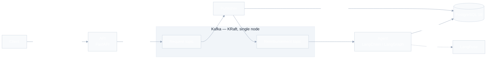

# Architecture

## Overview / pattern

Event-driven microservices in a uv monorepo: a FastAPI ingress publishes
every reimbursement request to Kafka, a publisher persists and republishes
it, and an agent decides the outcome with deterministic rules plus an LLM
layer. Services share only the `shared` kernel package and communicate
exclusively through Kafka topics and PostgreSQL.

**Implementation status:** the topology below is wired in
`docker-compose.yml`, but the services are placeholders — the API exposes
only `/health`, and both consumers subscribe to sample topics and print
messages. The target behavior is specified in `docs/SCOPE.md`; this file
marks such sections as *target*.

## High-level structure (target)

## Layers

| Layer | Responsibility | Key files or dirs |
| ----- | -------------- | ----------------- |
| Decision engine | Deterministic rules + probabilistic (LLM) evaluation, human-review routing | `src/agent/src/agent/consumer.py` |
| Ingress | Accept HTTP requests, publish raw payloads to Kafka | `src/api/src/api/main.py` |
| Persistence bridge | Consume raw requests, create DB records, republish | `src/publisher/src/publisher/consumer.py` |
| Shared kernel | Pydantic models shared across services | `src/shared/src/shared/models.py` |

## Dependency rules

- `agent`, `api`, and `publisher` depend on `shared`; they never import each
  other (their source is never even copied into each other's images).
- `shared` depends only on Pydantic — no service, framework, or I/O
  dependencies.

## Request / data flow (target, per `docs/SCOPE.md`)

1. `POST /api/v1/reimbursement` accepts any payload up to 25 MB with three
   required fields (`request_id`, `submitted_by`, `submitted_at`) and
   publishes it whole to the `Request` topic with `retry = 0`. Publish
   failure rejects the request — nothing is processed outside Kafka.
2. Publisher consumes `Request`, and in a single transaction creates the
   `Reimbursement` row (UUID + original payload) and publishes to the
   `Reimbursement` topic. DB failure blocks the publish; publish failure
   rolls back the transaction.
3. Agent consumes `Reimbursement` and decides: receipts older than 90 days
   are rejected; amounts over 2000 always go to human review; amounts up to
   200 may auto-approve when all checks pass. Payloads the deterministic
   layer cannot read go to the LLM layer, which only extracts fields — it
   never approves or rejects on its own.
4. Errors republish the message with `retry` incremented; after 3 retries the
   record is parked in human-review status, with file logging as the final
   fallback.

## Communication patterns

- External: REST over HTTP (FastAPI).
- Internal: Kafka topics, at-least-once, with a `retry` counter carried in
  the message (target). Consumers are idempotent by design intent — a
  message whose published date is older than the row's `updated_at` is
  ignored.
- Current code: plain `Consumer.poll()` loops against placeholder topics
  `sample-topic` (agent) and `sample-queue` (publisher).

## Data model

Current: `HealthStatus` and `SampleMessage` in
`src/shared/src/shared/models.py`.

Target (schema in `docs/SCOPE.md`): `Reimbursement` (UUID, original payload,
status enum, request id, submitter, receipt value/date, currency, decision,
audit timestamps; unique on request id + submitter) and `HumanReview` (UUID,
reimbursement UUID, approved/rejected, reviewer, reason). Reviews are
append-only — a new decision creates a new row.

## Database access patterns

asyncpg (raw SQL, no ORM) against PostgreSQL 18. No code, schema, or
migration framework exists yet; `docs/SCOPE.md` mandates migrations.

## State management

Services are stateless; all state lives in PostgreSQL and Kafka offsets.
Horizontal scaling is per-consumer (the stated reason for the event-driven
choice).

## Error handling strategy (target)

No request is ever dropped: any processing error republishes with `retry`
incremented; `retry > 3` parks the record in human-review status; if even
that fails, the error is logged to a file. Current code only prints consumer
errors and continues.

## Observability

- LangFuse v4 traces the agent's LLM steps; the compose stack wires
  `LANGFUSE_HOST` and the auto-provisioned key pair into the agent container.
  File-logging fallback is required when LangFuse is unreachable (target).
- Other services: stdout logging only, so external tooling can collect it.
  No structured-logging framework yet (see `CONCERNS.md`).

## API versioning

URL path versioning, `/api/v1/` (target — no versioned routes exist yet).

## Notable patterns

- Shared-kernel monorepo: one lockfile, workspace-resolved `shared` package.
- Dev/prod split per Dockerfile: editable install + bind mounts + reload in
  `dev`; non-editable baked venv in `prod`. Deps-only layer built with
  `uv sync --frozen --no-install-workspace` for caching.
- LLM used as extractor, not judge of record: approval/rejection authority
  stays in the deterministic layer (`docs/SCOPE.md` decisions).
